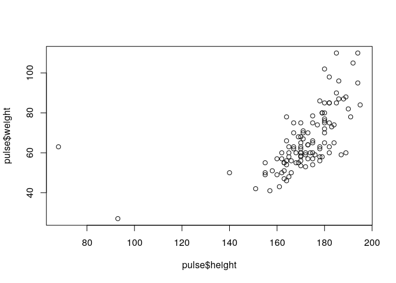

# Basic data types

We will use the `pulse` and `survey` data again for illustration and exercises:


```
# To get 'pulse.txt' directly from the server, use:
# pulse <- read.table( url( "https://github.com/rxmenezes/RcourseNKI/tree/master/data/pulse.txt" ), header = TRUE, sep = "\t" )
```

```r
pulse <- read.delim( "data/pulse.txt" )
```


```
# To get 'survey.txt' directly from the server, use:
# survey <- read.table( url( "https://github.com/rxmenezes/RcourseNKI/tree/master/data/survey.txt" ), header = TRUE, sep = "\t" )
```

```r
survey <- read.delim( "data/survey.txt" )
```

## Types

Columns in a data.frame can be of different types. Typically:

- numeric (we've seen already)
- character (for text)
- factor (for categorical variables)

## `str` and `class`

To get a quick overview (structure) of the types of data in your data.frame:

```r
str(pulse)
```

```
'data.frame':	110 obs. of  12 variables:
 $ name    : Factor w/ 106 levels "Adeline","Adrian",..: 7 72 16 101 56 35 11 31 96 102 ...
 $ height  : int  173 179 167 195 173 184 162 169 164 168 ...
 $ weight  : num  57 58 62 84 64 74 57 55 56 60 ...
 $ age     : int  18 19 18 18 18 22 20 18 19 23 ...
 $ gender  : Factor w/ 2 levels "female","male": 1 1 1 2 1 2 1 1 1 2 ...
 $ smokes  : Factor w/ 2 levels "no","yes": 1 1 1 1 1 1 1 1 1 1 ...
 $ alcohol : Factor w/ 2 levels "no","yes": 2 2 2 2 2 2 2 2 2 2 ...
 $ exercise: Factor w/ 3 levels "high","low","moderate": 3 3 1 1 2 2 3 3 1 3 ...
 $ ran     : Factor w/ 2 levels "ran","sat": 2 1 1 2 2 1 2 2 2 1 ...
 $ pulse1  : int  86 82 96 71 90 78 68 71 68 88 ...
 $ pulse2  : int  88 150 176 73 88 141 72 77 68 150 ...
 $ year    : int  1993 1993 1993 1993 1993 1993 1993 1993 1993 1993 ...
```

To learn about the type of a specific column:

```r
class(pulse$name)
```

```
[1] "factor"
```

# Vector classes

## Numeric data

Numeric data can be `integer` (whole numbers) or `numeric` (continuous data) but you can ignore that distinction if you are not a programmer.

We've seen how to make numeric data with `c` or `:`

### Useful functions for numeric data

Summarizing a single variable:

- `mean`
- `median`
- `min`
- `max`
- `range` (two values: min, max)
- `sd` (standard deviation)
- `var` (variance)
- `hist` (histogram)

A six-number summary: range, three quartiles and the mean:

```r
summary(pulse$age)
```

```
   Min. 1st Qu.  Median    Mean 3rd Qu.    Max. 
  18.00   19.00   20.00   20.56   21.00   45.00 
```

### Relationships between two variables

- `cor` (correlation)
- `plot` (scatterplot)


```r
cor(pulse$height, pulse$weight)
```

```
[1] 0.5796849
```

```r
plot(pulse$height, pulse$weight)
```

<!-- -->


- - -

> _Quick task(s)_:
> 
> Solve [the task(s)](05_character_factor_basics.tasks.nocode.html#numeric), and check your solution(s) [here](05_character_factor_basics.tasks.code.html#numeric).

- - -

## Character data

Texts in R is called `character`. You recognize is by the quotes around the values.

### Creating character data

Use either single or double quotes


```r
text <- c('alpha', 'beta', 'gamma')
TEXT <- c("ALPHA", "BETA", "GAMMA")
```

### Names

Row and column names in a data.frame are always `character`:

```r
rownames(pulse)[1:10]
```

```
 [1] "1993_A" "1993_B" "1993_C" "1993_D" "1993_E" "1993_F" "1993_G" "1993_H"
 [9] "1993_I" "1993_J"
```

### (*) Useful premade character vectors

- `LETTERS` (capitals)
- `letters` (lower case)
- `month.name` (months)

### (*) Calculating with character vectors

Arithmetics of text


```r
toupper("me")
```

```
[1] "ME"
```

```r
paste(LETTERS, letters, sep='_')
```

```
 [1] "A_a" "B_b" "C_c" "D_d" "E_e" "F_f" "G_g" "H_h" "I_i" "J_j" "K_k" "L_l"
[13] "M_m" "N_n" "O_o" "P_p" "Q_q" "R_r" "S_s" "T_t" "U_u" "V_v" "W_w" "X_x"
[25] "Y_y" "Z_z"
```


## Factor - categorical data

A categorical variable in R is called `factor`:

- They are internally coded as numbers 1,2,3,...
- The numbers have value labels attached to them (called levels)

### Making a factor

To make a factor variable, start with a character vector and use `factor`:


```r
fac <- factor(c('A', 'B', 'A', 'B', 'B'))
```

### Factor basics

You recognize a factor by the `Levels:` line when printing:

```r
fac
```

```
[1] A B A B B
Levels: A B
```

To get the numeric coding:

```r
as.numeric(fac)
```

```
[1] 1 2 1 2 2
```

To get the value labels:

```r
levels(fac)
```

```
[1] "A" "B"
```

```r
nlevels(fac)
```

```
[1] 2
```

### Turning factor (back) into character


```r
as.character(fac)
```

```
[1] "A" "B" "A" "B" "B"
```

### Table

Factors are best summarized with `table`:

```r
table(pulse$exercise)
```

```

    high      low moderate 
      14       37       59 
```

`table` can also crosstabulate two (or even more) variables:

```r
table(pulse$gender, pulse$exercise)
```

```
        
         high low moderate
  female    3  20       28
  male     11  17       31
```

### (*) Table of table

It is suprisingly useful to use table twice.


```r
table(table(pulse$name))
```

```

  1   2 
102   4 
```


- - -

> _Quick task(s)_:
> 
> Solve [the task(s)](05_character_factor_basics.tasks.nocode.html#factors), and check your solution(s) [here](05_character_factor_basics.tasks.code.html#factors).

- - -


