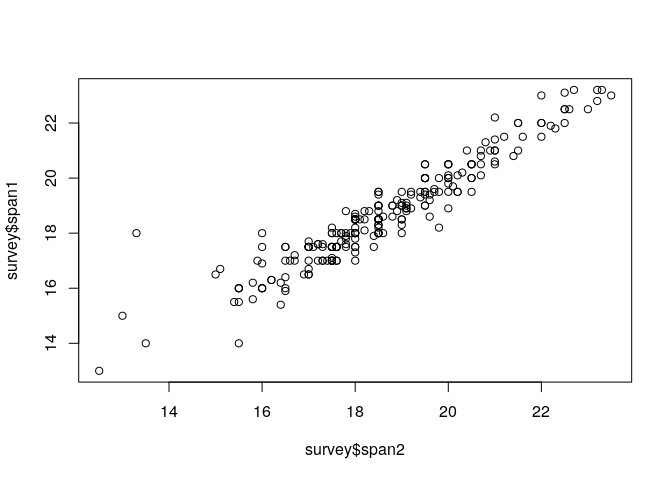
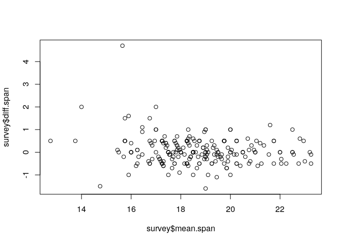
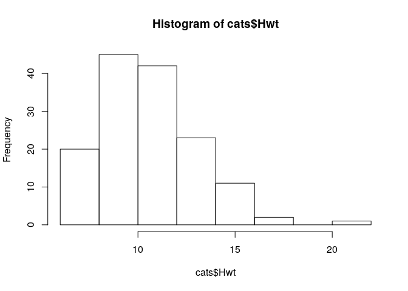
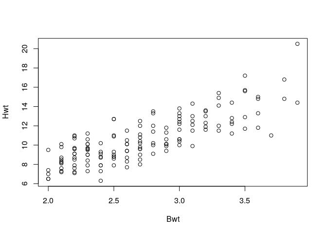
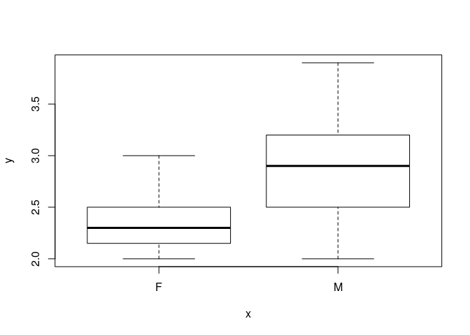

# Numeric data {#numeric}

In the `survey` data

- Find the standard deviation of `span1`

```r
sd(survey$span1)
```

```
[1] 1.84626
```

- Find the age range

```r
range(survey$age)
```

```
[1] 16.75 73.00
```

- plot `span1` (y-axis) against `span2` (x-axis)

```r
plot(survey$span2, survey$span1)
```

<!-- -->

- (*) plot the difference between `span1` and `span2` (y-axis) against their average (x-axis)

```r
survey$diff.span <- survey$span1 - survey$span2
survey$mean.span <- (survey$span1 + survey$span2)/2
plot(survey$mean.span, survey$diff.span)
```

<!-- -->

# Factors {#factors}

In the `survey` data

- How many and what levels does the `fold` variable have?
```
levels(survey$fold)
```

- Make a `table` of the fold variable (columns) versus the clap variable (rows)

```r
table(survey$clap, survey$fold)
```

```
         
          left neither right
  left      15       0    22
  neither   21       2    26
  right     60      16    71
```

- Convert the `name` column to `character`

```r
survey$name <- as.character(survey$name)
```

- Do the same for the `pulse` data.

- Add these conversion steps to your standard script for reading in the data! 


# Desciptive statistics of a data set

We make use of the `cats` data set from the `MASS` package. 

-	Load the `MASS` package by writing `library(MASS)`. This makes the `cats` data available to you. What variables of what types are in `cats`?

```r
library(MASS)
```

```

Attaching package: 'MASS'
```

```
The following object is masked _by_ '.GlobalEnv':

    survey
```

```r
str(cats)
```

```
'data.frame':	144 obs. of  3 variables:
 $ Sex: Factor w/ 2 levels "F","M": 1 1 1 1 1 1 1 1 1 1 ...
 $ Bwt: num  2 2 2 2.1 2.1 2.1 2.1 2.1 2.1 2.1 ...
 $ Hwt: num  7 7.4 9.5 7.2 7.3 7.6 8.1 8.2 8.3 8.5 ...
```

- How many male and female cats were in this experiment?

```r
table(cats$Sex)
```

```

 F  M 
47 97 
```

- Make a histogram of heart weights

```r
hist(cats$Hwt)
```

<!-- -->

- Find mean and median heart weight

```r
mean(cats$Hwt)
```

```
[1] 10.63056
```

```r
median(cats$Hwt)
```

```
[1] 10.1
```

-	Plot heart weight against body weight

```r
with(cats, plot(Bwt, Hwt))
```

<!-- -->

-	(*) `plot` when applied to a factor and a numeric variable makes boxplots. Make boxplots of body weight against gender

```r
plot(cats$Sex, cats$Bwt)
```

<!-- -->

