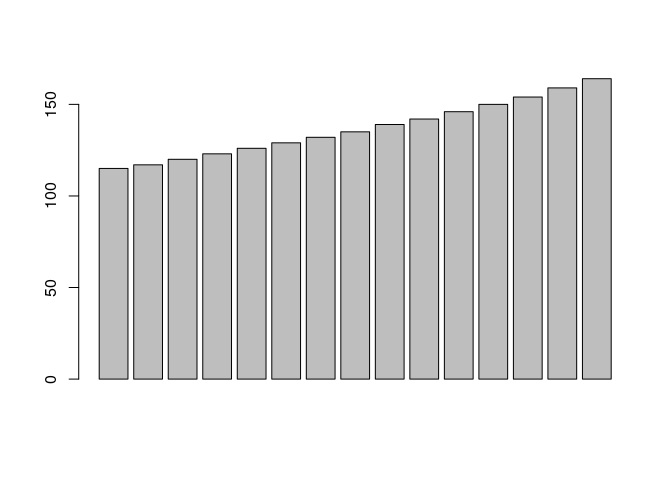
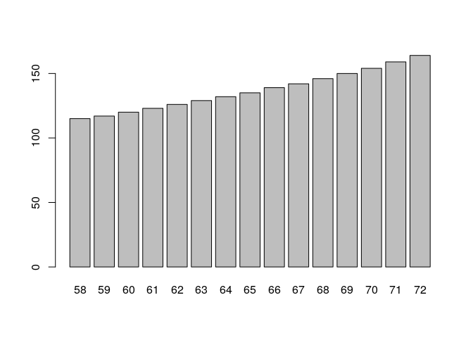
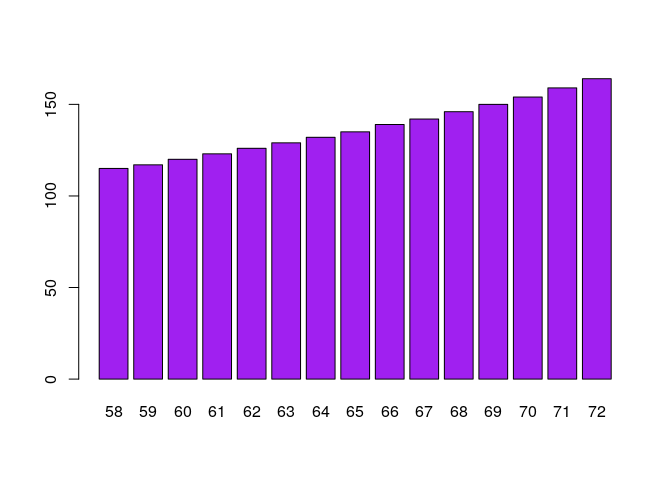
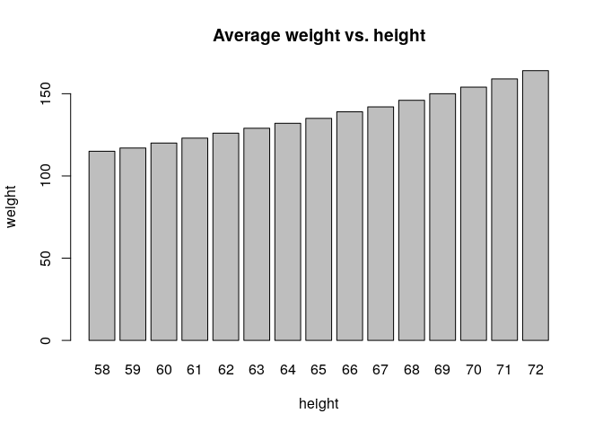

# Round and signif {#signif}

- Use the `signif` function to give pi in 4 significant digits

```r
signif(pi, 4)
```

```
[1] 3.142
```

- (*) What is the value of `round(pi,-1)` and why?

```r
round(pi,-1)
```

```
[1] 0
```

- (*) For what `x` is `trunc(x)` different from `floor(x)`

```r
x=-1.1
trunc(x)
```

```
[1] -1
```

```r
floor(x)
```

```
[1] -2
```


## `barplot` options {#help}

Have a look at the `women` example data

- Open the help file for `women` to understand the data.

```r
?women
```

- The `barplot` function can be used for barplots. Make a barplot of `weight`.

```r
barplot(women$weight)
```

<!-- -->

-	What argument of `barplot` can be used to add names to the bars? HINT: `names.arg`. Add `height` as a names under the bars.

```r
barplot(women$weight, names.arg=women$height)
```

<!-- -->

- Basic colors are represented in R simply by their names, e.g. `"yellow"`. Note the quotation marks. Make the bars in the plot purple.

```r
barplot(women$weight, names.arg=women$height, col="purple")
```

<!-- -->

- Add labels to the plot and a title

```r
barplot(women$weight, names.arg=women$height, xlab='height', ylab='weight', main='Average weight vs. height') 
```

<!-- -->


## Spearman correlation

In the `survey` data:


```
# To get 'survey.txt' directly from the server, use:
# survey <- read.table( url( "https://github.com/rxmenezes/RcourseNKI/tree/master/data/survey.txt" ), header = TRUE, sep = "\t" )
```

```r
survey <- read.delim( "data/survey.txt" )
```

-	The function for correlation in R is `cor`. Calculate correlation between average `span1` and `span2`

```r
cor(survey$span1, survey$span1)
```

```
[1] 1
```

- Is this a Pearson or Spearman correlation? Calculate the Spearman correlation.

```r
cor(survey$span1, survey$span1, method='spearman')
```

```
[1] 1
```

# (*) `table` options

`NA` in R stands for missing values

- Open the help file for `table`.

```r
?table
```

- What is the default of the `useNA` argument?

```r
"no"
```

```
[1] "no"
```

- Apply table to the `clap` and `m.i.`columns in `survey` with all three options for `useNA`

```r
table(survey$m.i, useNA = 'no')
```

```

imperial   metric 
      67      139 
```

```r
table(survey$m.i, useNA = 'ifany')
```

```

imperial   metric     <NA> 
      67      139       27 
```

```r
table(survey$m.i, useNA = 'always')
```

```

imperial   metric     <NA> 
      67      139       27 
```

```r
table(survey$clap, useNA = 'no')
```

```

   left neither   right 
     37      49     147 
```

```r
table(survey$clap, useNA = 'ifany')
```

```

   left neither   right 
     37      49     147 
```

```r
table(survey$clap, useNA = 'always')
```

```

   left neither   right    <NA> 
     37      49     147       0 
```

- Explain the role of the `useNA` argument in your own words.
