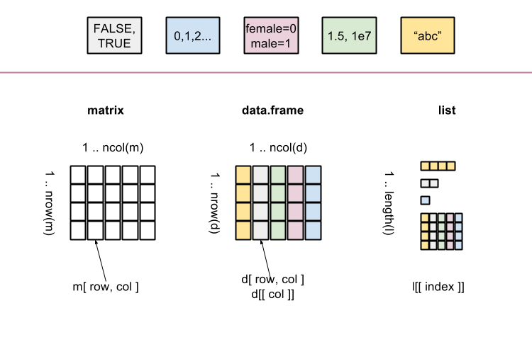

# Lists

## What is a list

A [list](http://cran.r-project.org/doc/manuals/r-release/R-lang.html#List-objects) can be thought of as zero or more (named) cells containing data of _any type_.

Elements may be named.

Elements are accessed through indexing operations.

<center></center>

## Creation


```r
study <- list(            # here = or <-
  name = "Bob",           # but here only =
  age = 44,               # never <-
  children = c( "Amy", "Dan", "Eve" )
)
study
```

```
$name
[1] "Bob"

$age
[1] 44

$children
[1] "Amy" "Dan" "Eve"
```

The class of `study`:

```r
class( study )
```

```
[1] "list"
```

Function `str` gives a compact display of an object structure/content:

```r
str( study )
```

```
List of 3
 $ name    : chr "Bob"
 $ age     : num 44
 $ children: chr [1:3] "Amy" "Dan" "Eve"
```

## Length

Length of the list (number of elements):

```r
length( study )
```

```
[1] 3
```

## Getting names of the elements


```r
names( study )
```

```
[1] "name"     "age"      "children"
```

## Getting a single element

Single elements can be accessed by their names in the list:

```r
study$age
```

```
[1] 44
```

```r
study[[ "age" ]]
```

```
[1] 44
```
Note the double [[.

The type of the returned element depends on the element:

```r
class( study$age )
```

```
[1] "numeric"
```

```r
class( study$children )
```

```
[1] "character"
```

Nonexisting elements will give `NULL` 


```r
study$parents
```

```
NULL
```

It is also possible to access elements by numerical index:

```r
study[[ 2 ]]
```

```
[1] 44
```


- - -

> _Quick task(s)_:
> 
> Solve [the task(s)](04_lists.tasks.nocode.html#createList), and check your solution(s) [here](04_lists.tasks.code.html#createList).

- - -

## (*) Getting multiple elements as a list 

To get (possibly) multiple elements use single brackets notation:

```r
study[ c( "age", "children" ) ]
```

```
$age
[1] 44

$children
[1] "Amy" "Dan" "Eve"
```

Note the difference:

```r
study[[ "age" ]]
```

```
[1] 44
```

```r
study[ "age" ]
```

```
$age
[1] 44
```

```r
class( study[[ "age" ]] )
```

```
[1] "numeric"
```

```r
class( study[ "age" ] )
```

```
[1] "list"
```

Accessing nonexisting elements with single brackets:

```r
study[ "parents" ]
```

```
$<NA>
NULL
```

```r
class( study[ "parents" ] )
```

```
[1] "list"
```

```r
names( study[ "parents" ] )
```

```
[1] NA
```

```r
is.null( study[ "parents" ] )
```

```
[1] FALSE
```

Numerical or logical indices may be also used:

```r
study[ c( 3, 1, 1 ) ]
```

```
$children
[1] "Amy" "Dan" "Eve"

$name
[1] "Bob"

$name
[1] "Bob"
```

```r
study[ c( T, F, T ) ]
```

```
$name
[1] "Bob"

$children
[1] "Amy" "Dan" "Eve"
```

## (*) Removing an element 

A list element is removed by setting to NULL:

```r
str( study )
```

```
List of 3
 $ name    : chr "Bob"
 $ age     : num 44
 $ children: chr [1:3] "Amy" "Dan" "Eve"
```

```r
study[[ "children" ]] <- NULL;   # NULL means "nothing"
str( study )
```

```
List of 2
 $ name: chr "Bob"
 $ age : num 44
```

## (*) Adding an element 


```r
str( study )
```

```
List of 2
 $ name: chr "Bob"
 $ age : num 44
```

```r
study$gender <- "male"
str( study )
```

```
List of 3
 $ name  : chr "Bob"
 $ age   : num 44
 $ gender: chr "male"
```


- - -

> _Quick task(s)_:
> 
> Solve [the task(s)](01_lists.tasks.nocode.html#elementsList), and check your solution(s) [here](01_lists.tasks.code.html#elementsList).

- - -
