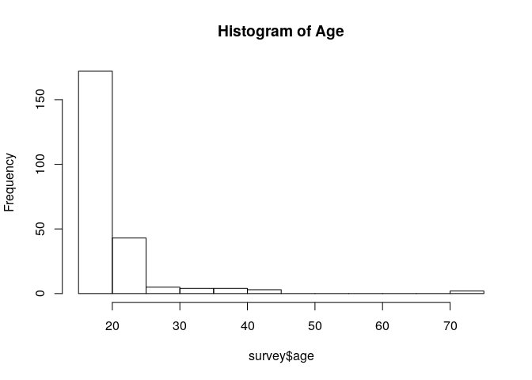
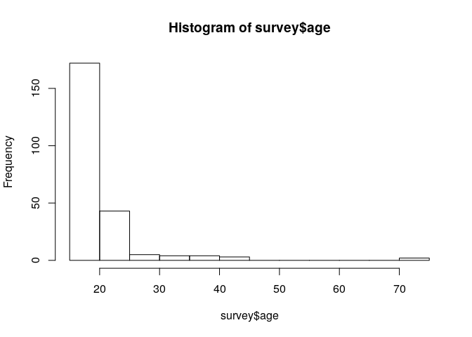
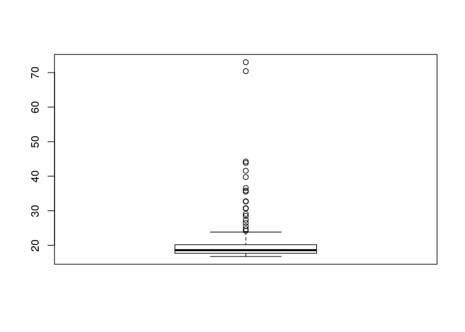

# Lists (tasks)

## Tasks

### Building a list {#createList}

Three people received different sets of scores:

- `Amy`: 1,6,7,9,10
- `Bob`: 6,7,4,3,5,2,2,1,4
- `Dan`: 9,9,10

- build a list `scores` with numeric vector elements. The elements should be named as the people, and they should contain the corresponding scores.

```r
scores <- list(
  Amy = c( 1,6,7,9,10 ),
  Bob = c( 6,7,4,3,5,2,2,1,4 ),
  Dan = c( 9,9,10 )
)
scores
```

```
## $Amy
## [1]  1  6  7  9 10
## 
## $Bob
## [1] 6 7 4 3 5 2 2 1 4
## 
## $Dan
## [1]  9  9 10
```

- check `class` and `str` of `scores`

```r
class( scores )
```

```
## [1] "list"
```

```r
str( scores )
```

```
## List of 3
##  $ Amy: num [1:5] 1 6 7 9 10
##  $ Bob: num [1:9] 6 7 4 3 5 2 2 1 4
##  $ Dan: num [1:3] 9 9 10
```

- list names of all objects in `scores`

```r
names( scores )
```

```
## [1] "Amy" "Bob" "Dan"
```

- Get scores of `Bob` using single brackets, double brackets, and dollar notation: what is the class of returned value for each of these methods?


```r
scores[[ 'Bob' ]]
```

```
## [1] 6 7 4 3 5 2 2 1 4
```

```r
scores[ 'Bob' ]
```

```
## $Bob
## [1] 6 7 4 3 5 2 2 1 4
```

```r
scores$Bob
```

```
## [1] 6 7 4 3 5 2 2 1 4
```

```r
scores[[2]]
```

```
## [1] 6 7 4 3 5 2 2 1 4
```

```r
class( scores[[ 'Bob' ]] )
```

```
## [1] "numeric"
```

```r
class( scores[ 'Bob' ] )
```

```
## [1] "list"
```

### Accessing list elements {#elementsList} (*)

- Repeat the previous exercise to get simultanously scores of `c( "Bob", "Dan" )`. Check the result and its class. (*)


```r
scores[[ c( "Bob", "Dan" ) ]]
```

```
## Error in scores[[c("Bob", "Dan")]]: subscript out of bounds
```

```r
scores[ c( "Bob", "Dan" ) ]
```

```
## $Bob
## [1] 6 7 4 3 5 2 2 1 4
## 
## $Dan
## [1]  9  9 10
```

```r
class( scores[ c( "Bob", "Dan" ) ] )
```

```
## [1] "list"
```

- Extend `scores` by adding some scores of `Eve`. (*)


```r
scores$Eve <- c( 4,4,8,6,9 )
scores
```

```
## $Amy
## [1]  1  6  7  9 10
## 
## $Bob
## [1] 6 7 4 3 5 2 2 1 4
## 
## $Dan
## [1]  9  9 10
## 
## $Eve
## [1] 4 4 8 6 9
```

- `Dan` received new scores: 7,4,9. Add them to his vector. (*)


```r
scores$Dan <- c( scores[[ 'Dan' ]], 7, 4, 9 )
scores
```

```
## $Amy
## [1]  1  6  7  9 10
## 
## $Bob
## [1] 6 7 4 3 5 2 2 1 4
## 
## $Dan
## [1]  9  9 10  7  4  9
## 
## $Eve
## [1] 4 4 8 6 9
```

- There is a mistake. `Bob` does not belong to this group. Remove `Bob` from the list. (*)


```r
scores[[ 'Bob' ]] <- NULL
scores
```

```
## $Amy
## [1]  1  6  7  9 10
## 
## $Dan
## [1]  9  9 10  7  4  9
## 
## $Eve
## [1] 4 4 8 6 9
```

### A nested list (*)

- extend the previous example. Imagine, that there are scores of various topics. Try:

```r
scores <- list(
  Amy = list(
    math = c( 1,6,7,9,10 ),
    biology = c( 7,6,8 )
  ),
  Bob = list(
    math = c( 6,7,4,3,5,2,2,1,4 ),
    physics = c( 8,7 )
  ),
  Dan = list(
    math = c( 9,9,10 ),
    physics = c( 10, 10, 10 ),
    biology = c( 3, 5, 7 )
  )
)
```

- check `class` and `str` of `scores` (*)

```r
class( scores )
```

```
## [1] "list"
```

```r
str( scores )
```

```
## List of 3
##  $ Amy:List of 2
##   ..$ math   : num [1:5] 1 6 7 9 10
##   ..$ biology: num [1:3] 7 6 8
##  $ Bob:List of 2
##   ..$ math   : num [1:9] 6 7 4 3 5 2 2 1 4
##   ..$ physics: num [1:2] 8 7
##  $ Dan:List of 3
##   ..$ math   : num [1:3] 9 9 10
##   ..$ physics: num [1:3] 10 10 10
##   ..$ biology: num [1:3] 3 5 7
```

- how many elements are in the `scores` list (*)

```r
length( scores )
```

```
## [1] 3
```

```r
length( scores$Bob )
```

```
## [1] 2
```

- get `Dan` scores in `physics` (*)

```r
scores[[ "Dan" ]][[ "physics" ]]
```

```
## [1] 10 10 10
```

```r
scores$Dan$physics
```

```
## [1] 10 10 10
```

```r
scores$Dan[[ "physics" ]]
```

```
## [1] 10 10 10
```


# (*) Histogram

- Make a histogram of `age` from the survey data.


```r
hist(survey$age)
```

<!-- -->

- Change the title of the plot to `Histogram of Age`. Hint: use the slot `main` in the function call.


```r
hist(survey$age, main='Histogram of Age')
```

<!-- -->

- Check the class of the object generated by the function `hist`. Also check the names of the components within the object generated.


```r
class(hist(survey$age, main='Histogram of Age'))
```

```
## [1] "histogram"
```

```r
names(hist(survey$age, main='Histogram of Age'))
```

<!-- -->

```
## [1] "breaks"   "counts"   "density"  "mids"     "xname"    "equidist"
```

- Check the length of components `breaks` and `counts`. Also check the class of components `breaks` and `xname`. What do you conclude about the type of object generated by the function `hist`?


```r
length(hist(survey$age)$breaks)
```

```
## [1] 13
```

```r
length(hist(survey$age)$counts)
```

<!-- -->

```
## [1] 12
```

```r
class(hist(survey$age)$breaks)
```

```
## [1] "integer"
```

```r
class(hist(survey$age)$xname)
```

```
## [1] "character"
```

```r
# Since components in the object generated by hist involve both different classes 
# as well as different lenghts, it can be concluded that the hist result object is a list 
```

- What is the exact count in the first bin? Hint: use the component `counts` from the object.


```r
res <- hist(survey$age)
```

<!-- -->

```r
res$counts
```

```
##  [1] 172  43   5   4   4   3   0   0   0   0   0   2
```

```r
res$counts[1]
```

```
## [1] 172
```

- How many breaks does the produced histogram contain? Hint: use the component `breaks` from the object as well as the function `length`.


```r
names(res)
```

```
## [1] "breaks"   "counts"   "density"  "mids"     "xname"    "equidist"
```

```r
res$breaks
```

```
##  [1] 15 20 25 30 35 40 45 50 55 60 65 70 75
```

```r
length(res$breaks)
```

```
## [1] 13
```

# (*) Boxplot

- Make a boxplot of `age` from the survey data.


```r
boxplot(survey$age)
```

<!-- -->

- Save the boxplot as an object and check its class and the names of its components.


```r
bpa <- boxplot(survey$age)
```

<!-- -->

```r
class(bpa)
```

```
## [1] "list"
```

```r
names(bpa)
```

```
## [1] "stats" "n"     "conf"  "out"   "group" "names"
```

- Consulting the help file of `boxplot`, section 'Value', try to understand to what parts of the plot the values in the component `stats` of the boxplot object correspond to. Compare values to what you see on the boxlot itself.


```r
bpa$stats
```

```
##        [,1]
## [1,] 16.750
## [2,] 17.667
## [3,] 18.583
## [4,] 20.167
## [5,] 23.833
```

- Compute the median, the upper- and lowe-quartile of the `age` variable. Hint: use the function `quantile` with slot `probs` equal to 0.5, 0.25 and 0.75 to obtain these. Now compare these values to the values in the `stats` component of the boxplot object. What do you conclude about the computation of the values in `stats`?

- Check the help file for `boxplot.stats`, which is the function called by `boxplot` to actually produce the values in `stats` (see the entry under the 'See also' section of the boxplot help file). Was your conclusion correct?

