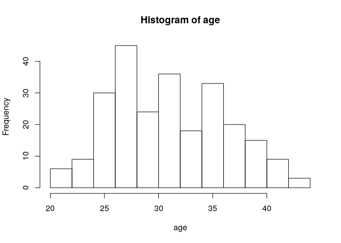

# R Markdown : R code + Markdown text formating language


With RMarkdown you can combine text, scripts and results. This makes it easy to organize projects.

- RMarkdown ([cheat sheet](http://www.rstudio.com/wp-content/uploads/2016/03/rmarkdown-cheatsheet-2.0.pdf)) is a simple language for creating professional reports

An RMarkdown document includes your R code output. Use to:

  - share your data analysis with colleagues
  - document your data analysis for future generations
  
The RMarkdown report can be exported in various formats: `html`, `pdf` and  `word`


## Short session

  - Opening a new RMarkdown file
    - From RStudio  File -> New File -> R Markdown
    - Choose title and output format, choose `html` (default) here and press OK.
  - Knitting (compiling R Markdown) 
    - New RMarkdown file contains example text and code generated for you.
    - To knit, press the `knit` button in Rstudio, or use the shortcut `CTRL`+`Shift`+`k`. It first asks you to save your file. Your file will by default get extension `.Rmd`
    
Quick exercises : Review the RMarkdown with the html produced. What did RMarkdown do?

# Features of R Markdown

## Markdown examples

Use 

  - two spaces at the end of a line for new paragraph (newline)
  - hash (`#`) for section titles. 
  - dash (`-`) for bullet lists.
  - \*italic\*, \*\*bold\*\* and \~\~strike through\~\~ for  *italic*, **bold**, ~~strike through~~ respectively
  - \> to highlight 
  
> to highlight

## Including R code in markdown

R code is included in a `chunk`:

<pre><code>```{r}
x <- 5
x + 10
```</code></pre>


```r
x <- 5
x + 10
```

```
[1] 15
```

## Chunk options

There are many chunck options available, most common being `echo`, `eval`. For example the option results='hide' prevents the result of the `x + 10` being included in this page:  

<pre><code>```{r results='hide'}
x <- 5
x + 10
```</code></pre>


```r
x <- 5
x + 10
```

And with plots

<pre><code>```{r results='hide'}
with(infert, hist(age))
```</code></pre>

<!-- -->

## R Studio and RMarkdown

- RMarkdown is well integrated with RStudio.
- By pressing `knit` a new R session is started and terminated after generating the report.
- This stand-alone nature helps to make sure that your analysis is ***reproducible***.
- The working directory of the markdown R session is the location of the markdown document.
- The knitting R session is independent from the R session in the RStudio console, this means that:
  - All data  needed for the generation of the report must be loaded/created by the scripts in the R Markdown document.
  - and conversely no data from R session in the R Studio console is accessible by the R session started for knitting. 
- It is possible to run a block of R code from R Markdown document inside the R Studio console.
- etc.


## Try this!

From now on, work only with RMarkdown for this course.


