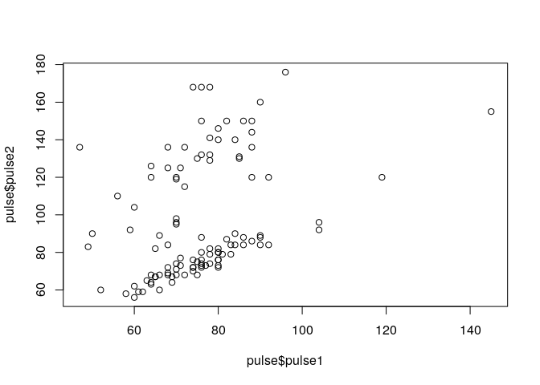
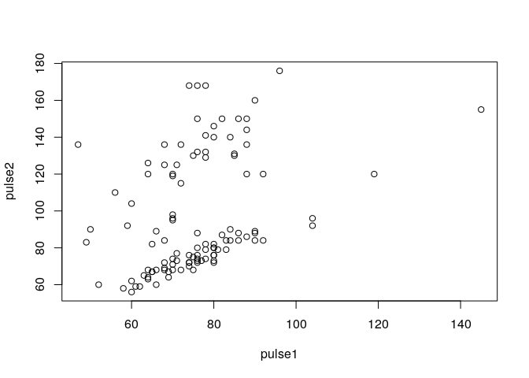
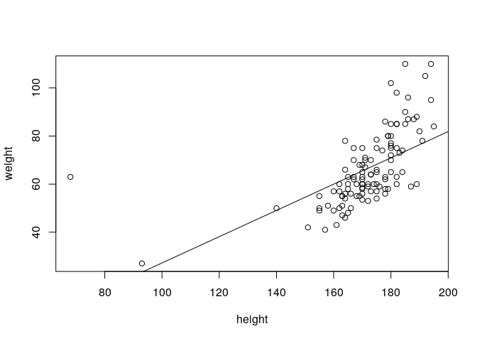

# Formula objects

Formula objects are the way to tell R that one variable depends on another. 

## Basics of formula objects

To specify a (statistical) model in which `y` depends on `x`, say


```r
y ~ x
```

```
y ~ x
```

We use a formula for more readable specification of code. For example, when plotting. Instead of


```r
plot(pulse$pulse1, pulse$pulse2)
```

<!-- -->

we say


```r
plot(pulse2 ~ pulse1, data=pulse)
```

<!-- -->

Note the reverse order!

If a function allows a formula as input it always has a `data` argument. This gives the data.frame (or other environment) in which the variables in the formula are interpreted.


## Use of formula objects in statistics

Formula objects can also be used in the syntax of tests and other functions, making them simpler. For example, consider the problem of comparing values of `pulse1` between males and females. We can use an unpaired t test for this, by writing:


```r
pulse1.male <- pulse$pulse1[survey$gender == 'male']
pulse1.female <- pulse$pulse1[survey$gender == 'female']
t.test(pulse1.male, pulse1.female)
```

```

	Welch Two Sample t-test

data:  pulse1.male and pulse1.female
t = 0.25755, df = 99.399, p-value = 0.7973
alternative hypothesis: true difference in means is not equal to 0
95 percent confidence interval:
 -4.469216  5.802550
sample estimates:
mean of x mean of y 
 76.00000  75.33333 
```

A much simpler way is to use a formula:


```r
t.test(pulse1 ~ gender, data = pulse)
```

```

	Welch Two Sample t-test

data:  pulse1 by gender
t = 1.3234, df = 106.3, p-value = 0.1885
alternative hypothesis: true difference in means is not equal to 0
95 percent confidence interval:
 -1.667268  8.362184
sample estimates:
mean in group female   mean in group male 
            77.50000             74.15254 
```

Many functions allow (or require!) formula as input.


## (*) The formula class

A formula is just a R object.


```r
class(y~x)
```

```
[1] "formula"
```

It can be stored in a variable and reused.


```r
form <- pulse1 ~ gender
t.test(form, data=pulse)
```

```

	Welch Two Sample t-test

data:  pulse1 by gender
t = 1.3234, df = 106.3, p-value = 0.1885
alternative hypothesis: true difference in means is not equal to 0
95 percent confidence interval:
 -1.667268  8.362184
sample estimates:
mean in group female   mean in group male 
            77.50000             74.15254 
```


- - -

> _Quick task(s)_:
> 
> Solve [the task(s)](03_regression.tasks.nocode.html#formula), and check your solution(s) [here](03_regression.tasks.code.html#formula).

- - -


# Simple linear regression

## The `lm` function

The command for linear regression is `lm` (for *linear model*). The linear model returns an object of class `lm`.


```r
fit <- lm(weight ~ height, data = pulse)
```

The output of `lm` is an object of class `lm`. 


```r
fit
```

```

Call:
lm(formula = weight ~ height, data = pulse)

Coefficients:
(Intercept)       height  
   -27.4398       0.5465  
```

```r
names(fit)
```

```
 [1] "coefficients"  "residuals"     "effects"       "rank"         
 [5] "fitted.values" "assign"        "qr"            "df.residual"  
 [9] "xlevels"       "call"          "terms"         "model"        
```

Some S3 objects have special functions defined for them. The following functions extract useful information from the `lm` object.


```r
summary(fit)
```

```

Call:
lm(formula = weight ~ height, data = pulse)

Residuals:
    Min      1Q  Median      3Q     Max 
-17.549  -8.197  -2.601   5.469  53.277 

Coefficients:
             Estimate Std. Error t value Pr(>|t|)    
(Intercept) -27.43977   12.73858  -2.154   0.0335 *  
height        0.54651    0.07392   7.393 3.23e-11 ***
---
Signif. codes:  0 '***' 0.001 '**' 0.01 '*' 0.05 '.' 0.1 ' ' 1

Residual standard error: 12.41 on 108 degrees of freedom
Multiple R-squared:  0.336,	Adjusted R-squared:  0.3299 
F-statistic: 54.66 on 1 and 108 DF,  p-value: 3.231e-11
```

```r
coef(fit)
```

```
(Intercept)      height 
-27.4397668   0.5465124 
```

```r
residuals(fit)
```

```
     1993_A      1993_B      1993_C      1993_D      1993_E      1993_F 
-10.1068721 -12.3859463  -1.8277979   4.8698559  -3.1068721   0.8814919 
     1993_G      1993_H      1993_I      1993_J      1993_K      1993_L 
 -4.0952361  -9.9208226  -6.1882608  -4.3743103   9.5326650 -11.8394339 
     1993_M      1993_N      1993_O      1993_P      1993_Q      1993_R 
  2.5326650 -15.7580452   1.0675414  36.3349796  -9.4673350  -0.9324586 
     1993_S      1993_T      1993_U      1993_V      1993_W      1993_X 
 -7.2812855  -7.2696495  -8.1998968   0.9280359  -6.6417484   2.9745167 
     1993_Y      1993_Z      1995_A      1995_B      1995_C      1995_D 
 -9.7464092   4.7070785  -5.4673350  -6.5603597 -15.8510699 -13.8394339 
     1995_E      1995_F      1995_G      1995_H      1995_I      1995_J 
  6.8001032  14.0675414  -3.0022114   3.8117392  -3.1998968  -6.6417484 
     1995_K      1995_L      1995_M      1995_N      1995_O      1995_P 
 16.3349796   3.0791774   0.2652268  -8.2696495  -2.1998968  -6.8394339 
     1995_Q      1995_R      1995_S      1995_T      1995_U      1995_V 
 -8.1185081  -5.4673350  -1.0952361 -16.1882608   3.9861526  12.9745167 
     1996_A      1996_B      1996_C      1996_D      1996_E      1996_F 
 -7.6533844   6.1722021 -17.3626743   0.4280043  11.1722021   0.9861526 
     1996_G      1996_H      1996_I      1996_J      1996_K      1996_L 
 -9.0254833   2.8931279  12.9745167  -7.9091866 -11.0022114   4.0675414 
     1996_M      1996_N      1996_O      1996_P      1996_Q      1996_R 
  6.0675414  11.6954425  -8.1882608  31.0675414  -7.8394339 -13.2812855 
     1996_S      1996_T      1996_U      1997_A      1997_B      1997_C 
-11.1998968   9.0675414  25.9745167 -13.0836001  12.7884672   5.6024177 
     1997_D      1997_E      1997_F      1997_G      1997_H      1997_I 
  9.6140537 -14.7347732 -13.5603597  -3.1068721 -11.9673350  -6.9673350 
     1997_J      1997_K      1997_L      1997_M      1997_N      1997_O 
-10.6417484   1.0559054  -7.5603597   4.9861526   5.0675414  31.4163683 
     1997_P      1997_Q      1997_R      1997_S      1997_T      1997_U 
 -0.8277979  27.5093930  16.4163683  12.1489301 -11.0952361 -14.1998968 
     1997_V      1997_W      1998_A      1998_B      1998_C      1998_D 
 10.3001032  21.7884672  16.1605661  -7.4673350  -4.7347732  15.8117392 
     1998_E      1998_F      1998_G      1998_H      1998_I      1998_J 
 -5.9324586  -3.4673350  -2.2696495  -2.7347732  -9.3743103  53.2769261 
     1998_K      1998_L      1998_M      1998_N      1998_O      1998_P 
 -2.4673350   9.6140537 -14.6417484   3.6141170 -17.5487237 -12.0254833 
     1998_Q      1998_R 
 -0.4673350  11.3349796 
```

```r
fitted.values(fit)
```

```
   1993_A    1993_B    1993_C    1993_D    1993_E    1993_F    1993_G    1993_H 
67.106872 70.385946 63.827798 79.130144 67.106872 73.118508 61.095236 64.920823 
   1993_I    1993_J    1993_K    1993_L    1993_M    1993_N    1993_O    1993_P 
62.188261 64.374310 65.467335 69.839434 65.467335 74.758045 70.932459 73.665020 
   1993_Q    1993_R    1993_S    1993_T    1993_U    1993_V    1993_W    1993_X 
65.467335 70.932459 63.281286 57.269650 68.199897 49.071964 61.641748 72.025483 
   1993_Y    1993_Z    1995_A    1995_B    1995_C    1995_D    1995_E    1995_F 
68.746409 69.292922 65.467335 66.560360 75.851070 69.839434 68.199897 70.932459 
   1995_G    1995_H    1995_I    1995_J    1995_K    1995_L    1995_M    1995_N 
60.002211 62.188261 68.199897 61.641748 73.665020 64.920823 62.734773 57.269650 
   1995_O    1995_P    1995_Q    1995_R    1995_S    1995_T    1995_U    1995_V 
68.199897 69.839434 73.118508 65.467335 61.095236 62.188261 66.013847 72.025483 
   1996_A    1996_B    1996_C    1996_D    1996_E    1996_F    1996_G    1996_H 
67.653384 63.827798 58.362674 72.571996 63.827798 66.013847 72.025483 67.106872 
   1996_I    1996_J    1996_K    1996_L    1996_M    1996_N    1996_O    1996_P 
72.025483 58.909187 60.002211 70.932459 70.932459 75.304558 62.188261 70.932459 
   1996_Q    1996_R    1996_S    1996_T    1996_U    1997_A    1997_B    1997_C 
69.839434 63.281286 68.199897 70.932459 72.025483 55.083600 74.211533 76.397582 
   1997_D    1997_E    1997_F    1997_G    1997_H    1997_I    1997_J    1997_K 
70.385946 62.734773 66.560360 67.106872 65.467335 65.467335 61.641748 76.944095 
   1997_L    1997_M    1997_N    1997_O    1997_P    1997_Q    1997_R    1997_S 
66.560360 66.013847 70.932459 78.583632 63.827798 77.490607 78.583632 75.851070 
   1997_T    1997_U    1997_V    1997_W    1998_A    1998_B    1998_C    1998_D 
61.095236 68.199897 68.199897 74.211533 69.839434 65.467335 62.734773 62.188261 
   1998_E    1998_F    1998_G    1998_H    1998_I    1998_J    1998_K    1998_L 
70.932459 65.467335 57.269650 62.734773 64.374310  9.723074 65.467335 70.385946 
   1998_M    1998_N    1998_O    1998_P    1998_Q    1998_R 
61.641748 23.385883 60.548724 72.025483 65.467335 73.665020 
```

Note that `summary(fit)` returns itself an object in which some additional things are calculated.


```r
summa <- summary(fit)
class(summa)
```

```
[1] "summary.lm"
```

```r
names(summa)
```

```
 [1] "call"          "terms"         "residuals"     "coefficients" 
 [5] "aliased"       "sigma"         "df"            "r.squared"    
 [9] "adj.r.squared" "fstatistic"    "cov.unscaled" 
```

Most useful is the regression table


```r
coef(summa)
```

```
               Estimate  Std. Error   t value     Pr(>|t|)
(Intercept) -27.4397668 12.73857886 -2.154068 3.345796e-02
height        0.5465124  0.07392117  7.393178 3.231467e-11
```

and the confidence intervals for all or some regression coefficients


```r
confint(fit)
```

```
                  2.5 %     97.5 %
(Intercept) -52.6898400 -2.1896935
height        0.3999878  0.6930369
```

```r
confint(fit, "height")
```

```
           2.5 %    97.5 %
height 0.3999878 0.6930369
```


##  Visualizing a regression 

We can easily visualize the regression using the same formula and fit object


```r
plot(weight ~ height, data=pulse)
abline(coef(fit))
```

<!-- -->


- - -

> _Quick task(s)_:
> 
> Solve [the task(s)](03_regression.tasks.nocode.html#lm), and check your solution(s) [here](03_regression.tasks.code.html#lm).

- - -


# Multiple regression and prediction

## Multiple terms in a formula

We can have multiple terms in a formula. This way we can do multiple regression


```r
fit <- lm(pulse2 ~ pulse1 + height, data=pulse)
fit
```

```

Call:
lm(formula = pulse2 ~ pulse1 + height, data = pulse)

Coefficients:
(Intercept)       pulse1       height  
   25.96489      0.86822      0.02984  
```

```r
summary(fit)
```

```

Call:
lm(formula = pulse2 ~ pulse1 + height, data = pulse)

Residuals:
   Min     1Q Median     3Q    Max 
-28.89 -23.05 -17.84  28.40  72.89 

Coefficients:
            Estimate Std. Error t value Pr(>|t|)    
(Intercept) 25.96489   39.90679   0.651 0.516688    
pulse1       0.86822    0.22380   3.879 0.000182 ***
height       0.02984    0.18427   0.162 0.871668    
---
Signif. codes:  0 '***' 0.001 '**' 0.01 '*' 0.05 '.' 0.1 ' ' 1

Residual standard error: 29.71 on 106 degrees of freedom
  (1 observation deleted due to missingness)
Multiple R-squared:  0.1309,	Adjusted R-squared:  0.1145 
F-statistic: 7.981 on 2 and 106 DF,  p-value: 0.0005904
```


## Predicting

We can use regression for prediction using the predict function. To predict we need two things. First, a fitted model object.


```r
fit <- lm(pulse2 ~ pulse1 + height, data=pulse)
```

Second, a data.frame with new data for our covariates


```r
new.data <- data.frame(pulse1=c(90, 80), height=c(c(173, 185)))
```

Now we can predict a value for a person with these covariates


```r
predict(fit, new.data)
```

```
       1        2 
109.2668 100.9426 
```


## (*) Interaction

Specifying interactions between variables in a formula: use `:` or `*`:

- `:` interaction only
- `*` interaction and main effects

Let us say that we want to explain `pulse2` by `pulse1`, `exercise` and `alcohol`, as well as a variable representing an interaction between `exercise` and `alcohol`. Two alternative ways of specifying the same model are


```r
lm(pulse2 ~ pulse1 + exercise + alcohol + exercise:alcohol, data=pulse)
```

```

Call:
lm(formula = pulse2 ~ pulse1 + exercise + alcohol + exercise:alcohol, 
    data = pulse)

Coefficients:
                (Intercept)                       pulse1  
                     6.0581                       0.8911  
                exerciselow             exercisemoderate  
                    17.6346                      24.1769  
                 alcoholyes       exerciselow:alcoholyes  
                    28.4487                     -21.3348  
exercisemoderate:alcoholyes  
                   -28.8261  
```

```r
lm(pulse2 ~ pulse1 + exercise*alcohol, data=pulse)
```

```

Call:
lm(formula = pulse2 ~ pulse1 + exercise * alcohol, data = pulse)

Coefficients:
                (Intercept)                       pulse1  
                     6.0581                       0.8911  
                exerciselow             exercisemoderate  
                    17.6346                      24.1769  
                 alcoholyes       exerciselow:alcoholyes  
                    28.4487                     -21.3348  
exercisemoderate:alcoholyes  
                   -28.8261  
```


## (*) The intercept term

We see that R automatically adds an intercept term to the model. You can suppress the intercept too, by adding either `+0` or `-1` to the formula. Suppressing the intercept has different effects if there are factor variables in your model or not. 

Suppression of the intercept means regression through the origin


```r
lm(weight ~ 0 + height, data=pulse)
```

```

Call:
lm(formula = weight ~ 0 + height, data = pulse)

Coefficients:
height  
 0.388  
```

Note that this is different if we have factors (see next part)!


- - -

> _Quick task(s)_:
> 
> Solve [the task(s)](03_regression.tasks.nocode.html#multiple), and check your solution(s) [here](03_regression.tasks.code.html#multiple).

- - -


