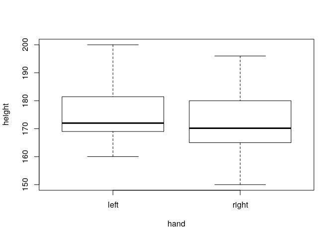
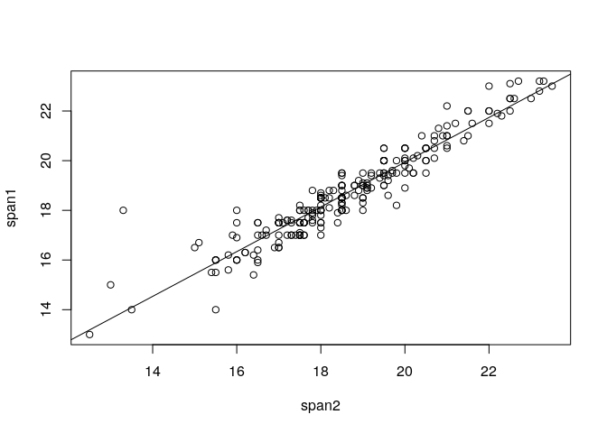
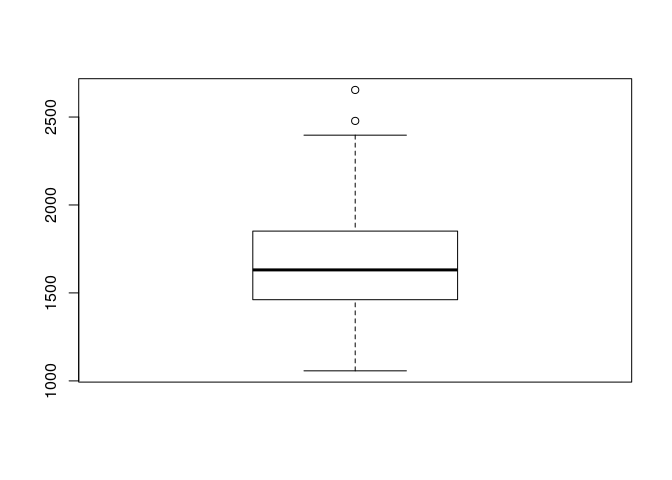
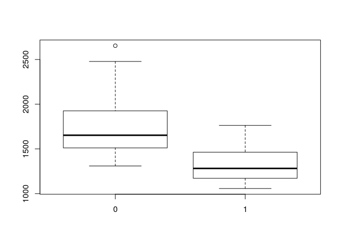

# Formulae basics {#formula}

Try to execute the tasks below using a formula in the syntax.

- In the survey data, compute an unpaired t-test for association between `height` and `hand`.


```r
t.test(height ~ hand, data=survey)
```

```
## 
## 	Welch Two Sample t-test
## 
## data:  height by hand
## t = 1.1211, df = 15.792, p-value = 0.279
## alternative hypothesis: true difference in means is not equal to 0
## 95 percent confidence interval:
##  -2.933466  9.504062
## sample estimates:
##  mean in group left mean in group right 
##            175.3920            172.1067
```

- Make a plot `height` (y-axis) against `hand` (x-axis).


```r
plot(height ~ hand, data=survey)
```

<!-- -->

- (*) Repeat the previous exercises using a formula stored as an object, then calling it in the syntax.


```r
form <- height ~ hand
t.test(form, data=survey)
plot(form, data=survey)
```

# Wilcoxon test and formula syntax {#formula}

- Compare the values of `pulse` between males and females in the survey data using a t test. Save the resulting p-value as a variable.


```r
t.test(pulse ~ gender, data = survey)
```

```
## 
## 	Welch Two Sample t-test
## 
## data:  pulse by gender
## t = 1.1176, df = 185.56, p-value = 0.2652
## alternative hypothesis: true difference in means is not equal to 0
## 95 percent confidence interval:
##  -1.465226  5.295013
## sample estimates:
## mean in group female   mean in group male 
##             75.18085             73.26596
```

```r
p.t <- t.test(pulse ~ gender, data = survey)$p.value
```


- Perform the same comparison, now using a Wilcoxon test, by means of a formula syntax. Hint: the syntax of the input in wilcox.test is similar to that needed for t.test. Save the resulting p-value as a variable.


```r
wilcox.test(pulse ~ gender, data = survey)
```

```
## 
## 	Wilcoxon rank sum test with continuity correction
## 
## data:  pulse by gender
## W = 4950.5, p-value = 0.1532
## alternative hypothesis: true location shift is not equal to 0
```

```r
p.w <- wilcox.test(pulse ~ gender, data = survey)$p.value
```

- Print the two computed p-values on the console, rounded off to 3 decimal places.


```r
round(p.t, 3)
```

```
## [1] 0.265
```

```r
round(p.w, 3)
```

```
## [1] 0.153
```

# Simple regression {#lm}


- Perform a linear regression of `span1` against `span2` from the survey data. Save the regression result yielded by `lm` as an object and check which components it has. 


```r
fit <-lm(span1 ~ span2, data=survey)
names(fit)
```

```
##  [1] "coefficients"  "residuals"     "effects"       "rank"         
##  [5] "fitted.values" "assign"        "qr"            "df.residual"  
##  [9] "xlevels"       "call"          "terms"         "model"
```

- Print the summary of the object by using the function `summary`. Save the summary produced as a separate object and check which components it has.


```r
summary(fit)
```

```
## 
## Call:
## lm(formula = span1 ~ span2, data = survey)
## 
## Residuals:
##     Min      1Q  Median      3Q     Max 
## -1.8876 -0.3376 -0.0378  0.3120  4.0925 
## 
## Coefficients:
##             Estimate Std. Error t value Pr(>|t|)    
## (Intercept)  1.93674    0.37238   5.201 4.37e-07 ***
## span2        0.90006    0.01991  45.203  < 2e-16 ***
## ---
## Signif. codes:  0 '***' 0.001 '**' 0.01 '*' 0.05 '.' 0.1 ' ' 1
## 
## Residual standard error: 0.5897 on 231 degrees of freedom
## Multiple R-squared:  0.8984,	Adjusted R-squared:  0.898 
## F-statistic:  2043 on 1 and 231 DF,  p-value: < 2.2e-16
```

```r
sum.fit <- summary(fit)
names(sum.fit)
```

```
##  [1] "call"          "terms"         "residuals"     "coefficients" 
##  [5] "aliased"       "sigma"         "df"            "r.squared"    
##  [9] "adj.r.squared" "fstatistic"    "cov.unscaled"
```


- Visualize the fitted regression line using a plot which includes the scatterplot of the observed variables `span1` and `span2`.


```r
plot(span1 ~ span2, data=survey)
abline(coef(fit))
```

<!-- -->

- What is the confidence interval for the slope (i.e. the coefficient of `span2`) in the regression?


```r
confint(fit, 'span2')
```

```
##           2.5 %    97.5 %
## span2 0.8608238 0.9392867
```

- (*) What is the exact p-value for the coefficient of `span1`? Hint: use the component `coefficients` of the summary object.


```r
sum.fit$coefficients
```

```
##              Estimate Std. Error   t value      Pr(>|t|)
## (Intercept) 1.9367408 0.37238105  5.200965  4.366490e-07
## span2       0.9000552 0.01991154 45.202683 1.057707e-116
```

```r
sum.fit$coefficients['span2', 'Pr(>|t|)']
```

```
## [1] 1.057707e-116
```


# Multiple regression {#multiple}

We look at the `swiss` data. In this data set we explain fertility of Swiss regions using various indicators.

- Check the dimensions of the data, row and column names.


```r
dim(swiss)
```

```
## [1] 47  6
```

```r
rownames(swiss)
```

```
##  [1] "Courtelary"   "Delemont"     "Franches-Mnt" "Moutier"     
##  [5] "Neuveville"   "Porrentruy"   "Broye"        "Glane"       
##  [9] "Gruyere"      "Sarine"       "Veveyse"      "Aigle"       
## [13] "Aubonne"      "Avenches"     "Cossonay"     "Echallens"   
## [17] "Grandson"     "Lausanne"     "La Vallee"    "Lavaux"      
## [21] "Morges"       "Moudon"       "Nyone"        "Orbe"        
## [25] "Oron"         "Payerne"      "Paysd'enhaut" "Rolle"       
## [29] "Vevey"        "Yverdon"      "Conthey"      "Entremont"   
## [33] "Herens"       "Martigwy"     "Monthey"      "St Maurice"  
## [37] "Sierre"       "Sion"         "Boudry"       "La Chauxdfnd"
## [41] "Le Locle"     "Neuchatel"    "Val de Ruz"   "ValdeTravers"
## [45] "V. De Geneve" "Rive Droite"  "Rive Gauche"
```

```r
colnames(swiss)
```

```
## [1] "Fertility"        "Agriculture"      "Examination"     
## [4] "Education"        "Catholic"         "Infant.Mortality"
```

```r
# Note that, except for the rownames, much information can also be obtained by using str:
str(swiss)
```

```
## 'data.frame':	47 obs. of  6 variables:
##  $ Fertility       : num  80.2 83.1 92.5 85.8 76.9 76.1 83.8 92.4 82.4 82.9 ...
##  $ Agriculture     : num  17 45.1 39.7 36.5 43.5 35.3 70.2 67.8 53.3 45.2 ...
##  $ Examination     : int  15 6 5 12 17 9 16 14 12 16 ...
##  $ Education       : int  12 9 5 7 15 7 7 8 7 13 ...
##  $ Catholic        : num  9.96 84.84 93.4 33.77 5.16 ...
##  $ Infant.Mortality: num  22.2 22.2 20.2 20.3 20.6 26.6 23.6 24.9 21 24.4 ...
```

- Perform a linear regression of `Fertility` with `Agriculture` and `Catholic` as the explanatory variables. 


```r
res <- lm(Fertility ~ Agriculture + Catholic, data=swiss)
summary(res)
```

```
## 
## Call:
## lm(formula = Fertility ~ Agriculture + Catholic, data = swiss)
## 
## Residuals:
##     Min      1Q  Median      3Q     Max 
## -29.863  -6.350   1.136   7.476  18.056 
## 
## Coefficients:
##             Estimate Std. Error t value Pr(>|t|)    
## (Intercept) 59.86392    3.98754  15.013   <2e-16 ***
## Agriculture  0.10953    0.07848   1.396   0.1698    
## Catholic     0.11496    0.04274   2.690   0.0101 *  
## ---
## Signif. codes:  0 '***' 0.001 '**' 0.01 '*' 0.05 '.' 0.1 ' ' 1
## 
## Residual standard error: 11.07 on 44 degrees of freedom
## Multiple R-squared:  0.2483,	Adjusted R-squared:  0.2141 
## F-statistic: 7.266 on 2 and 44 DF,  p-value: 0.001876
```

- What is the confidence interval of the regression coefficient of `Agriculture`?


```r
confint(res, 'Agriculture')
```

```
##                   2.5 %    97.5 %
## Agriculture -0.04864213 0.2676983
```

- Create a new dataset that excludes the region `Courtelary`. Hint: use logical indices and the rownames of the dataset.


```r
sel.court <- rownames(swiss) == "Courtelary"
swiss1 <- swiss[!sel.court, ]
```

- Fit the regression model again in the data set that leaves out the region `Courtelary`. Then use the fitted model to predict `Fertility` in `Courtelary`.


```r
fit1 <- lm(Fertility ~ Agriculture + Catholic, data=swiss1)
predict(fit1, swiss[sel.court,])
```

```
## Courtelary 
##   61.57388
```

- (*) Fit a model that uses Agriculture, Catholic, as well as their interaction.


```r
summary(lm(Fertility ~ Agriculture * Catholic, data=swiss))
```

```
## 
## Call:
## lm(formula = Fertility ~ Agriculture * Catholic, data = swiss)
## 
## Residuals:
##     Min      1Q  Median      3Q     Max 
## -29.614  -6.278   1.162   7.490  18.163 
## 
## Coefficients:
##                       Estimate Std. Error t value Pr(>|t|)    
## (Intercept)          6.067e+01  5.848e+00  10.374  2.8e-13 ***
## Agriculture          9.384e-02  1.145e-01   0.819    0.417    
## Catholic             9.004e-02  1.381e-01   0.652    0.518    
## Agriculture:Catholic 4.135e-04  2.177e-03   0.190    0.850    
## ---
## Signif. codes:  0 '***' 0.001 '**' 0.01 '*' 0.05 '.' 0.1 ' ' 1
## 
## Residual standard error: 11.2 on 43 degrees of freedom
## Multiple R-squared:  0.2489,	Adjusted R-squared:  0.1965 
## F-statistic:  4.75 on 3 and 43 DF,  p-value: 0.006001
```

- (*) Make a variable `P` that has the p-value of the interaction term in the last model. 


```r
fit <- lm(Fertility ~ Agriculture * Catholic, data=swiss)
summary(fit)
```

```
## 
## Call:
## lm(formula = Fertility ~ Agriculture * Catholic, data = swiss)
## 
## Residuals:
##     Min      1Q  Median      3Q     Max 
## -29.614  -6.278   1.162   7.490  18.163 
## 
## Coefficients:
##                       Estimate Std. Error t value Pr(>|t|)    
## (Intercept)          6.067e+01  5.848e+00  10.374  2.8e-13 ***
## Agriculture          9.384e-02  1.145e-01   0.819    0.417    
## Catholic             9.004e-02  1.381e-01   0.652    0.518    
## Agriculture:Catholic 4.135e-04  2.177e-03   0.190    0.850    
## ---
## Signif. codes:  0 '***' 0.001 '**' 0.01 '*' 0.05 '.' 0.1 ' ' 1
## 
## Residual standard error: 11.2 on 43 degrees of freedom
## Multiple R-squared:  0.2489,	Adjusted R-squared:  0.1965 
## F-statistic:  4.75 on 3 and 43 DF,  p-value: 0.006001
```

```r
summary(fit)$coefficients
```

```
##                          Estimate  Std. Error    t value     Pr(>|t|)
## (Intercept)          6.066872e+01 5.848314939 10.3737102 2.801410e-13
## Agriculture          9.383755e-02 0.114537225  0.8192756 4.171471e-01
## Catholic             9.003586e-02 0.138139972  0.6517727 5.180166e-01
## Agriculture:Catholic 4.135083e-04 0.002176617  0.1899775 8.502208e-01
```

```r
# The above gives the same result as 
coef( summary(fit) )
```

```
##                          Estimate  Std. Error    t value     Pr(>|t|)
## (Intercept)          6.066872e+01 5.848314939 10.3737102 2.801410e-13
## Agriculture          9.383755e-02 0.114537225  0.8192756 4.171471e-01
## Catholic             9.003586e-02 0.138139972  0.6517727 5.180166e-01
## Agriculture:Catholic 4.135083e-04 0.002176617  0.1899775 8.502208e-01
```

```r
# The coefficients table, extracted by either way above, can be manipulated as other objects
# In particular, the desired p-value is available via:
P <- coef(summary(fit))['Agriculture:Catholic', 'Pr(>|t|)']
```


# Tests, graphs and formula objects {#formula}


The dataset `Seatbelts` contains data relating to people killed or seriously injured monthly in car accidents, between Jan 1969 and Dec 1984, in the UK. Compulsory wearing of seat belts was introduced on 31st January 1983.

- Check the help page for the data set, and the structure of the dataset via `str`. You will see that the data's 8th column called `law` corresponds to a binary variable indicating whether or not the seat belt law was already in effect in that month. Produce a table of this variable. Note: you will need to select it via square brackets, either by the column name, or by the column number. For this sort of object, a `$` cannot be used for selection.


```r
table(Seatbelts[, 8])
```

```
## 
##   0   1 
## 169  23
```

```r
# table(Seatbelts[,"law"]) # also works
# Selection via Seatbelts$law does not work because this is not available for mts objects 
# Check that Seatbelts is of this class
```

- The number of  deaths or serious injuries is given by the column `drivers`. Compute its median using the function `median`, storing it into a variable.


```r
med.drivers <- median( Seatbelts[, "drivers" ] )
```

- Make a boxplot of `drivers`. 


```r
boxplot(Seatbelts[, "drivers"])
```

<!-- -->

- Make a boxplot of `drivers` according to whether or not the law was already in effect. Hint: use a formula object to divide entries in `drivers` according to the groups defined by `law`, and use this object as input for the boxplot.


```r
boxplot(Seatbelts[, "drivers"] ~ Seatbelts[, "law"])
```

<!-- -->

- Use a Wilcoxon test to compare the number of driver deaths or serious injuries before and after the law was introduced. Use the same formula  in the function call as the one used for the boxplot above. Save the resulting p-value as a variable


```r
wilcox.test(Seatbelts[, "drivers"] ~ Seatbelts[, "law"])
```

```
## 
## 	Wilcoxon rank sum test with continuity correction
## 
## data:  Seatbelts[, "drivers"] by Seatbelts[, "law"]
## W = 3458, p-value = 1.402e-09
## alternative hypothesis: true location shift is not equal to 0
```

```r
p.w <- wilcox.test(Seatbelts[, "drivers"] ~ Seatbelts[, "law"])$p.value
```

- Create a binary variable indicating whether or not the number of drivers deaths or serious injuries was above its median. Produce a table of this variable and the `law` variable. Store this table in an object.


```r
ind.high <- Seatbelts[, "drivers"] > median(Seatbelts[, "drivers"])
table(ind.high, Seatbelts[, "law"])
```

```
##         
## ind.high  0  1
##    FALSE 75 21
##    TRUE  94  2
```

```r
mytable <- table(ind.high,Seatbelts[, "law"])
```

- Use a chi-square test to check if there seems to be any association between the number of drivers deaths or serious injuries being higher than its median, and the law coming into effect. Since one of the observed counts in the table is small, also check evidence for this association using a Fisher's exact test. In both test calls, use the table created as input. Save the p-values computed as variables.


```r
chisq.test(mytable)
```

```
## 
## 	Pearson's Chi-squared test with Yates' continuity correction
## 
## data:  mytable
## X-squared = 16.004, df = 1, p-value = 6.32e-05
```

```r
p.chi <- chisq.test(mytable)$p.value
fisher.test(mytable)
```

```
## 
## 	Fisher's Exact Test for Count Data
## 
## data:  mytable
## p-value = 2.383e-05
## alternative hypothesis: true odds ratio is not equal to 1
## 95 percent confidence interval:
##  0.008460765 0.330444509
## sample estimates:
## odds ratio 
## 0.07681076
```

```r
p.fis <- fisher.test(mytable)$p.value
```

- Print the three p-values computed with 3 decimal places.


```r
round(p.w, 3)
```

```
## [1] 0
```

```r
round(p.chi, 3)
```

```
## [1] 0
```

```r
round(p.fis, 3)
```

```
## [1] 0
```


