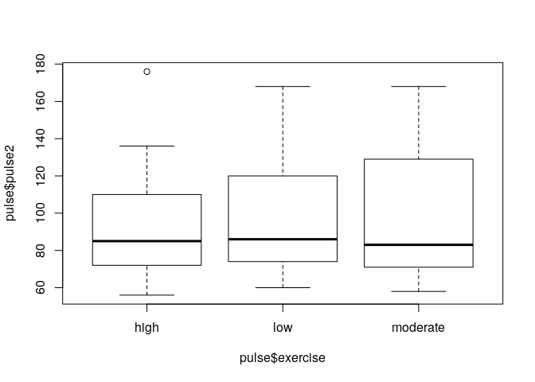
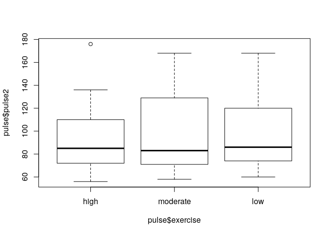
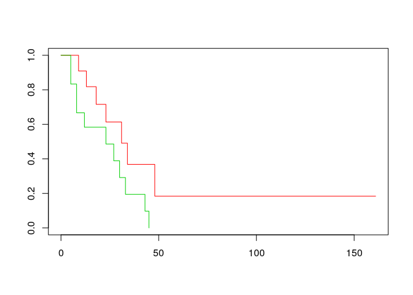

# Factors revisited

We have seen an introduction to factors in the section 'Basic data types'. Remember that they are variables that define categories. We can find out the category names involved using `levels` and tabulate factors:


```r
levels(pulse$exercise)
```

```
[1] "high"     "low"      "moderate"
```

```r
table(pulse$exercise)
```

```

    high      low moderate 
      14       37       59 
```

Note that the category names given by its levels come typically in alphabetical order. In the example above, this order does not correspond to the intrinsic order of the categories, in which the extremes are given by `high` and `low`, with `intermediate` in the middle, rather than the last one. This is not a big problem for a table, but it is not ideal for a graph. Indeed, a boxplot of `pulse2` according to the groups defined by `exercise`  looks like:


```r
boxplot(pulse$pulse2 ~ pulse$exercise)
```

<!-- -->

So we would like to re-order the factor levels so that they correspond to the intrinsic order of the categories.

## Reordering a factor

To change the order of the category levels, we create the factor again by giving its levels in the correct order:


```r
pulse$exercise <- factor(pulse$exercise, levels=c('high', 'moderate', 'low'))
```

We can check that the re-ordering has worked:


```r
levels(pulse$exercise)
```

```
[1] "high"     "moderate" "low"     
```

```r
table(pulse$exercise)
```

```

    high moderate      low 
      14       59       37 
```

```r
boxplot(pulse$pulse2 ~ pulse$exercise)
```

<!-- -->


## Changing factor labels

If you want to change the category labels only, without re-ordering them, assign new values to the `levels` of a factor.


```r
pulse$exercise2 <- pulse$exercise
levels(pulse$exercise2) <- c("H", "I", "L")
table(pulse$exercise2)
```

```

 H  I  L 
14 59 37 
```

We can use similar code to merge categories of a factor. For example, to merge the categories `H` and `I`, assign to them the same label:


```r
pulse$exercise3 <- pulse$exercise
levels(pulse$exercise3) <- c("H.I", "H.I" , "L")
```


## Turning a continuous variable into categories

Use `cut` to categorise a continuous variable and turn into a factor variable. Note that when calling `cut` the break points between categories need to be given, including the maximum and minimum values of the original variable.


```r
pulse$height4 <- cut(pulse$height, c(min(pulse$height)-1, 160, 170, 180, max(pulse$height)))
class(pulse$height4)
```

```
[1] "factor"
```

```r
table(pulse$height4)
```

```

 (67,160] (160,170] (170,180] (180,195] 
       11        38        37        24 
```


You may want to change the labels to something prettier.


```r
levels(pulse$height4) <- c('-160', '160-170', '170-180', '180+')
table(pulse$height4)
```

```

   -160 160-170 170-180    180+ 
     11      38      37      24 
```


## (*) Combining factors

The `:` operator can be used to make a new factor with all combinations of two (or more) factors

```r
pulse$smokes:pulse$alcohol
```

```
  [1] no:yes  no:yes  no:yes  no:yes  no:yes  no:yes  no:yes  no:yes  no:yes 
 [10] no:yes  no:yes  no:no   yes:yes no:yes  no:yes  no:yes  no:no   no:yes 
 [19] yes:no  no:no   no:no   no:no   no:no   yes:yes no:no   no:no   no:yes 
 [28] no:no   no:yes  no:yes  no:yes  yes:yes no:no   no:no   no:yes  no:no  
 [37] no:no   no:no   no:yes  no:yes  no:yes  no:yes  yes:no  no:yes  no:yes 
 [46] no:no   no:no   yes:yes no:yes  yes:yes no:no   no:yes  no:yes  no:yes 
 [55] no:yes  no:yes  no:yes  no:no   no:no   no:yes  no:no   no:yes  no:no  
 [64] no:yes  no:no   no:yes  no:yes  no:yes  no:yes  no:no   no:yes  no:no  
 [73] no:yes  no:no   no:no   no:yes  no:no   no:no   no:yes  no:yes  no:yes 
 [82] no:no   no:no   no:no   no:yes  no:no   no:yes  no:no   no:yes  no:yes 
 [91] no:yes  no:yes  yes:yes yes:yes no:yes  no:no   no:no   no:yes  no:yes 
[100] yes:yes no:no   no:no   no:yes  no:no   yes:yes no:no   no:no   no:yes 
[109] no:yes  no:yes 
Levels: no:no no:yes yes:no yes:yes
```


- - -

> _Quick task(s)_:
> 
> Solve [the task(s)](04_advanced_factors.tasks.nocode.html#levels), and check your solution(s) [here](04_advanced_factors.tasks.code.html#levels).

- - -


# ANOVA and regression with factors

An ANOVA analysis can be run in R by using the results of a regression model fit, such as from `lm`.

## Regression model fit

Say you fit a regression model of `pulse2` on `exercise`, which already had its categories reordered:


```r
table(pulse$exercise)
```

```

    high moderate      low 
      14       59       37 
```

```r
fit <- lm(pulse2 ~ exercise, data=pulse)
summary(fit)
```

```

Call:
lm(formula = pulse2 ~ exercise, data = pulse)

Residuals:
   Min     1Q Median     3Q    Max 
-39.45 -24.45 -12.97  27.55  82.36 

Coefficients:
                 Estimate Std. Error t value Pr(>|t|)    
(Intercept)        93.643      8.510  11.004   <2e-16 ***
exercisemoderate    3.805      9.481   0.401    0.689    
exerciselow         3.330      9.991   0.333    0.740    
---
Signif. codes:  0 '***' 0.001 '**' 0.01 '*' 0.05 '.' 0.1 ' ' 1

Residual standard error: 31.84 on 106 degrees of freedom
  (1 observation deleted due to missingness)
Multiple R-squared:  0.001533,	Adjusted R-squared:  -0.01731 
F-statistic: 0.08139 on 2 and 106 DF,  p-value: 0.9219
```

In the results, `exercisemoderate` represents the effect of `exercise='moderate'` versus the reference category `exercise='high'`. By default, the first level of the factor is taken as the reference category, and this is often the first level in alphabetical order. 

The model fit above yields tests per category of `exercise`, compared with the reference category. However, a test for the effect of the entire variable `exercise` is not directly available. This can be obtained with ANOVA (Analysis of Variance).

## The ANOVA table and F-test

The ANOVA table can be obtained by using the function `anova` and the model fit `fit`:


```r
anova(fit)
```

```
Analysis of Variance Table

Response: pulse2
           Df Sum Sq Mean Sq F value Pr(>F)
exercise    2    165   82.51  0.0814 0.9219
Residuals 106 107461 1013.78               
```

We can also compare two model fits using ANOVA. Say that we want to check if the above model fit improves by including `gender` in the model. Then we fit a model with both `exercise` and `gender`, and compare this new fit with the above one:


```r
fit2 <- lm(pulse2 ~ exercise + gender, data=pulse)
anova(fit, fit2)
```

```
Analysis of Variance Table

Model 1: pulse2 ~ exercise
Model 2: pulse2 ~ exercise + gender
  Res.Df    RSS Df Sum of Sq     F Pr(>F)
1    106 107461                          
2    105 107117  1    343.83 0.337 0.5628
```


Note that `lm` by default removes any subjects which have missing values in at least one of the covariates. This means that the number of subjects in `fit` and `fit0` may be different and error returned. In that case remove subjects with missing values manually (or do imputation or something more fancy).


## (*) Model fit without a reference category

When fitting a regression model, we can do without a reference category in a model fit by suppressing the intercept:


```r
lm(pulse2 ~ 0 + gender, data=pulse)
```

```

Call:
lm(formula = pulse2 ~ 0 + gender, data = pulse)

Coefficients:
genderfemale    gendermale  
       98.92         95.00  
```

The coefficient now represents the mean in the group (male or female), instead of a comparison between males and females (such a comparison is called a contrast).

Note that the reference category is only suppressed for the first factor in the formula:


```r
lm(pulse2 ~ 0 + gender + ran, data=pulse)
```

```

Call:
lm(formula = pulse2 ~ 0 + gender + ran, data = pulse)

Coefficients:
genderfemale    gendermale        ransat  
      127.99        125.80        -51.92  
```

Note that suppressing the intercept has a different effect for explanatory factors and for continuous explanatory variables.


# (*) Generalized linear models and survival

Regression models can be run using the function `glm` (generalized linear model), which has very similar syntax to `lm`. Amongst useful models are logistic models.

## (*) Logistic regression and ANOVA

For logistic regression, use `glm`  with slot `family=binomial`.


```r
## fit <- glm(alcohol ~ gender + smokes + exercise, family=binomial, data=pulse)
summary(fit)
```

```

Call:
lm(formula = pulse2 ~ exercise, data = pulse)

Residuals:
   Min     1Q Median     3Q    Max 
-39.45 -24.45 -12.97  27.55  82.36 

Coefficients:
                 Estimate Std. Error t value Pr(>|t|)    
(Intercept)        93.643      8.510  11.004   <2e-16 ***
exercisemoderate    3.805      9.481   0.401    0.689    
exerciselow         3.330      9.991   0.333    0.740    
---
Signif. codes:  0 '***' 0.001 '**' 0.01 '*' 0.05 '.' 0.1 ' ' 1

Residual standard error: 31.84 on 106 degrees of freedom
  (1 observation deleted due to missingness)
Multiple R-squared:  0.001533,	Adjusted R-squared:  -0.01731 
F-statistic: 0.08139 on 2 and 106 DF,  p-value: 0.9219
```

When using `anova` in `glm`, the default is not to give a p-value. If you want it, explicitly ask for one. In case of the logistic model, the adequate way to compute the ANOVA p-value is via the likelihood ratio test (LRT):


```r
anova(fit, test='LRT')
```

```
Analysis of Variance Table

Response: pulse2
           Df Sum Sq Mean Sq F value Pr(>F)
exercise    2    165   82.51  0.0814 0.9219
Residuals 106 107461 1013.78               
```


## (*) Survival analysis

Survival analysis methods are available in the `survival` package, which is installed automatically with the base package. The syntax is similar to `lm` and `glm`, except that the response has to be a `Surv` object, built from two separate variables giving time and event.

We do not have survival times in the `pulse` data, so we use the `aml` data from the `survival` package.


```r
library(survival)
## ?aml
with(aml, Surv(time, status))
```

```
 [1]   9   13   13+  18   23   28+  31   34   45+  48  161+   5    5    8    8 
[16]  12   16+  23   27   30   33   43   45 
```

To draw Kaplan-Meier curves, use `survfit`:


```r
fit <- survfit(Surv(time, status) ~ x, data=aml)
plot(fit, col=2:3)
```

<!-- -->


A log-rank test can be computed using:


```r
survdiff(Surv(time, status) ~ x, data=aml)
```

```
Call:
survdiff(formula = Surv(time, status) ~ x, data = aml)

                 N Observed Expected (O-E)^2/E (O-E)^2/V
x=Maintained    11        7    10.69      1.27       3.4
x=Nonmaintained 12       11     7.31      1.86       3.4

 Chisq= 3.4  on 1 degrees of freedom, p= 0.07 
```

A Cox model can be fitted as follows:


```r
coxph(Surv(time, status) ~ x, data=aml)
```

```
Call:
coxph(formula = Surv(time, status) ~ x, data = aml)

                 coef exp(coef) se(coef)     z      p
xNonmaintained 0.9155    2.4981   0.5119 1.788 0.0737

Likelihood ratio test=3.38  on 1 df, p=0.06581
n= 23, number of events= 18 
```


As before, each object can be stored separately. In particular, the Surv object can be saved and the entire analysis run using it. 

The result of coxph can be stored as an object and manipulated in most ways like a `lm` or `glm` object. In particular we can use `anova` to compare different model fits.


- - -

> _Quick task(s)_:
> 
> Solve [the task(s)](04_advanced_factors.tasks.nocode.html#anova), and check your solution(s) [here](04_advanced_factors.tasks.code.html#anova).

- - -


