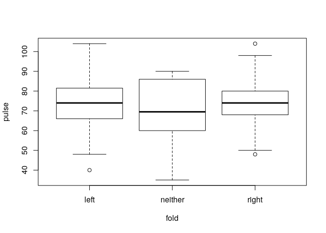

# Changing levels {#levels}

In the `survey` data

- Reorder the levels of the `smokes` variable in a more natural way.


```r
levels(survey$smokes)
```

```
[1] "heavy" "never" "occas" "regul"
```

```r
survey$smokes <- factor(survey$smokes, levels=c("never", "occas", "regul", "heavy"))
levels(survey$smokes)
```

```
[1] "never" "occas" "regul" "heavy"
```

- Make a new version of the `smokes` variable that puts the heavy, regular and occasional smokers together in the same category.


```r
survey$smokes2 <- survey$smokes
levels(survey$smokes2) <- c('no', 'yes', 'yes', 'yes')
```

- Tabulate the old and new smokes variables against each other to check that the category grouping worked as expected.


```r
table(survey$smokes, survey$smokes2)
```

```
       
         no yes
  never 186   0
  occas   0  19
  regul   0  17
  heavy   0  11
```


# Creating factors from existing variables

Use the `survey` data for the exercises below.

- Make a categorical variable that indicates whether subjects have pulse above or at most equal to the median pulse. Beware of missing values!


```r
med <- median(survey$pulse, na.rm=TRUE)
# This can be done in two ways. 
# First, using a logical variable, where pulse is compared to its median
survey$pulse2 <- survey$pulse > med
# The second way is to use cut. Here, when computing minimum and maximum,
# you need to indicate that NA entries are to be ignored, as with the function to compute the median
survey$pulse2 <- cut(survey$pulse, c(min(survey$pulse, na.rm = TRUE), 
                                     med, max(survey$pulse, na.rm = TRUE)))
```

- (*) Make a new factor with four categories: `lefthanded woman`, `righthanded woman`, `lefthanded man`, `righthanded man`. Hint: use `:` to combine `gender` and `hand`.


```r
survey$genderhand <- survey$gender:survey$hand
```

- (*) Give the factor the levels given above: `lefthanded woman`, etc.

```r
levels(survey$genderhand) <- c('lefthanded woman', 'righthanded woman', 'lefthanded man', 'righthanded man')
```


# Regression with factors {#anova}

- In the `survey` data, use ANOVA to see if `pulse` is different between the `fold` groups. Hint: use `lm` to fit a model where `pulse` is explained by `fold`, then use ANOVA on the model fit.


```r
fit <- lm(pulse ~ fold, data=survey)
summary(fit)
```

```

Call:
lm(formula = pulse ~ fold, data = survey)

Residuals:
    Min      1Q  Median      3Q     Max 
-34.467  -7.789  -0.563   6.603  29.533 

Coefficients:
            Estimate Std. Error t value Pr(>|t|)    
(Intercept) 74.46667    1.35660  54.892   <2e-16 ***
foldneither -5.56667    3.95512  -1.407    0.161    
foldright    0.09644    1.78337   0.054    0.957    
---
Signif. codes:  0 '***' 0.001 '**' 0.01 '*' 0.05 '.' 0.1 ' ' 1

Residual standard error: 11.75 on 185 degrees of freedom
  (45 observations deleted due to missingness)
Multiple R-squared:  0.0116,	Adjusted R-squared:  0.0009157 
F-statistic: 1.086 on 2 and 185 DF,  p-value: 0.3398
```

```r
anova(fit)
```

```
Analysis of Variance Table

Response: pulse
           Df  Sum Sq Mean Sq F value Pr(>F)
fold        2   299.7  149.85  1.0857 0.3398
Residuals 185 25534.9  138.03               
```

- Which category of `fold` corresponds to the intercept in this regression model? Why is that?


```r
# The intercept involves the first level of the factor fold. This is given below:
levels(survey$fold)[1]
```

```
[1] "left"
```

```r
# You can check this by verifying that this is the only level that does not appear explicitly in the coefficients table of the model fit summary:
summary(fit)$coefficients
```

```
               Estimate Std. Error     t value      Pr(>|t|)
(Intercept) 74.46666667   1.356596 54.89228054 1.952767e-116
foldneither -5.56666667   3.955124 -1.40745693  1.609699e-01
foldright    0.09644013   1.783372  0.05407739  9.569319e-01
```


- Reorder the levels of `fold` so that the category `fit` is the first level, and refit the model. 


```r
survey$fold2 <- factor(survey$fold, levels=c('right', 'neither', 'left'))
fit <- lm(pulse ~ fold2, data=survey)
summary(fit)
```

```

Call:
lm(formula = pulse ~ fold2, data = survey)

Residuals:
    Min      1Q  Median      3Q     Max 
-34.467  -7.789  -0.563   6.603  29.533 

Coefficients:
             Estimate Std. Error t value Pr(>|t|)    
(Intercept)  74.56311    1.15761  64.411   <2e-16 ***
fold2neither -5.66311    3.89136  -1.455    0.147    
fold2left    -0.09644    1.78337  -0.054    0.957    
---
Signif. codes:  0 '***' 0.001 '**' 0.01 '*' 0.05 '.' 0.1 ' ' 1

Residual standard error: 11.75 on 185 degrees of freedom
  (45 observations deleted due to missingness)
Multiple R-squared:  0.0116,	Adjusted R-squared:  0.0009157 
F-statistic: 1.086 on 2 and 185 DF,  p-value: 0.3398
```

- Make boxplots of `pulse` values for each of the groups defined by `fold`. Hint: use as input for the boxplot the same formula used for the `lm`.


```r
boxplot(pulse ~ fold, data=survey)
```

<!-- -->

```r
# Note that the plot function would have given the same result here:
# plot(pulse ~ fold, data=survey)
```

- Fit a model to explain `pulse` by `fold`, and save the model fit in an object.


```r
fit1 <- lm(pulse ~ fold , data=survey)
```

- Fit now a model to explain `pulse` by both `fold` and `clap`, and save the model fit in an object. 


```r
fit2 <- lm(pulse ~ fold + clap, data=survey)
```

- Does `clap` have (statistical) added value in the model that already contains `fold`? Hint: use `anova` to compare the model fits already obtained.


```r
anova(fit1, fit2)
```

```
Analysis of Variance Table

Model 1: pulse ~ fold
Model 2: pulse ~ fold + clap
  Res.Df   RSS Df Sum of Sq      F Pr(>F)
1    185 25535                           
2    183 25411  2    124.17 0.4471 0.6402
```


- (*) Now fit a model where `pulse` is explained by  `clap` only, and compare the fit with that using both `clap` and `fold`.  


```r
fit3 <- lm(pulse ~ clap , data=survey)
anova(fit3, fit2)
```

```
Analysis of Variance Table

Model 1: pulse ~ clap
Model 2: pulse ~ fold + clap
  Res.Df   RSS Df Sum of Sq     F Pr(>F)
1    185 25687                          
2    183 25411  2     276.6 0.996 0.3713
```


# (*) Logistic regression

In the quine data (from the library MASS, so remember to load this library using `library(MASS)`),  learning speed is studied in context of a number of variables.

- Make a logistic regression model to predict learning speed (`Lrn`) based on `Eth`, `Age` and `Sex`.


```r
library(MASS)
```

```

Attaching package: 'MASS'
```

```
The following object is masked _by_ '.GlobalEnv':

    survey
```

```r
fit <- glm(Lrn ~ Eth + Age + Sex, data=quine, family=binomial)
```

- Is there a significant relationship between `Age` and `Lrn`?
  

```r
fit0 <- glm(Lrn ~ Eth + Sex, data=quine, family=binomial)
anova(fit, fit0, test='LRT')
```

```
Analysis of Deviance Table

Model 1: Lrn ~ Eth + Age + Sex
Model 2: Lrn ~ Eth + Sex
  Resid. Df Resid. Dev Df Deviance  Pr(>Chi)    
1       140     141.90                          
2       143     196.17 -3  -54.268 9.838e-12 ***
---
Signif. codes:  0 '***' 0.001 '**' 0.01 '*' 0.05 '.' 0.1 ' ' 1
```

