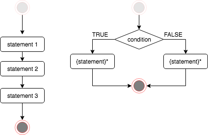

## User-defined Functions

Functions are constructs that encapsulate series of statements for convenience so you do not repeat the same statements all over again when needed. 

**Function construct:** 


```r
# (1) default return value is the last statment 
functionName <- function(...) {
  statement
  ...
  <value>
} 

# (2) return(...)
functionName <- function(...) {
  statement
  ...
  return(<value>)
} 
```

**Example:**

The following function `add_one` increments its argument by 1:


```r
add_one <- function(x) {
	x + 1
}

add_one(2)
```

```
[1] 3
```

```r
add_one(-1)
```

```
[1] 0
```

Now let's update  our function to calculate $x^2 + 1$ :


```r
square_add_one <- function(x) {
	result <- x^2    # choose a variable for temporary result
	result + 1
}

square_add_one(2) # 2^2 + 1 = 5
```

```
[1] 5
```

```r
square_add_one(-1) # (-1)^2 + 1 = 2
```

```
[1] 2
```

The following versions of this functions are all equivalent:


```r
# (v1) One operation per line.
square_add_one <- function(x) {
	result <- x^2
	result <- result + 1
	result    # The last statement is returned as the value.
}
# (v2) No additional 'result' variable needed 
square_add_one <- function(x) {
	x^2 + 1
}
```

**Multiple arguments** Functions may take as many arguments as needed. Recall the function `add_one` defined above, now we would like to have a more `generic` function to increment by a value other 
than a constant `1` :


```r
increment <- function(x,i) {
  # increment x by i
  x + i
}

increment(2,1)             # <=> add_one(2)
```

```
[1] 3
```

```r
increment(11,2)            # increment 11 by 2
```

```
[1] 13
```

You may use the argument names explicitly:  


```r
increment( x = 14, i = 7 ) # increment 14 by 7
```

```
[1] 21
```


Now let's write a function which is not already part of the base R, e.g. `odd`. This function will take as an argument a whole number and returns a logical `TRUE` if the number is an odd number and FALSE otherwise.

A whole number is odd when it is not integer divisible by 2. We can do this by taking it's remainder of integer division (`%%` operator) by 2 and see whether it is non-zero:


```r
odd <- function(x) {
  x %% 2 != 0
}

odd(31) 
```

```
[1] TRUE
```

```r
odd( x = 6 )
```

```
[1] FALSE
```

**Observations:**

  - User-defined functions lead to a more structured code.
  - Variables declared inside a function cease to exist once the function terminates.
  - Arguments are given in the same order as they are declared in the function except when the argument names are provided explicitly. 


- - -

> _Quick task(s)_:
> 
> Solve [the task(s)](01_userDefinedFunctions.tasks.nocode.html#functions0), and check your solution(s) [here](01_userDefinedFunctions.tasks.code.html#functions0).

- - -

# Control flow constructs 

Or `conditional statements` are constructs controlling the program sequence being executed. Based on the conditions we impose into the program we can influence the outcome. 

 <!-- <center></center> -->

## Sequential execution


```r
statement_1
statement_2; statement_3
```

## Conditional execution: if


```r
# Only if 'condition' variable evaluates to TRUE the 
# statement_T is executed.
#
# condition is TRUE  =>  statement_A ; statement_T ; statement_B
# condition is FALSE =>  statement_A ; statement_B
statement_A
if ( condition ) {
  statement_T
}
statement_B
```

## Conditional execution: if/else


```r
# condition is TRUE  =>  statement_A ; statement_T ; statement_B
# condition is FALSE =>  statement_A ; statement_F ; statement_B
statement_A
if ( condition ) {
  statement_T
} else {
  statement_F
}
statement_B
```

<!-- [<small>[doc:if]</small>](http://cran.r-project.org/doc/manuals/r-release/R-lang.html#if) --> 

**Example:**

Let's take the following excerpt from the World Health Organization (WHO): 


*An adult is a person older than 19 years of age unless national law defines a person as being an adult at an earlier age. An adolescent is a person aged 10 to 19 years inclusive. A child is a person 19 years or younger unless national law defines a person to be an adult at an earlier age. However, in these guidelines when a person falls into the 10 to 19 age category they are referred to as an adolescent (see adolescent definition). An infant is a child younger than one year of age.*


Now we would like to write a function, given the age in years, to evaluate the appropriate age group label for us. For this we need conditional statements.

**Important** First we enumerate the age group categories:

<center>
<table class='gmisc_table' style='border-collapse: collapse; margin-top: 1em; margin-bottom: 1em;' >
<thead>
<tr>
<th style='border-bottom: 1px solid grey; border-top: 2px solid grey;'> </th>
<th style='border-bottom: 1px solid grey; border-top: 2px solid grey; text-align: center;'>classification</th>
<th style='border-bottom: 1px solid grey; border-top: 2px solid grey; text-align: center;'>bmi</th>
<th style='border-bottom: 1px solid grey; border-top: 2px solid grey; text-align: center;'>notation</th>
</tr>
</thead>
<tbody>
<tr>
<td style='text-align: left;'>1</td>
<td style='text-align: center;'>adult</td>
<td style='text-align: center;'>\>19</td>
<td style='text-align: center;'>(19,∞)</td>
</tr>
<tr style='background-color: #f7f7f7;'>
<td style='background-color: #f7f7f7; text-align: left;'>2</td>
<td style='background-color: #f7f7f7; text-align: center;'>adolescent</td>
<td style='background-color: #f7f7f7; text-align: center;'>\>=10 and <=19</td>
<td style='background-color: #f7f7f7; text-align: center;'>[10,19]</td>
</tr>
<tr>
<td style='text-align: left;'>3</td>
<td style='text-align: center;'>child</td>
<td style='text-align: center;'>\>=1  and <=9</td>
<td style='text-align: center;'>[1,9]</td>
</tr>
<tr style='background-color: #f7f7f7;'>
<td style='background-color: #f7f7f7; border-bottom: 2px solid grey; text-align: left;'>4</td>
<td style='background-color: #f7f7f7; border-bottom: 2px solid grey; text-align: center;'>infant</td>
<td style='background-color: #f7f7f7; border-bottom: 2px solid grey; text-align: center;'><1</td>
<td style='background-color: #f7f7f7; border-bottom: 2px solid grey; text-align: center;'>(-∞,1)</td>
</tr>
</tbody>
</table>
</center>

Here is a template of the `AgeGroup` function:


```r
#
# Template
#
AgeGroup <- function(x) { 
  # x : is age in year
}

AgeGroup(0)   #  "infant"
AgeGroup(10)  #  "adolescent"
AgeGroup(9)   #  "child"
AgeGroup(20)  #  "adult"
```

**Scenario 1 : if ** 

Let's first assume that everybody is a child:


```r
AgeGroup <- function(x) { 
  # x : is age in year
  theLabel <- "child"
  theLabel
}

AgeGroup(0)   #  "infant"
```

```
[1] "child"
```

```r
AgeGroup(10)  #  "adolescent"
```

```
[1] "child"
```

```r
AgeGroup(9)   #  "child"
```

```
[1] "child"
```

```r
AgeGroup(20)  #  "adult"
```

```
[1] "child"
```

Next we add a single conditional to capture `adult` label: 


```r
# child and adult
AgeGroup <- function(x) { 
  # x : is age in year
  theLabel <- "child"
  if ( x > 19 ) {
    theLabel <- "adult"
  } 
  theLabel
}

AgeGroup(0)   #  "infant"
```

```
[1] "child"
```

```r
AgeGroup(10)  #  "adolescent"
```

```
[1] "child"
```

```r
AgeGroup(9)   #  "child"
```

```
[1] "child"
```

```r
AgeGroup(20)  #  "adult"
```

```
[1] "adult"
```


Finally we add the conditional statement to capture the labels `adolescent` and `infant` in the same way:


```r
# version final
AgeGroup <- function(x) { 
  # x : is age in year
  theLabel <- "child"
  if ( x > 19 ) {
    theLabel <- "adult"
  } 
  if ( x >= 10  & x <= 19 ) {
    theLabel <- "adolescent"
  } 
  if ( x < 1 ) {
    theLabel <- "infant"
  } 
  theLabel
}

AgeGroup(0)   #  "infant"
```

```
[1] "infant"
```

```r
AgeGroup(10)  #  "adolescent"
```

```
[1] "adolescent"
```

```r
AgeGroup(9)   #  "child"
```

```
[1] "child"
```

```r
AgeGroup(20)  #  "adult"
```

```
[1] "adult"
```


**Scenario 2 : if/else**

`if` conditional can be extended with `else` part. This is a more concise way to capture 
labels: 


```r
AgeGroup <- function(x) { 
  # x : is age in year
  # labels `adult` and `child`
  if ( x > 19 ) {
    theLabel <- "adult"
  } else {
    theLabel <- "child"
  }
  theLabel
}

AgeGroup(0)   #  "infant"
```

```
[1] "child"
```

```r
AgeGroup(10)  #  "adolescent"
```

```
[1] "child"
```

```r
AgeGroup(9)   #  "child"
```

```
[1] "child"
```

```r
AgeGroup(20)  #  "adult"
```

```
[1] "adult"
```

Now as before we add other conditionals to capture `adolescent` and `infant` labels:


```r
AgeGroup <- function(x) { 
  # x : is age in year
  # labels `adult` and `child`
  if ( x > 19 ) {
    theLabel <- "adult"
  } else {
    theLabel <- "child"
  }
  # label `adolescent`
  if ( x >= 10  & x <= 19 ) {
    theLabel <- "adolescent"
  } 
  # label `infant`
  if ( x < 1 ) {
    theLabel <- "infant"
  } 
  theLabel
}

AgeGroup(0)   #  "infant"
```

```
[1] "infant"
```

```r
AgeGroup(10)  #  "adolescent"
```

```
[1] "adolescent"
```

```r
AgeGroup(9)   #  "child"
```

```
[1] "child"
```

```r
AgeGroup(20)  #  "adult"
```

```
[1] "adult"
```


**Scenario 2 : if/else/if ...**

It is also possible to have cascading if/else construct with multiple conditionals:


```r
AgeGroup <- function(x) { 
  # x : is age in year
  if ( x > 19 ) {
    theLabel <- "adult"
  } else if ( x >= 10  & x <= 19 ) {
    theLabel <- "adolescent"
  } else if ( x < 1 ) {
    theLabel <- "infant"
  } else {
    theLabel <- "child"
  }
  theLabel
}

AgeGroup(0)   #  "infant"
```

```
[1] "infant"
```

```r
AgeGroup(10)  #  "adolescent"
```

```
[1] "adolescent"
```

```r
AgeGroup(9)   #  "child"
```

```
[1] "child"
```

```r
AgeGroup(20)  #  "adult"
```

```
[1] "adult"
```


- - -

> _Quick task(s)_:
> 
> Solve [the task(s)](01_userDefinedFunctions.tasks.nocode.html#functions1), and check your solution(s) [here](01_userDefinedFunctions.tasks.code.html#functions1).

- - -


# `apply` family functions : apply,lapply and sapply

The apply family functions  as the name suggests are a mechanism to apply a function  to a sequence of predefined arguments.

## apply(X, MARGIN, FUN, ...) 

`X` is a matrix (or data.frame)  and the `MARGIN` is either 1 or 2 corresponding to row and column respectively. It applies the function `FUN` to each row or column depending on MARGIN value. The returned value is an array structure, i.e either a vector or a matrix,  depending on the function `FUN` value.

If `FUN` returns a single value and not a vector then the return value is a vector:   


```r
# apply function to columns (MARGIN=2)
apply(pulse[,c("height","weight","age")],2, mean)  
```

```
   height    weight       age 
171.58182  66.33182  20.56364 
```

Applying mean to the columns pulse1 and pulse2 results into NA:


```r
apply(pulse[,c("pulse1","pulse2")],2, mean)  
```

```
pulse1 pulse2 
    NA     NA 
```

This is cause by missing values (NA's) in pulse1 and pulse2. Note that it the function mean's behavior that causes this:


```r
mean( c(3,4,1,5,10) ) 
```

```
[1] 4.6
```

```r
mean( c(3,4,1,5,10,NA) ) 
```

```
[1] NA
```


**Quiz** How can we get around NA's and produce mean values for pulse measurements? (Hint: ?mean) 

...

## sapply(X, FUN, ...) 

This is an easy way of running any function for a range of values.


```r
sapply(1:4, odd)  # <=>   unlist( lapply(1:4,odd) )
```

```
[1]  TRUE FALSE  TRUE FALSE
```

This is in fact a simplified, user-friendly  `lapply()`, which we will see next.


- - -

> _Quick task(s)_:
> 
> Solve [the task(s)](01_userDefinedFunctions.tasks.nocode.html#apply), and check your solution(s) [here](01_userDefinedFunctions.tasks.code.html#apply).

- - -


## lapply(X, FUN, ...) : apply a function to a list/vector

`X` is the  sequence (vector/list) of elements on which the function `FUN` is applied to each element. The return value is always a list.  


```r
lapply(1:2, add_one)               # vector as input
```

```
[[1]]
[1] 2

[[2]]
[1] 3
```

```r
lapply(list(1,2), square_add_one)  # list as input
```

```
[[1]]
[1] 2

[[2]]
[1] 5
```

Note that only the function name, e.g. `add_one`, is given without it's argument, `lapply` is aware of the function's argument and will instantiate the function first with `1` and then `2`.


**Quiz**  Rewrite `lapply(1:2, add_one)` by the function `increment`. 


**Anonymous functions** Are functions used in R expressions without being declared with a name:   


```r
# odd: test whether a number is odd (named function)
lapply(1:4,odd)
```

```
[[1]]
[1] TRUE

[[2]]
[1] FALSE

[[3]]
[1] TRUE

[[4]]
[1] FALSE
```

```r
# odd: test whether a number is odd (anonymous function)
lapply(1:4, function(x) { x %% 2 != 0 } ) 
```

```
[[1]]
[1] TRUE

[[2]]
[1] FALSE

[[3]]
[1] TRUE

[[4]]
[1] FALSE
```


# Type checking

R language is not a *strictly typed* language. This means the  programmer is responsible for making sure that variables involved in an assignment are of the same type.  For example :


```r
apple <- "123"  # character
pear  <- 123    # numeric 
apple == pear   # ? 
```

```
[1] TRUE
```

```r
apple +  pear   # ?
```

```
Error in apple + pear: non-numeric argument to binary operator
```

here the last two operations should both produce an error because `apple` and `pear` are not of the same type, however R is more liberal towards logical comparison and produces a result even though the variables compared are not of the same type. The mechanism is called `type coercion` and the full detail is beyond the scope of this course but in short what happens here is that first `pear` is converted from numeric to character to make the comparison possible and then a lexicographical comparison  (dictionary order) is carried out, i.e. :  


```r
"123" == "123" # character comparison
```

```
[1] TRUE
```

## is.* family functions

These are functions created to check a characteristic in/of the data. Some examples are:


```r
# type checkinh
is.numeric("a")
```

```
[1] FALSE
```

```r
is.numeric(1)
```

```
[1] TRUE
```

```r
is.character("b")
```

```
[1] TRUE
```

```r
is.character( data.frame() )
```

```
[1] FALSE
```

```r
is.logical("TRUE")
```

```
[1] FALSE
```

```r
is.logical(TRUE)
```

```
[1] TRUE
```

```r
# missing values
is.na(NA)
```

```
[1] TRUE
```

```r
is.na( c(3,NA,0,-1,NA) )
```

```
[1] FALSE  TRUE FALSE FALSE  TRUE
```

All these functions return a logical objetc as response. Note that both:


```r
is.na(3)
```

```
[1] FALSE
```

and


```r
is.na(NA)
```

```
[1] TRUE
```

return an object with a single entry, whilst


```r
is.na(c(3,NA,0,-1,NA))
```

```
[1] FALSE  TRUE FALSE FALSE  TRUE
```

returns an object which has one logical value for each entry in the input object. This function not only works with vectors as input, but also with matrices. Consider for example the following matrix, which involves some `NA` entries:


```r
mat <- matrix(1:9, nrow = 3, ncol = 3)
mat[1, 2] <- mat[3, 2] <- NA
mat
```

```
     [,1] [,2] [,3]
[1,]    1   NA    7
[2,]    2    5    8
[3,]    3   NA    9
```

Then if we apply `is.na()` to this object, we get:


```r
is.na(mat)
```

```
      [,1]  [,2]  [,3]
[1,] FALSE  TRUE FALSE
[2,] FALSE FALSE FALSE
[3,] FALSE  TRUE FALSE
```

which is an object with the same dimensions as the input object `mat`.

**Quiz** Compute the number of `NA` entries per row and per column of `mat`.


## stop(...)/warning(...)

When to issue:
 
 - **Warnings** : possibility of recovery and no potential harm to the end result
 
 - **Errors**   : no possibility for recovery and potential harm to the end result


```r
stop("your error message !")
```

```
Error in eval(expr, envir, enclos): your error message !
```

```r
warning("your warning message !")
```

```
Warning: your warning message !
```

**Example:** 

Recall the function `AgeGroup` which takes age as argument. The function as is now covers all positive numbers but there is a flaw in the function, it can not handle negative input.


```r
AgeGroup(-10)
```

```
[1] "infant"
```

which is an error. The function needs to be modified to prevent the erroneous answer as follows: 


```r
AgeGroup <- function(x) { 
  # x : is age in year
  # error on x<0
  if (x<0)
    stop("invalid age !")
  # x >= 0
  if ( x > 19 ) {
    theLabel <- "adult"
  } else if ( x >= 10  & x <= 19 ) {
    theLabel <- "adolescent"
  } else if ( x < 1 ) {
    theLabel <- "infant"
  } else {
    theLabel <- "child"
  }
  theLabel
}

AgeGroup(-10)
```

```
Error in AgeGroup(-10): invalid age !
```

**Quiz** What about `AgeGroup(1000)` ?


- - -

> _Quick task(s)_:
> 
> Solve [the task(s)](01_userDefinedFunctions.tasks.nocode.html#argcheck), and check your solution(s) [here](01_userDefinedFunctions.tasks.code.html#argcheck).

- - -


# R programming

## General coding conventions 

  - Coding conventions: to improve *readability* and *maintenance*
    - Identifiers: 
        function names : AgeGroup or age_group
        variable names : theLabel 
    - Line Length: maximum 70-80 characters
    - Indentation
    - Curly Brace
      - first on same line, last on own line
      - else: Surround else with braces
    - Assignment: use <-, not =
    - Semicolons: don't use them
    - General layout and ordering  (library, functions, main)
  - Use existing R functions if possible.
  - Write generic parts as functions for reuse
  - Inline documentation

## Finding, installing and loading packages

Package

  - Is a bundle of function(s), possibly with data and binary code.
  - R comes with packages already installed, e.g. **base**, **utils**, **stats**, **methods**, etc.
  - External packages can be installed and loaded into the workspace 

Main sources

  - Comprehensive R Archive Network (CRAN)
  - Bioconductor (genomic data) 

Links

  - http://cran.r-project.org
  - http://www.bioconductor.org
  - https://www.tidyverse.org
  
