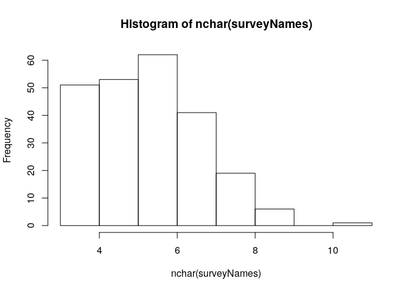

# Character strings & Pattern matching (tasks)

## Tasks

### concatenation {#characterVectors}

The `survey` data is used throughout the exercises.


```r
#survey <- read.delim("https://barmsijs.lumc.nl/R_course/data/survey.txt") 
survey <- read.delim("../data/survey.txt")
# Use subject names (column name) in survey data set
surveyNames <- as.vector(survey$name)
# Domain names
domains    <- c("lumc.nl", "leidenuniv.nl", "vumc.nl")
```


1. Generate a vector of e-mail addresses `@leidenuniv.nl` for all names in `surveyNames`.  


```r
emails <- paste(surveyNames, "leidenuniv.nl", sep="@")
head(emails)
```

```
[1] "Alyson@leidenuniv.nl" "Todd@leidenuniv.nl"   "Gerald@leidenuniv.nl"
[4] "Robert@leidenuniv.nl" "Dustin@leidenuniv.nl" "Abby@leidenuniv.nl"  
```

2. Mailing list: create a single string with all e-mail addresses separated by ';'. 


```r
mailingList <- paste(emails, collapse = ";")
```

3. Create a mailing list of all names randomly assigned to `domains` (hint: let recycling do the semi-random selection.) 


```r
# The vector 'surveyNames' is the largest vector therefore '@' and 'domains' are recycled.  
#
emails      <- paste(surveyNames, domains, sep="@")
mailingList <- paste(emails,collapse = ";")
```


4. Predict the output for the following statements, note that paste0(...) <=> paste(...,sep="") and rev(x) reverses `x`: 


```r
paste(c("a","b"),"c",letters[1:3], sep="")
```

```
[1] "aca" "bcb" "acc"
```

```r
paste0(paste0(letters[19:20],collapse = ""),"a", paste0(rev(letters[19:20]), collapse = ""))
```

```
[1] "stats"
```

5. Plot a histogram of name lengths. (hint: ?hist, ?nchar)


```r
hist(nchar(surveyNames))
```

<!-- -->

### strsplit {#strsplit}

1. Recreate the vector of e-mail addresses  from the *mailingList* ( previous exercise (paste: nr.3) ) using `strsplit(...)` function.


```r
emails <- unlist(strsplit(mailingList,";")) 
head(emails)
```

```
[1] "Alyson@lumc.nl"       "Todd@leidenuniv.nl"   "Gerald@vumc.nl"      
[4] "Robert@lumc.nl"       "Dustin@leidenuniv.nl" "Abby@vumc.nl"        
```

```r
length(emails)
```

```
[1] 233
```

2. Given the vector of e-mail addresses just obtained retrieve the user names only (hint: ?do.call.)


```r
usersAndDomains <- do.call(rbind, strsplit(emails, "@"))
colnames(usersAndDomains) <- c("user","domain")
head(usersAndDomains)
```

```
     user     domain         
[1,] "Alyson" "lumc.nl"      
[2,] "Todd"   "leidenuniv.nl"
[3,] "Gerald" "vumc.nl"      
[4,] "Robert" "lumc.nl"      
[5,] "Dustin" "leidenuniv.nl"
[6,] "Abby"   "vumc.nl"      
```

```r
userNames <- usersAndDomains[,"user"]
length(userNames)
```

```
[1] 233
```

```r
head(userNames)
```

```
[1] "Alyson" "Todd"   "Gerald" "Robert" "Dustin" "Abby"  
```

3. Create a frequency table of the number of users per domain (hint ?`table`).


```r
usersAndDomains <- do.call(rbind, strsplit(emails, "@"))
colnames(usersAndDomains) <- c("user","domain")
table(usersAndDomains[,"domain"])
```

```

leidenuniv.nl       lumc.nl       vumc.nl 
           78            78            77 
```

### grep/grepl/sub {#grep}

1. Create a list with elements 'lumc', 'leidenuniv' and 'vumc' containing  the corresponding e-mails using the vector `emails` from concatenation (1.1.1) exercise 3. 


```r
list(lumc=grep("lumc", emails, value = T), 
     leidenuniv=grep("leidenuniv", emails, value = T),
     vumc=grep("vumc", emails, value = T))
```

```
$lumc
 [1] "Alyson@lumc.nl"    "Robert@lumc.nl"    "Andre@lumc.nl"    
 [4] "Carl@lumc.nl"      "Bernice@lumc.nl"   "Fern@lumc.nl"     
 [7] "Ken@lumc.nl"       "Troy@lumc.nl"      "Jasmine@lumc.nl"  
[10] "Floyd@lumc.nl"     "Gale@lumc.nl"      "George@lumc.nl"   
[13] "Misty@lumc.nl"     "Mathew@lumc.nl"    "Gale@lumc.nl"     
[16] "Andrew@lumc.nl"    "Dennis@lumc.nl"    "George@lumc.nl"   
[19] "Matilda@lumc.nl"   "Guy@lumc.nl"       "Johnnie@lumc.nl"  
[22] "Patrick@lumc.nl"   "Roland@lumc.nl"    "Gloria@lumc.nl"   
[25] "Megan@lumc.nl"     "Earlene@lumc.nl"   "Jessie@lumc.nl"   
[28] "Wallace@lumc.nl"   "Eloise@lumc.nl"    "Brent@lumc.nl"    
[31] "Mindy@lumc.nl"     "George@lumc.nl"    "Belinda@lumc.nl"  
[34] "Beverley@lumc.nl"  "Tammy@lumc.nl"     "Sergio@lumc.nl"   
[37] "Tracy@lumc.nl"     "Dianna@lumc.nl"    "Mike@lumc.nl"     
[40] "Peter@lumc.nl"     "Jesse@lumc.nl"     "Barbra@lumc.nl"   
[43] "Eunice@lumc.nl"    "Vanessa@lumc.nl"   "George@lumc.nl"   
[46] "Tami@lumc.nl"      "Bethany@lumc.nl"   "Howard@lumc.nl"   
[49] "Ivy@lumc.nl"       "Lila@lumc.nl"      "Arnold@lumc.nl"   
[52] "Sofia@lumc.nl"     "Catherine@lumc.nl" "Patrica@lumc.nl"  
[55] "Iris@lumc.nl"      "Darrell@lumc.nl"   "Carly@lumc.nl"    
[58] "Lottie@lumc.nl"    "Claudette@lumc.nl" "Margaret@lumc.nl" 
[61] "Clyde@lumc.nl"     "Marc@lumc.nl"      "Bobby@lumc.nl"    
[64] "Luann@lumc.nl"     "Janine@lumc.nl"    "Mona@lumc.nl"     
[67] "Hilda@lumc.nl"     "Henrietta@lumc.nl" "Francis@lumc.nl"  
[70] "Melinda@lumc.nl"   "Kirsten@lumc.nl"   "Alex@lumc.nl"     
[73] "Todd@lumc.nl"      "Beverly@lumc.nl"   "Corrine@lumc.nl"  
[76] "Earl@lumc.nl"      "Jeanne@lumc.nl"    "Keith@lumc.nl"    

$leidenuniv
 [1] "Todd@leidenuniv.nl"        "Dustin@leidenuniv.nl"     
 [3] "Michael@leidenuniv.nl"     "Noemi@leidenuniv.nl"      
 [5] "Velma@leidenuniv.nl"       "Carolyn@leidenuniv.nl"    
 [7] "Richard@leidenuniv.nl"     "Charlie@leidenuniv.nl"    
 [9] "Adam@leidenuniv.nl"        "Luis@leidenuniv.nl"       
[11] "Russell@leidenuniv.nl"     "Wayne@leidenuniv.nl"      
[13] "Fernando@leidenuniv.nl"    "Lillie@leidenuniv.nl"     
[15] "Rafael@leidenuniv.nl"      "Elnora@leidenuniv.nl"     
[17] "Bernard@leidenuniv.nl"     "Wayne@leidenuniv.nl"      
[19] "Mathew@leidenuniv.nl"      "Felix@leidenuniv.nl"      
[21] "Deann@leidenuniv.nl"       "Jana@leidenuniv.nl"       
[23] "Luann@leidenuniv.nl"       "Lynnette@leidenuniv.nl"   
[25] "Julianne@leidenuniv.nl"    "Dean@leidenuniv.nl"       
[27] "Alicia@leidenuniv.nl"      "Elsie@leidenuniv.nl"      
[29] "Troy@leidenuniv.nl"        "Rose@leidenuniv.nl"       
[31] "Clifton@leidenuniv.nl"     "Lavonne@leidenuniv.nl"    
[33] "Gary@leidenuniv.nl"        "Deborah@leidenuniv.nl"    
[35] "Nikki@leidenuniv.nl"       "Ruben@leidenuniv.nl"      
[37] "Valeria@leidenuniv.nl"     "Angela@leidenuniv.nl"     
[39] "Brenda@leidenuniv.nl"      "Carlos@leidenuniv.nl"     
[41] "Benjamin@leidenuniv.nl"    "Phillip@leidenuniv.nl"    
[43] "Glenn@leidenuniv.nl"       "Sara@leidenuniv.nl"       
[45] "Mathew@leidenuniv.nl"      "Margo@leidenuniv.nl"      
[47] "Steve@leidenuniv.nl"       "Ted@leidenuniv.nl"        
[49] "Carmella@leidenuniv.nl"    "John@leidenuniv.nl"       
[51] "Cory@leidenuniv.nl"        "Benjamin@leidenuniv.nl"   
[53] "Greg@leidenuniv.nl"        "Christopher@leidenuniv.nl"
[55] "Juliette@leidenuniv.nl"    "Araceli@leidenuniv.nl"    
[57] "John@leidenuniv.nl"        "William@leidenuniv.nl"    
[59] "Haley@leidenuniv.nl"       "Bettye@leidenuniv.nl"     
[61] "Miguel@leidenuniv.nl"      "David@leidenuniv.nl"      
[63] "Ruben@leidenuniv.nl"       "Samantha@leidenuniv.nl"   
[65] "Clifford@leidenuniv.nl"    "Glenna@leidenuniv.nl"     
[67] "Lindsey@leidenuniv.nl"     "Casandra@leidenuniv.nl"   
[69] "Lorene@leidenuniv.nl"      "Warren@leidenuniv.nl"     
[71] "Henry@leidenuniv.nl"       "Lynnette@leidenuniv.nl"   
[73] "Amelia@leidenuniv.nl"      "Sharron@leidenuniv.nl"    
[75] "Joe@leidenuniv.nl"         "Marcella@leidenuniv.nl"   
[77] "Rosanna@leidenuniv.nl"     "Celina@leidenuniv.nl"     

$vumc
 [1] "Gerald@vumc.nl"    "Abby@vumc.nl"      "Edward@vumc.nl"   
 [4] "Alfred@vumc.nl"    "Eddie@vumc.nl"     "Virgil@vumc.nl"   
 [7] "Virgil@vumc.nl"    "Frank@vumc.nl"     "Joe@vumc.nl"      
[10] "Justin@vumc.nl"    "Lorena@vumc.nl"    "Nathaniel@vumc.nl"
[13] "Ben@vumc.nl"       "Mona@vumc.nl"      "Willard@vumc.nl"  
[16] "Jessie@vumc.nl"    "Floyd@vumc.nl"     "Robert@vumc.nl"   
[19] "Clifton@vumc.nl"   "Lila@vumc.nl"      "Natalia@vumc.nl"  
[22] "Helene@vumc.nl"    "Louis@vumc.nl"     "Victoria@vumc.nl" 
[25] "Kelly@vumc.nl"     "Corey@vumc.nl"     "Aimee@vumc.nl"    
[28] "Adriana@vumc.nl"   "Rachelle@vumc.nl"  "Carole@vumc.nl"   
[31] "Coleen@vumc.nl"    "Gilbert@vumc.nl"   "Francisco@vumc.nl"
[34] "Leah@vumc.nl"      "Erma@vumc.nl"      "Velma@vumc.nl"    
[37] "Shawn@vumc.nl"     "Joanna@vumc.nl"    "John@vumc.nl"     
[40] "Vonda@vumc.nl"     "Gene@vumc.nl"      "Cathleen@vumc.nl" 
[43] "Darren@vumc.nl"    "Louis@vumc.nl"     "Harry@vumc.nl"    
[46] "Daphne@vumc.nl"    "June@vumc.nl"      "Guy@vumc.nl"      
[49] "Adrian@vumc.nl"    "Clifton@vumc.nl"   "Andy@vumc.nl"     
[52] "Roland@vumc.nl"    "Cory@vumc.nl"      "Lindsay@vumc.nl"  
[55] "Nathaniel@vumc.nl" "Ramon@vumc.nl"     "Dolly@vumc.nl"    
[58] "Lupe@vumc.nl"      "Luis@vumc.nl"      "Angel@vumc.nl"    
[61] "Hope@vumc.nl"      "Travis@vumc.nl"    "Darryl@vumc.nl"   
[64] "Mavis@vumc.nl"     "Charlene@vumc.nl"  "Ross@vumc.nl"     
[67] "Juan@vumc.nl"      "Eddie@vumc.nl"     "Gabriela@vumc.nl" 
[70] "Chester@vumc.nl"   "Josefa@vumc.nl"    "Steven@vumc.nl"   
[73] "Barbra@vumc.nl"    "Vera@vumc.nl"      "Edith@vumc.nl"    
[76] "Jerry@vumc.nl"     "Tracey@vumc.nl"   
```

2. Create a mailing-list (semi-colon separated) with all user names containing pattern 'in'. 


```r
paste(grep("in", emails , value = T), collapse = ";")
```

```
[1] "Dustin@leidenuniv.nl;Jasmine@lumc.nl;Justin@vumc.nl;Mindy@lumc.nl;Belinda@lumc.nl;Benjamin@leidenuniv.nl;Benjamin@leidenuniv.nl;Catherine@lumc.nl;Lindsay@vumc.nl;Janine@lumc.nl;Lindsey@leidenuniv.nl;Melinda@lumc.nl;Corrine@lumc.nl;Celina@leidenuniv.nl"
```


3. Find the most popular letter which names start with.


```r
firstChar <- substr(surveyNames,1,1)
firstCharCounts <- table(firstChar)
( mostPopularFirstChar <-  names(firstCharCounts[firstCharCounts==max(firstCharCounts)]) )
```

```
[1] "C"
```

4. Find the names that start with the most popular first letter you found in the previous exercise. (*)


```r
surveyNames[ firstChar == mostPopularFirstChar ]
```

```
 [1] "Carl"        "Carolyn"     "Charlie"     "Clifton"     "Corey"      
 [6] "Carole"      "Clifton"     "Coleen"      "Carlos"      "Cathleen"   
[11] "Carmella"    "Clifton"     "Cory"        "Catherine"   "Cory"       
[16] "Christopher" "Carly"       "Claudette"   "Clyde"       "Clifford"   
[21] "Charlene"    "Casandra"    "Chester"     "Corrine"     "Celina"     
```

## Extra exercises {#extra}

1. Find the names that end with the most popular last character of all names.


```r
lastChar <- substr(surveyNames,nchar(surveyNames),nchar(surveyNames))
lastCharCounts <- table(lastChar)
( mostPopularLastChar <-  names(lastCharCounts[lastCharCounts==max(lastCharCounts)]) )
```

```
[1] "e"
```

```r
surveyNames[ lastChar == mostPopularLastChar ]
```

```
 [1] "Andre"     "Bernice"   "Eddie"     "Charlie"   "Jasmine"   "Joe"      
 [7] "Gale"      "George"    "Wayne"     "Lillie"    "Gale"      "Jessie"   
[13] "George"    "Wayne"     "Johnnie"   "Helene"    "Lynnette"  "Julianne" 
[19] "Earlene"   "Jessie"    "Aimee"     "Wallace"   "Elsie"     "Eloise"   
[25] "Rachelle"  "Rose"      "Carole"    "George"    "Lavonne"   "Mike"     
[31] "Jesse"     "Gene"      "Eunice"    "George"    "Daphne"    "Steve"    
[37] "June"      "Catherine" "Juliette"  "Lottie"    "Lupe"      "Claudette"
[43] "Bettye"    "Clyde"     "Hope"      "Janine"    "Charlene"  "Eddie"    
[49] "Lorene"    "Lynnette"  "Corrine"   "Joe"       "Jeanne"   
```

2. In the vector of e-mail addresses . 

Swap students between the two domains `lumc.nl` and `vumc.nl`. 


```r
swappedEmails <- emails
lumc <- grepl("lumc.nl",swappedEmails) 
vumc <- grepl("vumc.nl",swappedEmails)
swappedEmails[lumc] <- sub("lumc.nl","vumc.nl", swappedEmails[lumc])
swappedEmails[vumc] <- sub("vumc.nl","lumc.nl", swappedEmails[vumc])

#
# A more concise solution with *ifelse* (see ?ifelse)
#
swappedEmails2  <- ifelse(grepl("lumc.nl",emails), 
                          sub("lumc.nl","vumc.nl",emails), 
                          sub("vumc.nl","lumc.nl",emails)) 

identical(swappedEmails, swappedEmails2)
```

```
[1] TRUE
```

3. Some names are duplicated in the survey data set. Create a unique vector of e-mail addresses for these duplicated names by number suffixes, e.g. Barbra1, Barbra2 etc. 


```r
# First create table of non-unique names with counts as the number of occurences. 
tblOfNames<- table(surveyNames)
# Find the non-unique names
nonUniqueNames <- tblOfNames[ tblOfNames > 1 ]
# Make a copy of surveyNames called userNames and update the duplicated names. 
userNames <- surveyNames
# For each non-unique name find the names in userNames and replace them with 
# with <name>1 .. <name>n, where n is the number of occurences of
# the name in surveyNames.
for (u in names(nonUniqueNames)) {
  userNames[userNames==u] <- paste(u,1:nonUniqueNames[u],sep="")
}
# Create email addreses
emails2 <- paste(userNames, domains, sep="@")
```

4. Find top (most frequent) name initial for males and females.


```r
# Create a separate vector of male and female names.
femaleNames <- as.vector(subset(survey,gender=="female")$name)
maleNames   <- as.vector(subset(survey,gender=="male")$name)
# females initials
femalesLastChar <- substr(femaleNames,1,1)
femalesLastCharCounts <- table(femalesLastChar)
( femalesMostPopularLastChar <-  names(femalesLastCharCounts[femalesLastCharCounts==max(femalesLastCharCounts)]) )
```

```
[1] "L"
```

```r
femaleNames[ femalesLastChar == femalesMostPopularLastChar ]
```

```
 [1] "Lorena"   "Lillie"   "Lila"     "Luann"    "Lynnette" "Lavonne" 
 [7] "Leah"     "Lila"     "Lindsay"  "Lottie"   "Lupe"     "Luann"   
[13] "Lindsey"  "Lorene"   "Lynnette"
```

```r
# males initials
malesLastChar <- substr(maleNames,1,1)
malesLastCharCounts <- table(malesLastChar)
( malesMostPopularLastChar <-  names(malesLastCharCounts[malesLastCharCounts==max(malesLastCharCounts)]) )
```

```
[1] "C"
```

```r
maleNames[ malesLastChar == malesMostPopularLastChar ]
```

```
 [1] "Carl"        "Charlie"     "Clifton"     "Corey"       "Clifton"    
 [6] "Carlos"      "Clifton"     "Cory"        "Cory"        "Christopher"
[11] "Clyde"       "Clifford"    "Chester"    
```


5. Order survey table by `name` character length (?order).


```r
# Ordered from short to long names. See ?order for more options.
surveyOrderedByNameLength <- survey[order(nchar(surveyNames)),] 
```


