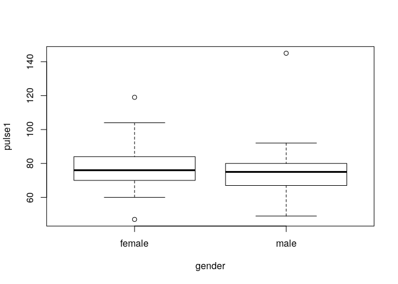
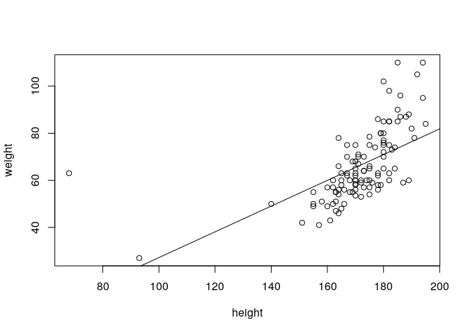
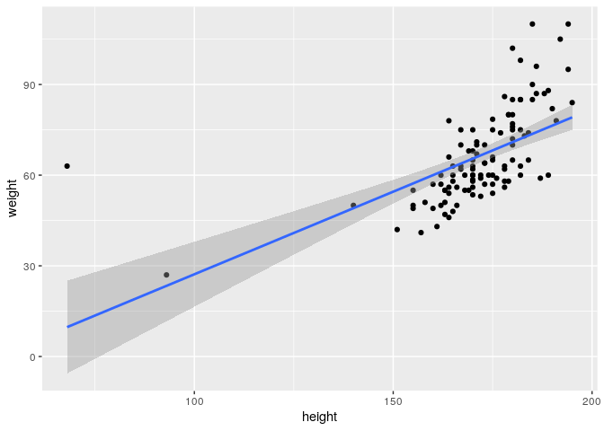

# Simple linear regression

We will use the `pulse` and `survey` data again for illustration and exercises:


```r
## pulse <- read.delim("pulse.txt")
## survey <- read.delim("survey.txt")
```

## Recall: formula objects

Formula objects are the way to tell R that one variable depends on another. Useful for

- easier specification of statistical models

```r
with(pulse, t.test(pulse1[gender == "female"], pulse1[gender == "male"]))
```

```

	Welch Two Sample t-test

data:  pulse1[gender == "female"] and pulse1[gender == "male"]
t = 1.3234, df = 106.3, p-value = 0.1885
alternative hypothesis: true difference in means is not equal to 0
95 percent confidence interval:
 -1.667268  8.362184
sample estimates:
mean of x mean of y 
 77.50000  74.15254 
```

```r
t.test(pulse1 ~ gender, data = pulse)
```

```

	Welch Two Sample t-test

data:  pulse1 by gender
t = 1.3234, df = 106.3, p-value = 0.1885
alternative hypothesis: true difference in means is not equal to 0
95 percent confidence interval:
 -1.667268  8.362184
sample estimates:
mean in group female   mean in group male 
            77.50000             74.15254 
```

- easier plots

```r
plot(pulse1 ~ gender, data = pulse)
```

<!-- -->

Many functions allow formula as input.


## The `lm` function

The command for linear regression is `lm` (for *linear model*). The linear model returns an object of class `lm`.


```r
fit <- lm(weight ~ height, data = pulse)
```

The first two arguments: `formula` and `data` are the most important ones.

Note that `formula` is a single R object consisting of a tilde `\~` with variable names to the left and right. It says that `weight` (response) depends on height (covariate). 


```r
class(height ~ weight)
```

```
[1] "formula"
```

## `lm` objects

The output of `lm` is an object of class `lm`. 


```r
fit
```

```

Call:
lm(formula = weight ~ height, data = pulse)

Coefficients:
(Intercept)       height  
   -27.4398       0.5465  
```

```r
names(fit)
```

```
 [1] "coefficients"  "residuals"     "effects"       "rank"         
 [5] "fitted.values" "assign"        "qr"            "df.residual"  
 [9] "xlevels"       "call"          "terms"         "model"        
```

Several functions extract useful information from the object.


```r
summary(fit)
```

```

Call:
lm(formula = weight ~ height, data = pulse)

Residuals:
    Min      1Q  Median      3Q     Max 
-17.549  -8.197  -2.601   5.469  53.277 

Coefficients:
             Estimate Std. Error t value Pr(>|t|)    
(Intercept) -27.43977   12.73858  -2.154   0.0335 *  
height        0.54651    0.07392   7.393 3.23e-11 ***
---
Signif. codes:  0 '***' 0.001 '**' 0.01 '*' 0.05 '.' 0.1 ' ' 1

Residual standard error: 12.41 on 108 degrees of freedom
Multiple R-squared:  0.336,	Adjusted R-squared:  0.3299 
F-statistic: 54.66 on 1 and 108 DF,  p-value: 3.231e-11
```

```r
coef(fit)
```

```
(Intercept)      height 
-27.4397668   0.5465124 
```

```r
residuals(fit)
```

```
     1993_A      1993_B      1993_C      1993_D      1993_E      1993_F 
-10.1068721 -12.3859463  -1.8277979   4.8698559  -3.1068721   0.8814919 
     1993_G      1993_H      1993_I      1993_J      1993_K      1993_L 
 -4.0952361  -9.9208226  -6.1882608  -4.3743103   9.5326650 -11.8394339 
     1993_M      1993_N      1993_O      1993_P      1993_Q      1993_R 
  2.5326650 -15.7580452   1.0675414  36.3349796  -9.4673350  -0.9324586 
     1993_S      1993_T      1993_U      1993_V      1993_W      1993_X 
 -7.2812855  -7.2696495  -8.1998968   0.9280359  -6.6417484   2.9745167 
     1993_Y      1993_Z      1995_A      1995_B      1995_C      1995_D 
 -9.7464092   4.7070785  -5.4673350  -6.5603597 -15.8510699 -13.8394339 
     1995_E      1995_F      1995_G      1995_H      1995_I      1995_J 
  6.8001032  14.0675414  -3.0022114   3.8117392  -3.1998968  -6.6417484 
     1995_K      1995_L      1995_M      1995_N      1995_O      1995_P 
 16.3349796   3.0791774   0.2652268  -8.2696495  -2.1998968  -6.8394339 
     1995_Q      1995_R      1995_S      1995_T      1995_U      1995_V 
 -8.1185081  -5.4673350  -1.0952361 -16.1882608   3.9861526  12.9745167 
     1996_A      1996_B      1996_C      1996_D      1996_E      1996_F 
 -7.6533844   6.1722021 -17.3626743   0.4280043  11.1722021   0.9861526 
     1996_G      1996_H      1996_I      1996_J      1996_K      1996_L 
 -9.0254833   2.8931279  12.9745167  -7.9091866 -11.0022114   4.0675414 
     1996_M      1996_N      1996_O      1996_P      1996_Q      1996_R 
  6.0675414  11.6954425  -8.1882608  31.0675414  -7.8394339 -13.2812855 
     1996_S      1996_T      1996_U      1997_A      1997_B      1997_C 
-11.1998968   9.0675414  25.9745167 -13.0836001  12.7884672   5.6024177 
     1997_D      1997_E      1997_F      1997_G      1997_H      1997_I 
  9.6140537 -14.7347732 -13.5603597  -3.1068721 -11.9673350  -6.9673350 
     1997_J      1997_K      1997_L      1997_M      1997_N      1997_O 
-10.6417484   1.0559054  -7.5603597   4.9861526   5.0675414  31.4163683 
     1997_P      1997_Q      1997_R      1997_S      1997_T      1997_U 
 -0.8277979  27.5093930  16.4163683  12.1489301 -11.0952361 -14.1998968 
     1997_V      1997_W      1998_A      1998_B      1998_C      1998_D 
 10.3001032  21.7884672  16.1605661  -7.4673350  -4.7347732  15.8117392 
     1998_E      1998_F      1998_G      1998_H      1998_I      1998_J 
 -5.9324586  -3.4673350  -2.2696495  -2.7347732  -9.3743103  53.2769261 
     1998_K      1998_L      1998_M      1998_N      1998_O      1998_P 
 -2.4673350   9.6140537 -14.6417484   3.6141170 -17.5487237 -12.0254833 
     1998_Q      1998_R 
 -0.4673350  11.3349796 
```

```r
fitted.values(fit)
```

```
   1993_A    1993_B    1993_C    1993_D    1993_E    1993_F    1993_G    1993_H 
67.106872 70.385946 63.827798 79.130144 67.106872 73.118508 61.095236 64.920823 
   1993_I    1993_J    1993_K    1993_L    1993_M    1993_N    1993_O    1993_P 
62.188261 64.374310 65.467335 69.839434 65.467335 74.758045 70.932459 73.665020 
   1993_Q    1993_R    1993_S    1993_T    1993_U    1993_V    1993_W    1993_X 
65.467335 70.932459 63.281286 57.269650 68.199897 49.071964 61.641748 72.025483 
   1993_Y    1993_Z    1995_A    1995_B    1995_C    1995_D    1995_E    1995_F 
68.746409 69.292922 65.467335 66.560360 75.851070 69.839434 68.199897 70.932459 
   1995_G    1995_H    1995_I    1995_J    1995_K    1995_L    1995_M    1995_N 
60.002211 62.188261 68.199897 61.641748 73.665020 64.920823 62.734773 57.269650 
   1995_O    1995_P    1995_Q    1995_R    1995_S    1995_T    1995_U    1995_V 
68.199897 69.839434 73.118508 65.467335 61.095236 62.188261 66.013847 72.025483 
   1996_A    1996_B    1996_C    1996_D    1996_E    1996_F    1996_G    1996_H 
67.653384 63.827798 58.362674 72.571996 63.827798 66.013847 72.025483 67.106872 
   1996_I    1996_J    1996_K    1996_L    1996_M    1996_N    1996_O    1996_P 
72.025483 58.909187 60.002211 70.932459 70.932459 75.304558 62.188261 70.932459 
   1996_Q    1996_R    1996_S    1996_T    1996_U    1997_A    1997_B    1997_C 
69.839434 63.281286 68.199897 70.932459 72.025483 55.083600 74.211533 76.397582 
   1997_D    1997_E    1997_F    1997_G    1997_H    1997_I    1997_J    1997_K 
70.385946 62.734773 66.560360 67.106872 65.467335 65.467335 61.641748 76.944095 
   1997_L    1997_M    1997_N    1997_O    1997_P    1997_Q    1997_R    1997_S 
66.560360 66.013847 70.932459 78.583632 63.827798 77.490607 78.583632 75.851070 
   1997_T    1997_U    1997_V    1997_W    1998_A    1998_B    1998_C    1998_D 
61.095236 68.199897 68.199897 74.211533 69.839434 65.467335 62.734773 62.188261 
   1998_E    1998_F    1998_G    1998_H    1998_I    1998_J    1998_K    1998_L 
70.932459 65.467335 57.269650 62.734773 64.374310  9.723074 65.467335 70.385946 
   1998_M    1998_N    1998_O    1998_P    1998_Q    1998_R 
61.641748 23.385883 60.548724 72.025483 65.467335 73.665020 
```

Note that `summary(fit)` returns itself an object in which some additional things are calculated.


```r
summa <- summary(fit)
class(summa)
```

```
[1] "summary.lm"
```

```r
names(summa)
```

```
 [1] "call"          "terms"         "residuals"     "coefficients" 
 [5] "aliased"       "sigma"         "df"            "r.squared"    
 [9] "adj.r.squared" "fstatistic"    "cov.unscaled" 
```

Most useful is the regression table


```r
coef(summa)
```

```
               Estimate  Std. Error   t value     Pr(>|t|)
(Intercept) -27.4397668 12.73857886 -2.154068 3.345796e-02
height        0.5465124  0.07392117  7.393178 3.231467e-11
```

## Confidence intervals

We can calculate confidence intervals for all or some regression coefficients


```r
confint(fit)
```

```
                  2.5 %     97.5 %
(Intercept) -52.6898400 -2.1896935
height        0.3999878  0.6930369
```

```r
confint(fit, "height")
```

```
           2.5 %    97.5 %
height 0.3999878 0.6930369
```

## Visualizing a regression

We can easily visualize the regression using the same formula and fit object


```r
plot(weight ~ height, data=pulse)
abline(coef(fit))
```

<!-- -->

Slightly more difficult with `ggplot`


```r
library(ggplot2)
gg <- ggplot(pulse) + aes(x=height, y=weight) + geom_point()
a <- coef(fit)[1]
b <- coef(fit)[2]
gg <- gg + geom_abline(intercept=a, slope=b)
```

Or with confidence intervals


```r
gg <- ggplot(pulse) + aes(x=height, y=weight) + geom_point() + stat_smooth(method='lm')
plot(gg)
```

```
`geom_smooth()` using formula 'y ~ x'
```

<!-- -->

## Quick exercises

In the `survey` data

- Perform a linear regression of `wr.hand` against `nw.hand`
- What is the confidence interval for the slope in the regression?
- Visualize the result of this regression in a plot


# Multiple regression

## Multiple terms in a formula

We can have multiple terms in a formula. This way we can do multiple regression


```r
fit <- lm(pulse2 ~ pulse1 + ran, data=pulse)
fit
```

```

Call:
lm(formula = pulse2 ~ pulse1 + ran, data = pulse)

Coefficients:
(Intercept)       pulse1       ransat  
    59.8930       0.8873     -52.3462  
```

```r
summary(fit)
```

```

Call:
lm(formula = pulse2 ~ pulse1 + ran, data = pulse)

Residuals:
    Min      1Q  Median      3Q     Max 
-39.330  -3.435   0.417   4.340  42.445 

Coefficients:
            Estimate Std. Error t value Pr(>|t|)    
(Intercept)  59.8930     7.9095   7.572 1.43e-11 ***
pulse1        0.8873     0.1012   8.768 3.29e-14 ***
ransat      -52.3462     2.7122 -19.300  < 2e-16 ***
---
Signif. codes:  0 '***' 0.001 '**' 0.01 '*' 0.05 '.' 0.1 ' ' 1

Residual standard error: 13.98 on 106 degrees of freedom
  (1 observation deleted due to missingness)
Multiple R-squared:  0.8074,	Adjusted R-squared:  0.8038 
F-statistic: 222.2 on 2 and 106 DF,  p-value: < 2.2e-16
```

Note that R automatically creates dummy variables for factors. Here, `ransat` means the effect of `ran='sat'`. The reference class, apparently, is the `ran` group. In general, the first level of the factor is the reference class.


```r
levels(pulse$ran)
```

```
[1] "ran" "sat"
```


## The intercept term

We see that R automatically adds an intercept term to the model. You can suppress the intercept too, by adding either `+0` or `-1` to the formula. Suppressing the intercept has different effects if there are factor variables in your model or not. 

Only numeric variables: regression through the origin


```r
lm(weight ~ 0 + height, data=pulse)
```

```

Call:
lm(formula = weight ~ 0 + height, data = pulse)

Coefficients:
height  
 0.388  
```

If you have factors, it does not have a reference category anymore


```r
lm(weight ~ 0 + gender, data=pulse)
```

```

Call:
lm(formula = weight ~ 0 + gender, data = pulse)

Coefficients:
genderfemale    gendermale  
       56.60         74.75  
```

## Interactions

Specifying interactions: use `:` or `*`:

- `:` interaction only
- `*` interaction and main effects

Two alternative ways of specifying the same model


```r
lm(pulse2 ~ pulse1 + exercise + pulse1:exercise, data=pulse)
```

```

Call:
lm(formula = pulse2 ~ pulse1 + exercise + pulse1:exercise, data = pulse)

Coefficients:
            (Intercept)                   pulse1              exerciselow  
               25.65586                  0.99045                 15.52877  
       exercisemoderate       pulse1:exerciselow  pulse1:exercisemoderate  
                0.77866                 -0.27842                 -0.05222  
```

```r
lm(pulse2 ~ pulse1 * exercise, data=pulse)
```

```

Call:
lm(formula = pulse2 ~ pulse1 * exercise, data = pulse)

Coefficients:
            (Intercept)                   pulse1              exerciselow  
               25.65586                  0.99045                 15.52877  
       exercisemoderate       pulse1:exerciselow  pulse1:exercisemoderate  
                0.77866                 -0.27842                 -0.05222  
```


## Transformations and the I() function

Sometimes you don't want to use a variable directly, but a function of it. This is never a problem in the response


```r
lm(pulse1 - pulse2 ~ exercise * gender, data=pulse)
```

```

Call:
lm(formula = pulse1 - pulse2 ~ exercise * gender, data = pulse)

Coefficients:
                (Intercept)                  exerciselow  
                    -28.333                        8.583  
           exercisemoderate                   gendermale  
                      6.444                        4.242  
     exerciselow:gendermale  exercisemoderate:gendermale  
                     -1.787                       -3.999  
```

It also works in the covariates in case of simple transformations


```r
lm(weight ~ log(height), data=pulse) 
```

```

Call:
lm(formula = weight ~ log(height), data = pulse)

Coefficients:
(Intercept)  log(height)  
    -241.02        59.81  
```

But in other cases the transformation needs to be protected by `I` (Inhibit)


```r
lm(weight ~ height + height^2, data=pulse) 
```

```

Call:
lm(formula = weight ~ height + height^2, data = pulse)

Coefficients:
(Intercept)       height  
   -27.4398       0.5465  
```

```r
lm(weight ~ height + I(height^2), data=pulse) 
```

```

Call:
lm(formula = weight ~ height + I(height^2), data = pulse)

Coefficients:
(Intercept)       height  I(height^2)  
  169.52570     -2.33326      0.01001  
```

But it is often more clear to first create more variables in your data frame


```r
pulse$height2 <- pulse$height^2
lm(weight ~ height + height2, data=pulse) 
```

```

Call:
lm(formula = weight ~ height + height2, data = pulse)

Coefficients:
(Intercept)       height      height2  
  169.52570     -2.33326      0.01001  
```


## Comparing models using anova

The `summary` function gives useful statistical tests for single covariates or dummies.


```r
fit <- lm(pulse2 ~ pulse1 + gender + exercise, data=pulse)
summary(fit)
```

```

Call:
lm(formula = pulse2 ~ pulse1 + gender + exercise, data = pulse)

Residuals:
   Min     1Q Median     3Q    Max 
-31.25 -22.36 -17.21  28.49  74.09 

Coefficients:
                 Estimate Std. Error t value Pr(>|t|)    
(Intercept)        34.543     18.218   1.896 0.060730 .  
pulse1              0.880      0.223   3.945 0.000145 ***
gendermale         -1.659      5.894  -0.281 0.778901    
exerciselow        -5.754      9.792  -0.588 0.558035    
exercisemoderate   -2.812      9.149  -0.307 0.759158    
---
Signif. codes:  0 '***' 0.001 '**' 0.01 '*' 0.05 '.' 0.1 ' ' 1

Residual standard error: 29.93 on 104 degrees of freedom
  (1 observation deleted due to missingness)
Multiple R-squared:  0.1343,	Adjusted R-squared:  0.101 
F-statistic: 4.033 on 4 and 104 DF,  p-value: 0.004419
```

So, is there a significant effect of exercise? We can't tell, because `summary` does not take the dummies for `exercise` together. To test this, explicitly fit the null model without exercise, and compare it to the complete model. The name `anova` for this function is awkward, unfortunatetely. This use is not restricted to anova models.


```r
fit0 <- lm(pulse2 ~ pulse1 + gender, data=pulse)
anova(fit, fit0)
```

```
Analysis of Variance Table

Model 1: pulse2 ~ pulse1 + gender + exercise
Model 2: pulse2 ~ pulse1 + gender
  Res.Df   RSS Df Sum of Sq      F Pr(>F)
1    104 93172                           
2    106 93532 -2   -360.41 0.2012 0.8181
```

This comparison is especially useful if we want to evaluate the significance of a variable in the presence of interaction.

```r
fit <- lm(pulse2 ~ pulse1 * gender, data=pulse)
fit0 <- lm(pulse2 ~ pulse1, data=pulse)
anova(fit, fit0)
```

```
Analysis of Variance Table

Model 1: pulse2 ~ pulse1 * gender
Model 2: pulse2 ~ pulse1
  Res.Df   RSS Df Sum of Sq      F Pr(>F)
1    105 93029                           
2    107 93562 -2   -533.22 0.3009 0.7408
```

Note that `lm` by default removes any subjects which have missing values in at least one of the covariates. This means that the number of subjects in `fit` and `fit0` may be different. In that case remove subjects with missing values manually (or do imputation or something more fancy).

## Quick exercises

In the `survey` data

- Perform a linear regression of `pulse` against `smokes` and `exercise`. Include the interaction in the model.
- Compare the model obtained in the previous exercise against a null model that does not include exercise. Is there a significant effect of exercise on pulse?


# Predicting

We can use regression for prediction using the predict function. To predict we need two things. First, a fitted model object.


```r
fit <- lm(pulse2 ~ pulse1 * gender, data=pulse)
```

Second, a data.frame with new data for our covariates


```r
new.data <- data.frame(pulse1=c(90, 80), gender=c("female", "male"))
```

Now we can predict a value for a person with these covariates


```r
predict(fit, new.data)
```

```
       1        2 
107.1595 100.7955 
```


# Exercises

## Linear regression

We look at the `swiss` data. In this data set we explain fertility of Swiss regions using various indicators.

- Perform a linear regression with `Agriculture` as the explanatory variable. 


- What is the confidence interval of the regression coefficient?


- Perform another linear regession, but use a log-transformed `Agriculture`


- Again, but use both `Agriculture` and `Agriculture` squared


- Again, but use Agriculture, Catholic, and their interaction


- Make a variable `P` that has the p-value of the interaction in the last model. Hint: use coef of the summary of your object.


- Is this model significantly better than the model with Agriculture alone? Hint: use anova.


- Fit the model again in a data set that leaves out the canton `Courtelary`. Use the model to predict `Fertility` in `Courtelary`


## Logistic regression

In the quine data (from MASS), we can try to predict learning speed.

- Make a logistic regression model to predict `Lrn` based on `Eth`, `Age` and `Sex`.


- Is there a significant relationship between Age and Learning speed?
 


# Generalized linear models and survival

## Logistic regression

For logistic regression, use `glm` (generalized linear model), with `family=binomial`.


```r
## fit <- glm(alcohol ~ gender+smokes+exercise, family=binomial, data=pulse)
summary(fit)
```

```

Call:
lm(formula = pulse2 ~ pulse1 * gender, data = pulse)

Residuals:
   Min     1Q Median     3Q    Max 
-31.34 -22.85 -17.64  26.14  71.39 

Coefficients:
                  Estimate Std. Error t value Pr(>|t|)  
(Intercept)        47.8352    26.4329   1.810   0.0732 .
pulse1              0.6592     0.3367   1.958   0.0529 .
gendermale        -26.3284    34.0208  -0.774   0.4407  
pulse1:gendermale   0.3319     0.4405   0.754   0.4528  
---
Signif. codes:  0 '***' 0.001 '**' 0.01 '*' 0.05 '.' 0.1 ' ' 1

Residual standard error: 29.77 on 105 degrees of freedom
  (1 observation deleted due to missingness)
Multiple R-squared:  0.1356,	Adjusted R-squared:  0.1109 
F-statistic: 5.492 on 3 and 105 DF,  p-value: 0.001523
```

When using `anova` in `glm`, the default is not to give a p-value. If you want it, explicitly ask for the likelihood ratio test (LRT)


```r
fit0 <- glm(alcohol ~ gender+smokes, family=binomial, data=pulse)
anova(fit, fit0, test='LRT')
```

```
Warning in anova.lmlist(object, ...): models with response '"alcohol"' removed
because response differs from model 1
```

```
Analysis of Variance Table

Response: pulse2
               Df Sum Sq Mean Sq F value    Pr(>F)    
pulse1          1  14063 14063.2 15.8729 0.0001252 ***
gender          1     30    30.2  0.0341 0.8539479    
pulse1:gender   1    503   503.0  0.5678 0.4528288    
Residuals     105  93029   886.0                      
---
Signif. codes:  0 '***' 0.001 '**' 0.01 '*' 0.05 '.' 0.1 ' ' 1
```


## Survival

Survival analysis methods are available in the `survival` package. All works very similar to `lm` and `glm` except that the response has to be a `Surv` object, built from time and event status.

We do not have survival times in the `pulse` data, so we use the `aml` data from the `survival` package.


```r
library(survival)
## ?aml
with(aml, Surv(time, status))
```

```
 [1]   9   13   13+  18   23   28+  31   34   45+  48  161+   5    5    8    8 
[16]  12   16+  23   27   30   33   43   45 
```

To draw Kaplan-Meier curves, use `survfit`


```r
fit <- survfit(Surv(time, status) ~ x, data=aml)
plot(fit, col=2:3)
```

<!-- -->

A log-rank test and a fitted Cox model


```r
survdiff(Surv(time, status) ~ x, data=aml)
```

```
Call:
survdiff(formula = Surv(time, status) ~ x, data = aml)

                 N Observed Expected (O-E)^2/E (O-E)^2/V
x=Maintained    11        7    10.69      1.27       3.4
x=Nonmaintained 12       11     7.31      1.86       3.4

 Chisq= 3.4  on 1 degrees of freedom, p= 0.07 
```

```r
coxph(Surv(time, status) ~ x, data=aml)
```

```
Call:
coxph(formula = Surv(time, status) ~ x, data = aml)

                 coef exp(coef) se(coef)     z      p
xNonmaintained 0.9155    2.4981   0.5119 1.788 0.0737

Likelihood ratio test=3.38  on 1 df, p=0.06581
n= 23, number of events= 18 
```

The result of coxph can be stored as an object and used in most ways like a `lm` or `glm` object. In particular we can use `anova` to compare models.


## Quick exercises

In the `survey` data

- Perform a logistic regression with `fold` as response and `w.hand` and `clap` as covariates. 

# Extra's

## Model matrix

If you want to see the precise dummy variables that R creates from a formula, use `model.matrix`


```r
M <- model.matrix(pulse2 ~ pulse1 * ran, data=pulse)
head(M)
```

```
       (Intercept) pulse1 ransat pulse1:ransat
1993_A           1     86      1            86
1993_B           1     82      0             0
1993_C           1     96      0             0
1993_D           1     71      1            71
1993_E           1     90      1            90
1993_F           1     78      0             0
```

Logical variables are automatically turned into a dummy with FALSE as the reference class


```r
lm(pulse2 ~ (exercise == 'low'), data=pulse)
```

```

Call:
lm(formula = pulse2 ~ (exercise == "low"), data = pulse)

Coefficients:
          (Intercept)  exercise == "low"TRUE  
              96.7083                 0.2646  
```

## The dot in a formula

If you just want to put all variables from a data.frame into the model, use `.`


```r
fit <- lm(pulse2 ~ ., data=pulse)
```

Note that character variables are automatically turned into factor.

To exclude variables, use `-`


```r
lm(pulse2 ~ . - name, data = pulse)
```

```

Call:
lm(formula = pulse2 ~ . - name, data = pulse)

Coefficients:
     (Intercept)            height            weight               age  
      681.792730         -1.141094         -0.160608         -0.051716  
      gendermale         smokesyes        alcoholyes       exerciselow  
       -2.396358         -0.767190         -1.506127          2.466492  
exercisemoderate            ransat            pulse1              year  
        1.782231        -52.394236          0.891167         -0.277599  
         height2  
        0.004709  
```

## Higher order interactions

Get all interactions between a number of variables including higher order terms


```r
lm(pulse2 ~ ran * alcohol * smokes, data=pulse)
```

```

Call:
lm(formula = pulse2 ~ ran * alcohol * smokes, data = pulse)

Coefficients:
                (Intercept)                       ransat  
                   126.6667                     -50.2667  
                 alcoholyes                    smokesyes  
                     0.6548                     -11.3214  
          ransat:alcoholyes             ransat:smokesyes  
                    -3.8214                       7.9214  
       alcoholyes:smokesyes  ransat:alcoholyes:smokesyes  
                     7.3333                           NA  
```

We get some `NA`'s because not all combinations exist.

To have only up to second order interaction terms


```r
lm(pulse2 ~ (ran + alcohol + smokes)^2, data=pulse)
```

```

Call:
lm(formula = pulse2 ~ (ran + alcohol + smokes)^2, data = pulse)

Coefficients:
         (Intercept)                ransat            alcoholyes  
            126.6667              -50.2667                0.6548  
           smokesyes     ransat:alcoholyes      ransat:smokesyes  
            -11.3214               -3.8214                7.9214  
alcoholyes:smokesyes  
              7.3333  
```

Or again we can use dots


```r
fit <- lm(pulse2 ~ (. - name)^2, data=pulse)
```


## anova versus summary

Always use anova to compare models. Don't use anova on a single model unless you really know what you're doing! Anova on a single model evaluates the significane of variable stepwise in the order in which variables appear in formula. Compare:


```r
anova(lm(pulse2 ~ pulse1 + gender, data=pulse))
```

```
Analysis of Variance Table

Response: pulse2
           Df Sum Sq Mean Sq F value    Pr(>F)    
pulse1      1  14063 14063.2 15.9379 0.0001209 ***
gender      1     30    30.2  0.0342 0.8536493    
Residuals 106  93532   882.4                      
---
Signif. codes:  0 '***' 0.001 '**' 0.01 '*' 0.05 '.' 0.1 ' ' 1
```

```r
anova(lm(pulse2 ~ gender + pulse1, data=pulse))
```

```
Analysis of Variance Table

Response: pulse2
           Df Sum Sq Mean Sq F value    Pr(>F)    
gender      1    416   415.9  0.4713 0.4938812    
pulse1      1  13678 13677.5 15.5007 0.0001478 ***
Residuals 106  93532   882.4                      
---
Signif. codes:  0 '***' 0.001 '**' 0.01 '*' 0.05 '.' 0.1 ' ' 1
```

```r
summary(lm(pulse2 ~ pulse1 + gender, data=pulse))
```

```

Call:
lm(formula = pulse2 ~ pulse1 + gender, data = pulse)

Residuals:
   Min     1Q Median     3Q    Max 
-29.53 -22.91 -17.99  27.48  72.07 

Coefficients:
            Estimate Std. Error t value Pr(>|t|)    
(Intercept)  32.8059    17.3101   1.895 0.060792 .  
pulse1        0.8531     0.2167   3.937 0.000148 ***
gendermale   -1.0643     5.7558  -0.185 0.853649    
---
Signif. codes:  0 '***' 0.001 '**' 0.01 '*' 0.05 '.' 0.1 ' ' 1

Residual standard error: 29.7 on 106 degrees of freedom
  (1 observation deleted due to missingness)
Multiple R-squared:  0.1309,	Adjusted R-squared:  0.1146 
F-statistic: 7.986 on 2 and 106 DF,  p-value: 0.000588
```

