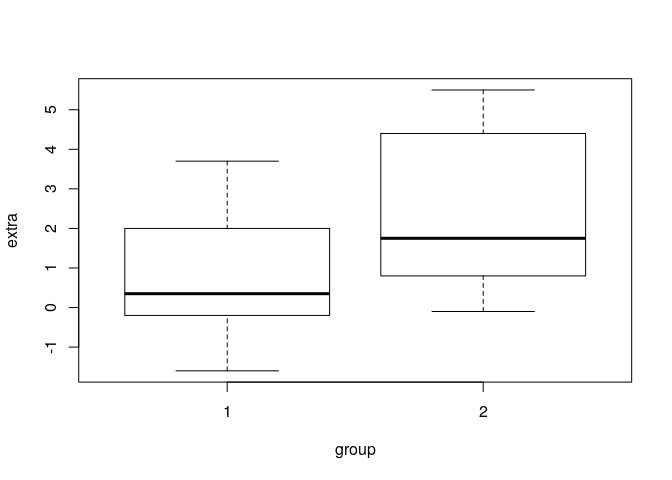
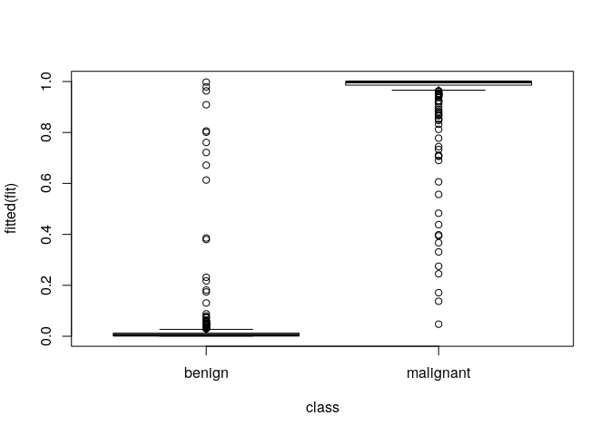
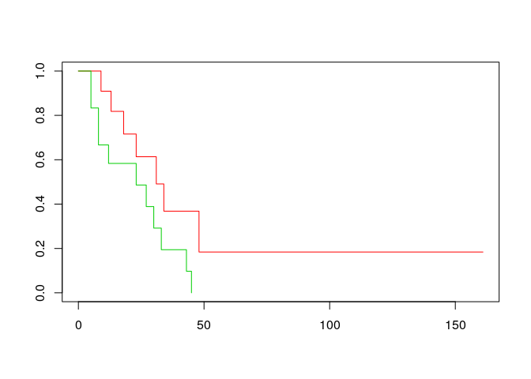

# More formulae

## Formula objects

### Recap

Formula objects are the way to tell R that one variable depends on another. Useful for

- easier specification of statistical models

```r
with(sleep, t.test(extra[group == 1], extra[group == 2]))
```

```

	Welch Two Sample t-test

data:  extra[group == 1] and extra[group == 2]
t = -1.8608, df = 17.776, p-value = 0.07939
alternative hypothesis: true difference in means is not equal to 0
95 percent confidence interval:
 -3.3654832  0.2054832
sample estimates:
mean of x mean of y 
     0.75      2.33 
```

```r
t.test(extra ~ group, data = sleep)
```

```

	Welch Two Sample t-test

data:  extra by group
t = -1.8608, df = 17.776, p-value = 0.07939
alternative hypothesis: true difference in means is not equal to 0
95 percent confidence interval:
 -3.3654832  0.2054832
sample estimates:
mean in group 1 mean in group 2 
           0.75            2.33 
```

- easier plots

```r
plot(extra ~ group, data = sleep)
```

<!-- -->

Many functions allow formula as input.


### Multiple regression

We can have multiple terms in a formula. Let's have a look at the quine data.


```r
library(MASS)
head(quine)
```

```
  Eth Sex Age Lrn Days
1   A   M  F0  SL    2
2   A   M  F0  SL   11
3   A   M  F0  SL   14
4   A   M  F0  AL    5
5   A   M  F0  AL    5
6   A   M  F0  AL   13
```

Multiple regression with only main effects


```r
fit <- lm(Days ~ Eth + Sex + Age + Lrn, data=quine)
fit
```

```

Call:
lm(formula = Days ~ Eth + Sex + Age + Lrn, data = quine)

Coefficients:
(Intercept)         EthN         SexM        AgeF1        AgeF2        AgeF3  
     16.233       -8.745        2.530       -4.457        4.701        6.805  
      LrnSL  
      5.267  
```

```r
summary(fit)
```

```

Call:
lm(formula = Days ~ Eth + Sex + Age + Lrn, data = quine)

Residuals:
    Min      1Q  Median      3Q     Max 
-23.038 -10.027  -3.297   7.094  54.799 

Coefficients:
            Estimate Std. Error t value Pr(>|t|)    
(Intercept)   16.233      3.767   4.309 3.08e-05 ***
EthN          -8.745      2.529  -3.458 0.000721 ***
SexM           2.530      2.635   0.960 0.338631    
AgeF1         -4.457      3.929  -1.134 0.258547    
AgeF2          4.701      3.906   1.204 0.230778    
AgeF3          6.805      4.107   1.657 0.099771 .  
LrnSL          5.267      3.055   1.724 0.086934 .  
---
Signif. codes:  0 '***' 0.001 '**' 0.01 '*' 0.05 '.' 0.1 ' ' 1

Residual standard error: 15.23 on 139 degrees of freedom
Multiple R-squared:  0.1584,	Adjusted R-squared:  0.1221 
F-statistic:  4.36 on 6 and 139 DF,  p-value: 0.000458
```

Note that R automatically creates dummy variables for factors. Here, `sexM` means the effect of `Sex='M'`. The reference class, apparently, is the females. In general, the first level of the factor is the reference class.


```r
levels(quine$Sex)
```

```
[1] "F" "M"
```

If you want to see the precise dummy variables that R creates from a formula, use `model.matrix`


```r
M <- model.matrix(Days ~ Eth + Sex + Age + Lrn, data=quine)
head(M)
```

```
  (Intercept) EthN SexM AgeF1 AgeF2 AgeF3 LrnSL
1           1    0    1     0     0     0     1
2           1    0    1     0     0     0     1
3           1    0    1     0     0     0     1
4           1    0    1     0     0     0     0
5           1    0    1     0     0     0     0
6           1    0    1     0     0     0     0
```

Logical variables are automatically turned into a dummy with FALSE as the reference class


```r
lm(Days ~ (Age == 'F2'), data=quine)
```

```

Call:
lm(formula = Days ~ (Age == "F2"), data = quine)

Coefficients:
    (Intercept)  Age == "F2"TRUE  
         14.726            6.324  
```

If you just want to put everything into the model, use `.`


```r
lm(Days ~ ., data=quine)
```

```

Call:
lm(formula = Days ~ ., data = quine)

Coefficients:
(Intercept)         EthN         SexM        AgeF1        AgeF2        AgeF3  
     16.233       -8.745        2.530       -4.457        4.701        6.805  
      LrnSL  
      5.267  
```

To exclude variables, use `-`


```r
lm(Days ~ . - Eth, data=quine)
```

```

Call:
lm(formula = Days ~ . - Eth, data = quine)

Coefficients:
(Intercept)         SexM        AgeF1        AgeF2        AgeF3        LrnSL  
     11.841        2.369       -4.865        4.889        6.760        5.127  
```


### The intercept term

We see that R automatically adds an intercept term to the model. You can suppress the intercept too, by adding either `+0` or `-1` to the formula. Suppressing the intercept has different effects if there are factor variables in your model or not. 


```r
lm(Postwt ~ 0 + Prewt, data=anorexia)
```

```

Call:
lm(formula = Postwt ~ 0 + Prewt, data = anorexia)

Coefficients:
Prewt  
1.032  
```

```r
lm(Postwt ~ 0 + Treat, data=anorexia)
```

```

Call:
lm(formula = Postwt ~ 0 + Treat, data = anorexia)

Coefficients:
 TreatCBT  TreatCont    TreatFT  
    85.70      81.11      90.49  
```

```r
levels(anorexia$Treat)
```

```
[1] "CBT"  "Cont" "FT"  
```

```r
lm(Postwt ~ 0 + Prewt + Treat, data=anorexia)
```

```

Call:
lm(formula = Postwt ~ 0 + Prewt + Treat, data = anorexia)

Coefficients:
    Prewt   TreatCBT  TreatCont    TreatFT  
   0.4345    49.7711    45.6740    54.3342  
```

### Interactions

Specifying interactions: use `:` or `*`:

- `:` interaction only
- `*` interaction and lower order terms


```r
lm(Days ~ Eth + Sex + Eth:Sex, data=quine)
```

```

Call:
lm(formula = Days ~ Eth + Sex + Eth:Sex, data = quine)

Coefficients:
(Intercept)         EthN         SexM    EthN:SexM  
    20.9211     -10.8496       0.6919       3.9510  
```

```r
lm(Days ~ Eth * Sex, data=quine)
```

```

Call:
lm(formula = Days ~ Eth * Sex, data = quine)

Coefficients:
(Intercept)         EthN         SexM    EthN:SexM  
    20.9211     -10.8496       0.6919       3.9510  
```

Get all interactions between four variables up to fourth order terms


```r
lm(Days ~ Eth * Sex * Age * Lrn, data=quine)
```

```

Call:
lm(formula = Days ~ Eth * Sex * Age * Lrn, data = quine)

Coefficients:
          (Intercept)                   EthN                   SexM  
               21.250                 -2.750                 -8.250  
                AgeF1                  AgeF2                  AgeF3  
               -9.850                -19.250                 -6.694  
                LrnSL              EthN:SexM             EthN:AgeF1  
              -18.250                 -4.917                  2.350  
           EthN:AgeF2             EthN:AgeF3             SexM:AgeF1  
                1.750                  1.694                  7.350  
           SexM:AgeF2             SexM:AgeF3             EthN:LrnSL  
               33.679                 20.837                 24.750  
           SexM:LrnSL            AgeF1:LrnSL            AgeF2:LrnSL  
               14.250                 29.450                 52.625  
          AgeF3:LrnSL        EthN:SexM:AgeF1        EthN:SexM:AgeF2  
                   NA                 -1.683                -12.369  
      EthN:SexM:AgeF3        EthN:SexM:LrnSL       EthN:AgeF1:LrnSL  
                6.115                  3.917                -40.950  
     EthN:AgeF2:LrnSL       EthN:AgeF3:LrnSL       SexM:AgeF1:LrnSL  
              -53.903                     NA                -26.950  
     SexM:AgeF2:LrnSL       SexM:AgeF3:LrnSL  EthN:SexM:AgeF1:LrnSL  
              -39.054                     NA                 16.426  
EthN:SexM:AgeF2:LrnSL  EthN:SexM:AgeF3:LrnSL  
               35.855                     NA  
```

To have only up to second order interaction terms


```r
lm(Days ~ (Eth + Sex + Age + Lrn)^2, data=quine)
```

```

Call:
lm(formula = Days ~ (Eth + Sex + Age + Lrn)^2, data = quine)

Coefficients:
(Intercept)         EthN         SexM        AgeF1        AgeF2        AgeF3  
   18.46441     -1.35856    -10.52048     -0.67029     -0.34691     -2.89141  
      LrnSL    EthN:SexM   EthN:AgeF1   EthN:AgeF2   EthN:AgeF3   EthN:LrnSL  
    4.53119      5.74785     -9.58246    -22.24668     -1.63014      0.08633  
 SexM:AgeF1   SexM:AgeF2   SexM:AgeF3   SexM:LrnSL  AgeF1:LrnSL  AgeF2:LrnSL  
    0.55064     18.92954     20.78219      2.00057     -3.07234      9.64780  
AgeF3:LrnSL  
         NA  
```

Or again with dots


```r
lm(Days ~ .^2, data=quine)
```

```

Call:
lm(formula = Days ~ .^2, data = quine)

Coefficients:
(Intercept)         EthN         SexM        AgeF1        AgeF2        AgeF3  
   18.46441     -1.35856    -10.52048     -0.67029     -0.34691     -2.89141  
      LrnSL    EthN:SexM   EthN:AgeF1   EthN:AgeF2   EthN:AgeF3   EthN:LrnSL  
    4.53119      5.74785     -9.58246    -22.24668     -1.63014      0.08633  
 SexM:AgeF1   SexM:AgeF2   SexM:AgeF3   SexM:LrnSL  AgeF1:LrnSL  AgeF2:LrnSL  
    0.55064     18.92954     20.78219      2.00057     -3.07234      9.64780  
AgeF3:LrnSL  
         NA  
```


### Transformations and the I() function

Sometimes you don't want to use a variable directly, but a function of it. This is no problem in the response


```r
lm(Postwt - Prewt ~ Treat + Prewt, data=anorexia)
```

```

Call:
lm(formula = Postwt - Prewt ~ Treat + Prewt, data = anorexia)

Coefficients:
(Intercept)    TreatCont      TreatFT        Prewt  
    49.7711      -4.0971       4.5631      -0.5655  
```

But it doesn't work on the right hand side of the formula


```r
lm(Postwt - Prewt ~ Treat + (Prewt-50), data=anorexia)
```

```
Error in terms.formula(formula, data = data): invalid model formula in ExtractVars
```

Use `I` (Inhibit) to let R take a term literally in a formula, i.e. interpret it as a calculation.


```r
lm(Postwt - Prewt ~ Treat + I(Prewt-50), data=anorexia)
```

```

Call:
lm(formula = Postwt - Prewt ~ Treat + I(Prewt - 50), data = anorexia)

Coefficients:
  (Intercept)      TreatCont        TreatFT  I(Prewt - 50)  
      21.4942        -4.0971         4.5631        -0.5655  
```

Standard transformations such as log and square root can be used directly without `I`


```r
lm(Postwt - Prewt ~ Treat + log10(Prewt), data=anorexia)
```

```

Call:
lm(formula = Postwt - Prewt ~ Treat + log10(Prewt), data = anorexia)

Coefficients:
 (Intercept)     TreatCont       TreatFT  log10(Prewt)  
     215.857        -4.155         4.570      -111.049  
```


### Using anova

The `summary` function gives useful statistical tests for single covariates or dummies.


```r
fit <- lm(Days ~ Eth + Sex + Age + Lrn, data=quine)
summary(fit)
```

```

Call:
lm(formula = Days ~ Eth + Sex + Age + Lrn, data = quine)

Residuals:
    Min      1Q  Median      3Q     Max 
-23.038 -10.027  -3.297   7.094  54.799 

Coefficients:
            Estimate Std. Error t value Pr(>|t|)    
(Intercept)   16.233      3.767   4.309 3.08e-05 ***
EthN          -8.745      2.529  -3.458 0.000721 ***
SexM           2.530      2.635   0.960 0.338631    
AgeF1         -4.457      3.929  -1.134 0.258547    
AgeF2          4.701      3.906   1.204 0.230778    
AgeF3          6.805      4.107   1.657 0.099771 .  
LrnSL          5.267      3.055   1.724 0.086934 .  
---
Signif. codes:  0 '***' 0.001 '**' 0.01 '*' 0.05 '.' 0.1 ' ' 1

Residual standard error: 15.23 on 139 degrees of freedom
Multiple R-squared:  0.1584,	Adjusted R-squared:  0.1221 
F-statistic:  4.36 on 6 and 139 DF,  p-value: 0.000458
```

So, is there a significant effect of age? We can't tell, because `summary` does not take the dummies for `Age` together. To test this, explicitly fit the null model without age, and compare it to the complete model. The name `anova` for this function is awkward, unfortunatetely. This use is not restricted to anova models.


```r
fit0 <- lm(Days ~ Eth + Sex + Lrn, data=quine)
anova(fit, fit0)
```

```
Analysis of Variance Table

Model 1: Days ~ Eth + Sex + Age + Lrn
Model 2: Days ~ Eth + Sex + Lrn
  Res.Df   RSS Df Sum of Sq      F  Pr(>F)  
1    139 32237                              
2    142 34882 -3   -2645.8 3.8028 0.01171 *
---
Signif. codes:  0 '***' 0.001 '**' 0.01 '*' 0.05 '.' 0.1 ' ' 1
```

This comparison is also very useful if we want to evaluate the significance of a variable in the presence of interaction.

```r
fit <- lm(Days ~ (Eth + Sex + Age + Lrn)^2, data=quine)
fit0 <- lm(Days ~ (Eth + Age + Lrn)^2, data=quine)
anova(fit, fit0)
```

```
Analysis of Variance Table

Model 1: Days ~ (Eth + Sex + Age + Lrn)^2
Model 2: Days ~ (Eth + Age + Lrn)^2
  Res.Df   RSS Df Sum of Sq      F  Pr(>F)  
1    128 26083                              
2    134 29397 -6     -3314 2.7105 0.01641 *
---
Signif. codes:  0 '***' 0.001 '**' 0.01 '*' 0.05 '.' 0.1 ' ' 1
```

Always use anova to compare models. Don't use anova on a single model unless you really know what you're doing! Anova on a single model evaluates the significane of variable stepwise in the order in which variables appear in formula. Compare:


```r
anova(lm(Days ~ Age + Eth + Sex + Lrn, data=quine))
```

```
Analysis of Variance Table

Response: Days
           Df Sum Sq Mean Sq F value    Pr(>F)    
Age         3   2535  845.04  3.6437 0.0143586 *  
Eth         1   2720 2720.29 11.7295 0.0008089 ***
Sex         1    123  122.90  0.5299 0.4678572    
Lrn         1    689  689.29  2.9721 0.0869342 .  
Residuals 139  32237  231.92                      
---
Signif. codes:  0 '***' 0.001 '**' 0.01 '*' 0.05 '.' 0.1 ' ' 1
```

```r
anova(lm(Days ~ Eth + Sex + Lrn + Age, data=quine))
```

```
Analysis of Variance Table

Response: Days
           Df Sum Sq Mean Sq F value    Pr(>F)    
Eth         1   2981 2980.51 12.8515 0.0004658 ***
Sex         1    279  279.01  1.2030 0.2746125    
Lrn         1    162  162.26  0.6996 0.4043376    
Age         3   2646  881.95  3.8028 0.0117069 *  
Residuals 139  32237  231.92                      
---
Signif. codes:  0 '***' 0.001 '**' 0.01 '*' 0.05 '.' 0.1 ' ' 1
```

```r
summary(lm(Days ~ Eth + Sex + Lrn + Age, data=quine))
```

```

Call:
lm(formula = Days ~ Eth + Sex + Lrn + Age, data = quine)

Residuals:
    Min      1Q  Median      3Q     Max 
-23.038 -10.027  -3.297   7.094  54.799 

Coefficients:
            Estimate Std. Error t value Pr(>|t|)    
(Intercept)   16.233      3.767   4.309 3.08e-05 ***
EthN          -8.745      2.529  -3.458 0.000721 ***
SexM           2.530      2.635   0.960 0.338631    
LrnSL          5.267      3.055   1.724 0.086934 .  
AgeF1         -4.457      3.929  -1.134 0.258547    
AgeF2          4.701      3.906   1.204 0.230778    
AgeF3          6.805      4.107   1.657 0.099771 .  
---
Signif. codes:  0 '***' 0.001 '**' 0.01 '*' 0.05 '.' 0.1 ' ' 1

Residual standard error: 15.23 on 139 degrees of freedom
Multiple R-squared:  0.1584,	Adjusted R-squared:  0.1221 
F-statistic:  4.36 on 6 and 139 DF,  p-value: 0.000458
```

### Getting information from a regression model


```r
fit <- lm(Days ~ Eth + Sex + Age + Lrn, data=quine)
fitted(fit)
```

```
        1         2         3         4         5         6         7         8 
24.029780 24.029780 24.029780 18.762816 18.762816 18.762816 18.762816 18.762816 
        9        10        11        12        13        14        15        16 
19.572534 19.572534 19.572534 14.305570 14.305570 28.731088 28.731088 28.731088 
       17        18        19        20        21        22        23        24 
28.731088 23.464123 23.464123 23.464123 23.464123 23.464123 23.464123 23.464123 
       25        26        27        28        29        30        31        32 
25.567774 25.567774 25.567774 25.567774 25.567774 25.567774 25.567774 21.499864 
       33        34        35        36        37        38        39        40 
16.232900 16.232900 16.232900 16.232900 17.042618 17.042618 17.042618 17.042618 
       41        42        43        44        45        46        47        48 
17.042618 17.042618 17.042618 17.042618 17.042618 17.042618 11.775654 11.775654 
       49        50        51        52        53        54        55        56 
11.775654 11.775654 11.775654 26.201172 26.201172 26.201172 26.201172 26.201172 
       57        58        59        60        61        62        63        64 
26.201172 26.201172 26.201172 20.934208 23.037858 23.037858 23.037858 23.037858 
       65        66        67        68        69        70        71        72 
23.037858 23.037858 23.037858 23.037858 23.037858 15.284596 15.284596 15.284596 
       73        74        75        76        77        78        79        80 
10.017632 10.017632 10.017632 10.017632 10.017632 10.017632 10.827350 10.827350 
       81        82        83        84        85        86        87        88 
10.827350 10.827350 10.827350 10.827350 10.827350  5.560386  5.560386 19.985904 
       89        90        91        92        93        94        95        96 
19.985904 19.985904 14.718940 14.718940 14.718940 14.718940 14.718940 14.718940 
       97        98        99       100       101       102       103       104 
14.718940 16.822590 16.822590 16.822590 16.822590 16.822590 16.822590 16.822590 
      105       106       107       108       109       110       111       112 
12.754680  7.487716  7.487716  7.487716  7.487716  8.297434  8.297434  8.297434 
      113       114       115       116       117       118       119       120 
 8.297434  8.297434  8.297434  8.297434  8.297434  8.297434  8.297434  8.297434 
      121       122       123       124       125       126       127       128 
 3.030470  3.030470  3.030470  3.030470  3.030470  3.030470 17.455988 17.455988 
      129       130       131       132       133       134       135       136 
17.455988 17.455988 17.455988 17.455988 17.455988 17.455988 17.455988 12.189024 
      137       138       139       140       141       142       143       144 
14.292674 14.292674 14.292674 14.292674 14.292674 14.292674 14.292674 14.292674 
      145       146 
14.292674 14.292674 
```

```r
residuals(fit)
```

```
          1           2           3           4           5           6 
-22.0297797 -13.0297797 -10.0297797 -13.7628156 -13.7628156  -5.7628156 
          7           8           9          10          11          12 
  1.2371844   3.2371844 -13.5725337 -13.5725337  -4.5725337  -7.3055696 
         13          14          15          16          17          18 
 -0.3055696 -22.7310877   3.2689123  24.2689123  28.2689123  -9.4641235 
         19          20          21          22          23          24 
 -7.4641235  -7.4641235  -6.4641235  16.5358765  19.5358765  22.5358765 
         25          26          27          28          29          30 
-17.5677736  -2.5677736  -2.5677736   2.4322264   8.4322264  10.4322264 
         31          32          33          34          35          36 
 12.4322264 -18.4998639 -11.2328997  -5.2328997   7.7671003  28.7671003 
         37          38          39          40          41          42 
-12.0426179 -11.0426179 -11.0426179  -8.0426179  -4.0426179   5.9573821 
         43          44          45          46          47          48 
  7.9573821  14.9573821  35.9573821  36.9573821  -6.7756537  -6.7756537 
         49          50          51          52          53          54 
 -0.7756537   5.2243463   7.2243463 -18.2011718 -13.2011718 -12.2011718 
         55          56          57          58          59          60 
 -6.2011718  20.7988282  21.7988282  33.7988282  54.7988282 -18.9342077 
         61          62          63          64          65          66 
-23.0378577 -21.0378577 -20.0378577 -18.0378577 -13.0378577  -9.0378577 
         67          68          69          70          71          72 
 -2.0378577  12.9621423  16.9621423  -9.2845958   1.7154042  51.7154042 
         73          74          75          76          77          78 
-10.0176316 -10.0176316  -8.0176316  -3.0176316   0.9823684   1.9823684 
         79          80          81          82          83          84 
-10.8273498 -10.8273498  -5.8273498  -5.8273498  -5.8273498   0.1726502 
         85          86          87          88          89          90 
  6.1726502  -2.5603856  -1.5603856   2.0140963  10.0140963  16.0140963 
         91          92          93          94          95          96 
 -6.7189395 -14.7189395 -13.7189395  -9.7189395  -7.7189395   1.2810605 
         97          98          99         100         101         102 
 12.2810605 -16.8225896  13.1774104  -6.8225896  -2.8225896  10.1774104 
        103         104         105         106         107         108 
 24.1774104  52.1774104  12.2453201   2.5122842   3.5122842  12.5122842 
        109         110         111         112         113         114 
 25.5122842  -3.2974340  -1.2974340  -8.2974340  -7.2974340  -3.2974340 
        115         116         117         118         119         120 
 -3.2974340  -3.2974340  -3.2974340  -1.2974340   2.7025660   6.7025660 
        121         122         123         124         125         126 
  1.9695302  10.9695302   2.9695302   2.9695302   3.9695302  24.9695302 
        127         128         129         130         131         132 
-17.4559879 -12.4559879  -3.4559879 -15.4559879 -15.4559879 -14.4559879 
        133         134         135         136         137         138 
 -9.4559879  -7.4559879  -5.4559879 -11.1890237 -13.2926738  -5.2926738 
        139         140         141         142         143         144 
  7.7073262 -11.2926738 -11.2926738  -9.2926738   0.7073262   3.7073262 
        145         146 
  7.7073262  22.7073262 
```

```r
coef(fit)
```

```
(Intercept)        EthN        SexM       AgeF1       AgeF2       AgeF3 
  16.232900   -8.745184    2.529916   -4.457246    4.701308    6.804958 
      LrnSL 
   5.266964 
```

```r
confint(fit)
```

```
                  2.5 %    97.5 %
(Intercept)   8.7851903 23.680609
EthN        -13.7446965 -3.745671
SexM         -2.6796167  7.739448
AgeF1       -12.2253714  3.310879
AgeF2        -3.0214169 12.424033
AgeF3        -1.3148044 14.924720
LrnSL        -0.7735387 11.307467
```

```r
coef(summary(fit))
```

```
             Estimate Std. Error    t value     Pr(>|t|)
(Intercept) 16.232900   3.766839  4.3094227 0.0000307792
EthN        -8.745184   2.528611 -3.4584937 0.0007213696
SexM         2.529916   2.634833  0.9601808 0.3386314609
AgeF1       -4.457246   3.928896 -1.1344780 0.2585467390
AgeF2        4.701308   3.905934  1.2036323 0.2307775501
AgeF3        6.804958   4.106744  1.6570203 0.0997708311
LrnSL        5.266964   3.055114  1.7239830 0.0869341678
```


## Generalized linear models

### Logistic regression

For logistic regression, use `glm` (generalized linear model), with `family=binomial`.


```r
## ?biopsy       # from the MASS library again
fit <- glm(class ~ V1+V2+V3+V4+V5+V6+V7+V8+V9, family=binomial, data=biopsy)
summary(fit)
```

```

Call:
glm(formula = class ~ V1 + V2 + V3 + V4 + V5 + V6 + V7 + V8 + 
    V9, family = binomial, data = biopsy)

Deviance Residuals: 
    Min       1Q   Median       3Q      Max  
-3.4841  -0.1153  -0.0619   0.0222   2.4698  

Coefficients:
             Estimate Std. Error z value Pr(>|z|)    
(Intercept) -10.10394    1.17488  -8.600  < 2e-16 ***
V1            0.53501    0.14202   3.767 0.000165 ***
V2           -0.00628    0.20908  -0.030 0.976039    
V3            0.32271    0.23060   1.399 0.161688    
V4            0.33064    0.12345   2.678 0.007400 ** 
V5            0.09663    0.15659   0.617 0.537159    
V6            0.38303    0.09384   4.082 4.47e-05 ***
V7            0.44719    0.17138   2.609 0.009073 ** 
V8            0.21303    0.11287   1.887 0.059115 .  
V9            0.53484    0.32877   1.627 0.103788    
---
Signif. codes:  0 '***' 0.001 '**' 0.01 '*' 0.05 '.' 0.1 ' ' 1

(Dispersion parameter for binomial family taken to be 1)

    Null deviance: 884.35  on 682  degrees of freedom
Residual deviance: 102.89  on 673  degrees of freedom
  (16 observations deleted due to missingness)
AIC: 122.89

Number of Fisher Scoring iterations: 8
```

The resulting object can be used in much the same way as the linear model output. Example


```r
with(na.omit(biopsy), plot(fitted(fit) ~ class))
```

<!-- -->

Note that we have to use `na.omit(biopsy)` because `glm` like `lm` removes subjects with missing values in the covariates automatically. This feature may may also mess up your call to anova if values are missing for some covariates but not for all. It is better therefore to deal with missing values before you start fitting models.

When using `anova` in `glm`, the default is not to give a p-value. If you want it, explicitly ask for the likelihood ratio test (LRT)


```r
## fit0 <- glm(class ~ V1+V2+V3+V4+V5+V6, family=binomial, data=biopsy)
anova(fit, fit0, test='LRT')
```

```
Analysis of Deviance Table

Model: binomial, link: logit

Response: class

Terms added sequentially (first to last)

     Df Deviance Resid. Df Resid. Dev  Pr(>Chi)    
NULL                   682     884.35              
V1    1   425.87       681     458.48 < 2.2e-16 ***
V2    1   261.91       680     196.58 < 2.2e-16 ***
V3    1    20.08       679     176.50 7.427e-06 ***
V4    1    21.39       678     155.11 3.750e-06 ***
V5    1     6.45       677     148.66   0.01111 *  
V6    1    28.97       676     119.69 7.348e-08 ***
V7    1     9.21       675     110.48   0.00241 ** 
V8    1     3.87       674     106.61   0.04906 *  
V9    1     3.72       673     102.89   0.05378 .  
---
Signif. codes:  0 '***' 0.001 '**' 0.01 '*' 0.05 '.' 0.1 ' ' 1
```


### Survival

Survival analysis methods are available in the `survival` package. All works very similar to `lm` and `glm` except that the response has to be a `Surv` object, built from time and event status.


```r
library(survival)
## ?aml
with(aml, Surv(time, status))
```

```
 [1]   9   13   13+  18   23   28+  31   34   45+  48  161+   5    5    8    8 
[16]  12   16+  23   27   30   33   43   45 
```

To draw Kaplan-Meier curves, use `survfit`


```r
fit <- survfit(Surv(time, status) ~ x, data=aml)
plot(fit, col=2:3)
```

<!-- -->

A log-rank test and a fitted Cox model


```r
survdiff(Surv(time, status) ~ x, data=aml)
```

```
Call:
survdiff(formula = Surv(time, status) ~ x, data = aml)

                 N Observed Expected (O-E)^2/E (O-E)^2/V
x=Maintained    11        7    10.69      1.27       3.4
x=Nonmaintained 12       11     7.31      1.86       3.4

 Chisq= 3.4  on 1 degrees of freedom, p= 0.07 
```

```r
coxph(Surv(time, status) ~ x, data=aml)
```

```
Call:
coxph(formula = Surv(time, status) ~ x, data = aml)

                 coef exp(coef) se(coef)     z      p
xNonmaintained 0.9155    2.4981   0.5119 1.788 0.0737

Likelihood ratio test=3.38  on 1 df, p=0.06581
n= 23, number of events= 18 
```

The result of coxph can be stored as an object and used in most ways like a `lm` or `glm` object.
