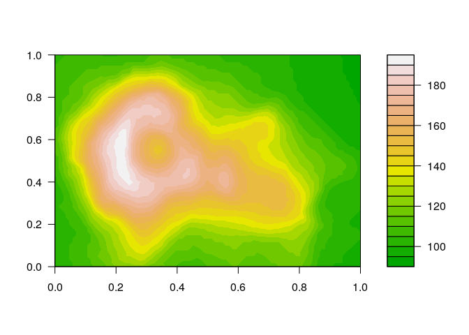

# Exporting plots

## Exporting plots

With R you can make very beautiful plots.


```r
filled.contour(volcano, color = terrain.colors)
```

<!-- -->

They are plotted within RStudio. If you want a separate plotting wondow, type 


```r
windows() # on Windows machines
x11() # on Linux/Mac
```

How to export such a plot to a file? Basic options are pdf, bitmap, jpg, tiff, png. You can use the export button, but then you have no control over the size ratio etcetera. This is not reprodicible. Better do this in a script.

There are three steps:

- open the connection


```r
pdf('my_beautiful_plot.pdf')
```

    - Other options: `jpeg`, `png`, `tiff`, `bmp`, `ps`
    - This creates the file, clears it, and reserves the file for R until it is closed again
    - Note: many options: `?pdf`

- make the plot


```r
filled.contour(volcano, color = terrain.colors)
```

    - If you make multiple plots, the file will contain only the last one (with `jpeg`, `png`, `tiff`, `bmp`) 
    - Or one plot on every page (`pdf` or `ps`)

- close the connection


```r
dev.off()
```

    - This closes the file so that you can access it with a viewer or some other program


