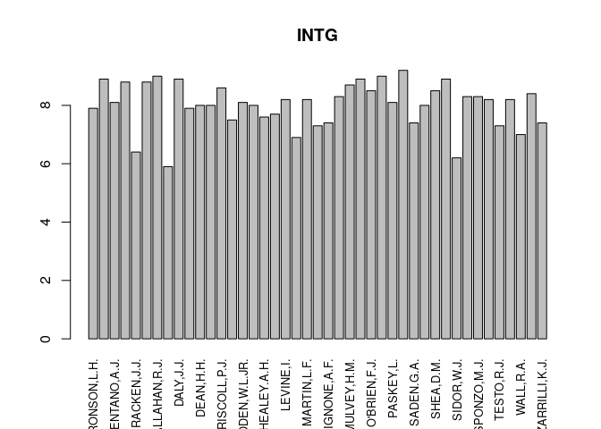
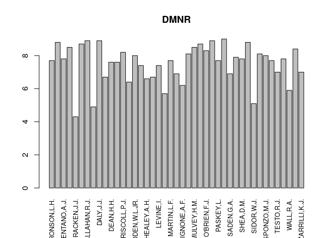

# Exporting plots

## Exporting some simple plots

We will make some plots for the USJudgeRatings data.

- Make a barplot for the second column of the USJudgeratings data. Add the names of the judges at the x-axis in a readable way. You can use `barplot` or `ggplot` as you choose. Add the name of the column as a title.


```r
barplot(USJudgeRatings[,2], names=rownames(USJudgeRatings),las=3, cex.names =.8, main = names(USJudgeRatings)[2])
```

<!-- -->

- Make the same plot for the third column.


```r
barplot(USJudgeRatings[,3], names=rownames(USJudgeRatings),las=3, cex.names =.8, main = names(USJudgeRatings)[3])
```

<!-- -->

- make a pdf file that has the 11 plots for the 11 columns (not using the first) on separate pages.


```r
pdf('Judgeplots.pdf')
for (i in 2:ncol(USJudgeRatings)) {
  barplot(USJudgeRatings[,i], names=rownames(USJudgeRatings), 
          las=3, cex.names =.8, main = names(USJudgeRatings)[i])
}
dev.off()
```

- 
