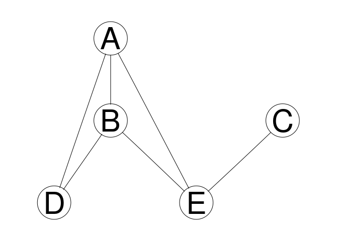
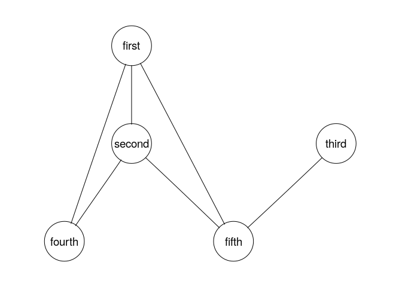

# S3 and S4 objects

S3 and S4 classes are used to store and return miscellaneous results coming from a function. They come in two types: S3 and S4 classes. S1 and S2 do not exist. 

## S3 objects

S3 classes occur more frequently. We have already encountered many of them


```r
res <- lm(extra ~ group, data=sleep)
class(res)
```

```
[1] "lm"
```

An S3 object is essentially a list with some extra attributes. What works on list, works on an S3 object.


```r
names(res)
```

```
 [1] "coefficients"  "residuals"     "effects"       "rank"         
 [5] "fitted.values" "assign"        "qr"            "df.residual"  
 [9] "contrasts"     "xlevels"       "call"          "terms"        
[13] "model"        
```

```r
length(res)
```

```
[1] 13
```

```r
res$fitted.values
```

```
   1    2    3    4    5    6    7    8    9   10   11   12   13   14   15   16 
0.75 0.75 0.75 0.75 0.75 0.75 0.75 0.75 0.75 0.75 2.33 2.33 2.33 2.33 2.33 2.33 
  17   18   19   20 
2.33 2.33 2.33 2.33 
```

```r
res[1:2]
```

```
$coefficients
(Intercept)      group2 
       0.75        1.58 

$residuals
    1     2     3     4     5     6     7     8     9    10    11    12    13 
-0.05 -2.35 -0.95 -1.95 -0.85  2.65  2.95  0.05 -0.75  1.25 -0.43 -1.53 -1.23 
   14    15    16    17    18    19    20 
-2.23 -2.43  2.07  3.17 -0.73  2.27  1.07 
```

For most types of S3 objects, special methods have been defined. Functions work in different ways on objects of this type.


```r
summary(res)
```

```

Call:
lm(formula = extra ~ group, data = sleep)

Residuals:
   Min     1Q Median     3Q    Max 
-2.430 -1.305 -0.580  1.455  3.170 

Coefficients:
            Estimate Std. Error t value Pr(>|t|)  
(Intercept)   0.7500     0.6004   1.249   0.2276  
group2        1.5800     0.8491   1.861   0.0792 .
---
Signif. codes:  0 '***' 0.001 '**' 0.01 '*' 0.05 '.' 0.1 ' ' 1

Residual standard error: 1.899 on 18 degrees of freedom
Multiple R-squared:  0.1613,	Adjusted R-squared:  0.1147 
F-statistic: 3.463 on 1 and 18 DF,  p-value: 0.07919
```

```r
coef(res)
```

```
(Intercept)      group2 
       0.75        1.58 
```

Problem of S3 objects is that it can be difficult to find out what kind of functions are available for your object.

# S4 objects

S4 objects are more structured and more strict than S3 objects. They are not so popular with packages on CRAN, but very popular for packages on bioconductor. Let's look at an example from Bioconductor


```r
source("https://bioconductor.org/biocLite.R")
biocLite(c("graph", "Rgraphviz"))
```

The packages `graph` and `Rgraphviz` are for working with graphs and visualizing them.


```r
library( graph )
```

```
Loading required package: BiocGenerics
```

```
Loading required package: parallel
```

```

Attaching package: 'BiocGenerics'
```

```
The following objects are masked from 'package:parallel':

    clusterApply, clusterApplyLB, clusterCall, clusterEvalQ,
    clusterExport, clusterMap, parApply, parCapply, parLapply,
    parLapplyLB, parRapply, parSapply, parSapplyLB
```

```
The following objects are masked from 'package:stats':

    IQR, mad, sd, var, xtabs
```

```
The following objects are masked from 'package:base':

    anyDuplicated, append, as.data.frame, basename, cbind, colnames,
    dirname, do.call, duplicated, eval, evalq, Filter, Find, get, grep,
    grepl, intersect, is.unsorted, lapply, Map, mapply, match, mget,
    order, paste, pmax, pmax.int, pmin, pmin.int, Position, rank,
    rbind, Reduce, rownames, sapply, setdiff, sort, table, tapply,
    union, unique, unsplit, which, which.max, which.min
```

```r
library( Rgraphviz )
```

```
Loading required package: grid
```

```r
g1 <- randomEGraph(LETTERS[1:5], edges=6)
g1
```

```
A graphNEL graph with undirected edges
Number of Nodes = 5 
Number of Edges = 6 
```

```r
class(g1)
```

```
[1] "graphNEL"
attr(,"package")
[1] "graph"
```

```r
plot(g1)
```

<!-- -->

Note the `attr(,"package")` at the bottom. This shows that it is an S4, not an S3 object. To check explicitly


```r
isS4(g1)
```

```
[1] TRUE
```

There is no `isS3`. Things you may expect to work for these objects from S3 don't


```r
names(g1)
```

```
NULL
```

With S4 object you could directly access the content with `@`, but you are not meant to.


```r
getSlots('graphNEL')
```

```
       nodes        edgeL     edgeData     nodeData   renderInfo    graphData 
    "vector"       "list"   "attrData"   "attrData" "renderInfo"       "list" 
```

```r
g1@nodes
```

```
[1] "A" "B" "C" "D" "E"
```

There is always a help file for an S4 object which lists all the methods you can use


```r
class?graphNEL
?graphNEL
```

For example


```r
nodes(g1)
```

```
[1] "A" "B" "C" "D" "E"
```

```r
nodes(g1) <- c('first', 'second', 'third', 'fourth', 'fifth')
plot(g1)
```

<!-- -->


