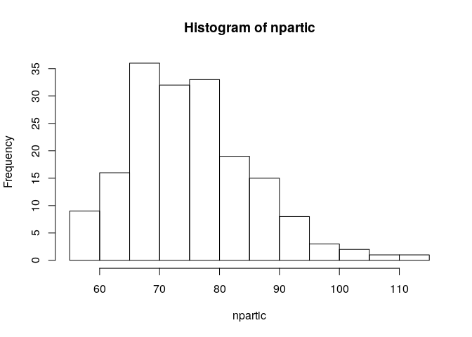
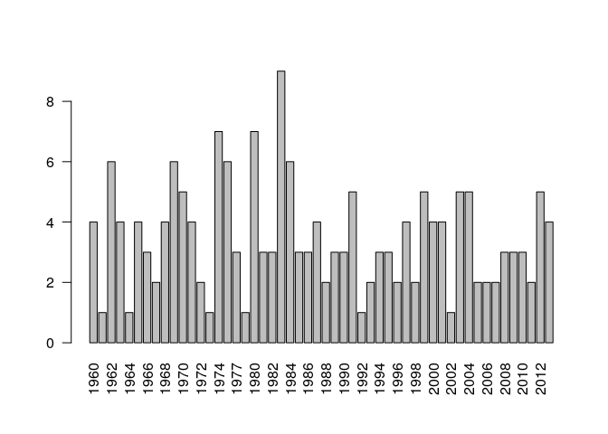
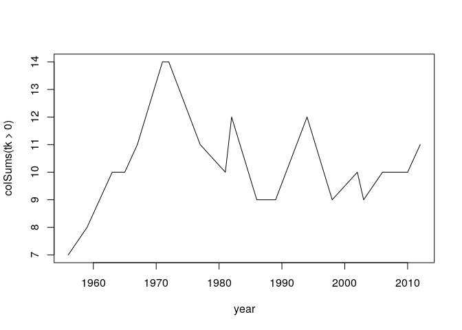
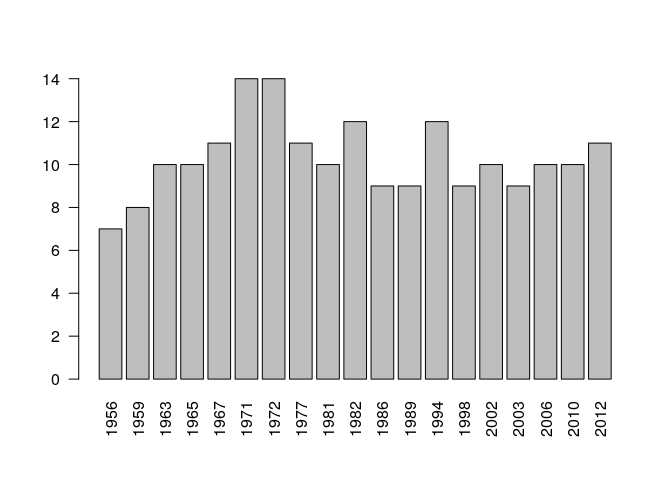
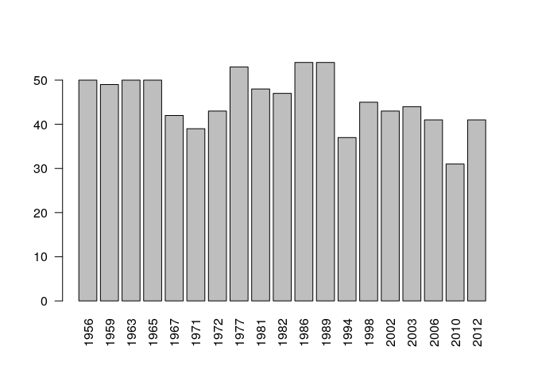
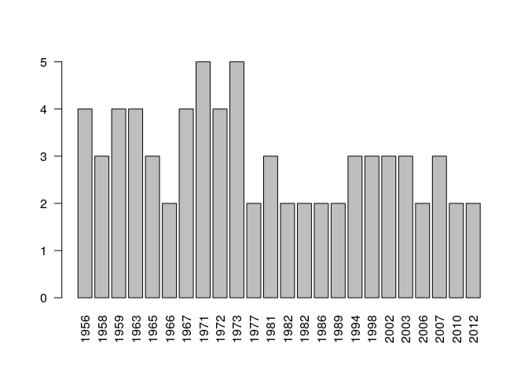

# Exercises

The exercises below use various parts of the material seen so far. They are also intended to handle situations we encounter in practice.

## Table and Histogram

The Union of Statistics Undergraduate Students includes many local offices, spread around the world. The local offices regularly organize meetings, with the frequency varying. They Union has made an inventory of all meetings organized. You must analyse this data to answer some of the questions they have.

- Read in the data that contains the overview of meetings: "meetings_locations.txt". Check which and what types of variables it has. What is the total number of meetings?


```r
# Remember to set the work directory to where the file to be read is located! Use setwd()
data.loc <- read.delim("meetings_locations.txt")
str(data.loc)
```

```
'data.frame':	182 obs. of  3 variables:
 $ locations: Factor w/ 21 levels "Amsterdam","Barcelona",..: 11 10 17 14 15 1 10 21 20 16 ...
 $ N.partic : Factor w/ 44 levels "100","103","109",..: 25 24 14 7 21 28 10 9 44 30 ...
 $ year     : int  2006 1984 1997 2005 2013 1963 1967 1979 1969 1968 ...
```

```r
# The total number of meetings is the same as the number of rows in the data, since there is one meeting per row. So:
nrow(data.loc)
```

```
[1] 182
```

- The location given is that of a meeting that took place. How many locations have held a meeting a single time? Tip: tabulate the table of locations.


```r
table(table(data.loc$locations))
```

```

 1  4  5  7  9 12 16 18 22 
 1  3  5  3  3  2  2  1  1 
```

```r
# This is much quicker than producing the entire table and checking visually how many entries are equal to 1 - compare:
table(data.loc$locations)
```

```

     Amsterdam      Barcelona         Boston      Cambridge        Chennai 
            12              5              5              9              4 
        Geneva        Glasgow       Istanbul           Lyon         Milano 
            16              7              7              5              5 
      New York         Oporto        Phoenix Rio de Janeiro       Salzburg 
            18              5              9             12              4 
       Seattle         Sidney St. Petersburg   Thessaloniki      Vancouver 
             9             16              4              1             22 
      Yokohama 
             7 
```

- To get an idea about the typical number of participants, make a histogram. For this, the number of participants should be a numeric variable, but it is not - you may check that it is not possible to make a histogram with the variable as it now is. The reason for this is that some values are actually characters ("combined") and, while reading in the file, R stores this variable as a factor. This stands for a code to indicate that the meeting was held in combination with other meetings, and somehow the organizers could not evaluate the number of participants of their meeting only. In order to be able to work with this variable, we need to transform it to numeric. To do so, first change values that are not naturally numeric to NA. Then transform it to numeric by first transforming it to character, and only then to numeric. Compare this transformed variable with one where the step of transforming to character is skipped. Do you see a difference? Why do you think they are different?


```r
npart <- data.loc$N.partic
npart[npart=="combined"] <- NA
# Check that this variable is still a factor
class(npart)
```

```
[1] "factor"
```

```r
npartic <- as.numeric(as.character(npart))
# Now the resulting variable is numeric, and we can make a histogram of it:
hist(npartic)
```

<!-- -->

```r
# What if we had not transformed npart into character, before transforming it into numeric?
npart2 <- as.numeric( npart )
# The problem is that, if we transform a factor directly into numeric, all it happens is that it looses the labels corresponding to the factor levels. So the first meeting had 77 participants, and in variable npart2 this has value 25 - because it was the 25th level of the factor. The numbers do not represent the number of participants.
# By transforming the factor first to character, we actually extract the labels corresponding to the factor levels - the participants numbers. 
# Compare the first three observations of each of these 3 variables - first, the factor:
npart[1:3]
```

```
[1] 77 76 66
44 Levels: 100 103 109 112 56 58 59 60 61 62 63 64 65 66 67 68 69 70 71 ... combined
```

```r
# Then, the variable transformed correctly:
npartic[1:3]
```

```
[1] 77 76 66
```

```r
# Now the variable that used only the internal factor numbers:
npart2[1:3]
```

```
[1] 25 24 14
```

- The Union also wants to have an overview of the number of meetings per year. For this, first make a table of the number of meetings per year. Then make a bar plot using this table as input (Hint: use the function barplot() ). Change the  labels on the x-axis so that they are visible (Hint:  display them vertically using the slot "las" of the function par() ).


```r
table(data.loc$year)
```

```

1960 1961 1962 1963 1964 1965 1966 1967 1968 1969 1970 1971 1972 1973 1974 1976 
   4    1    6    4    1    4    3    2    4    6    5    4    2    1    7    6 
1977 1979 1980 1981 1982 1983 1984 1985 1986 1987 1988 1989 1990 1991 1992 1993 
   3    1    7    3    3    9    6    3    3    4    2    3    3    5    1    2 
1994 1995 1996 1997 1998 1999 2000 2001 2002 2003 2004 2005 2006 2007 2008 2009 
   3    3    2    4    2    5    4    4    1    5    5    2    2    2    3    3 
2010 2011 2012 2013 
   3    2    5    4 
```

```r
barplot( table(data.loc$year) )
par(las=2)
barplot( table(data.loc$year) )
```

<!-- -->

## Using `apply`

The Puromycin data has enzyme reaction velocities under different concentrations and different treatments. There are two measurements per concentration/treatment combination. We want to summarize the results in a table that gives the average of the two measurements for every combination of concentration and treatment.

- Note that the second argument of tapply may be a list, so that we can summarize by two or more variables simultaneously. Make a list containing the two variables conc and state.


```r
PM <- Puromycin
mylist <- list(PM$conc, PM$state)
```

- Use tapply() to make the summarizing table.


```r
tapply(PM$rate, mylist, mean)
```

```
     treated untreated
0.02    61.5      59.0
0.06   102.0      85.0
0.11   131.0     106.5
0.22   155.5     127.5
0.56   196.0     151.0
1.1    203.5     160.0
```

##  Apply and functions

The OrchardSprays dataset has a so-called Latin Square design. This means that a field is divided into regular subfields by rows and columns, and that every row and column position is used exactly once for each treatment (like in a Sudoku).

- Find the row positions corresponding to treatment A.


```r
OS <- OrchardSprays
OS$rowpos[OS$treatment=="A"]
```

```
[1] 8 6 3 2 4 1 5 7
```

- Does every measurement for treatment A have a different row position? Hint: use duplicated.


```r
any(duplicated(OS$rowpos[OS$treatment=="A"]))
```

```
[1] FALSE
```

- Turn your check for treatment A into a function, and use that function to repeat the same check for treatment B.


```r
check.dup <- function(tr) {
  any(duplicated(OS$rowpos[OS$treatment==tr]))
}
```

- Check the same for all other treatments. Hint: use sapply and LETTERS.


```r
sapply(LETTERS[1:8], check.dup)
```

```
    A     B     C     D     E     F     G     H 
FALSE FALSE FALSE FALSE FALSE FALSE FALSE FALSE 
```

- We will now visualize the Latin square design. Make a matrix of 8 rows and 8 columns, with entries of the matrix giving the treatment used in that row and column. Hint: make sure the data matrix is ordered first by column and then by row (use order), and use the command matrix.


```r
ordering <- order(OS$colpos, OS$rowpos)
matrix(OS$treatment[ordering], 8, 8)
```

```
     [,1] [,2] [,3] [,4] [,5] [,6] [,7] [,8]
[1,] "D"  "C"  "F"  "H"  "E"  "A"  "B"  "G" 
[2,] "E"  "B"  "H"  "A"  "D"  "C"  "G"  "F" 
[3,] "B"  "H"  "A"  "E"  "G"  "F"  "C"  "D" 
[4,] "H"  "D"  "E"  "C"  "A"  "G"  "F"  "B" 
[5,] "G"  "E"  "D"  "F"  "C"  "B"  "A"  "H" 
[6,] "F"  "A"  "C"  "G"  "B"  "D"  "H"  "E" 
[7,] "C"  "F"  "G"  "B"  "H"  "E"  "D"  "A" 
[8,] "A"  "G"  "B"  "D"  "F"  "H"  "E"  "C" 
```

- Display the measured decrease values in their proper location in the Latin Square.


```r
matrix(OS$decrease[ordering], 8, 8)
```

```
     [,1] [,2] [,3] [,4] [,5] [,6] [,7] [,8]
[1,]   57   84   87  130   43   12    8   80
[2,]   95    6   72    4   28   29   72  114
[3,]    8  127    5  114   60   44   13   39
[4,]   69   36   39    9    5   77   57   14
[5,]   92   51   22   20   17    4    4   86
[6,]   90    2   16   24    7   27   81   55
[7,]   15   69   72   10   81   47   20    3
[8,]    2   71    4   51   71   76   61   19
```

## Read.table

The file tweedekamer.txt contains historical data on numbers of parliament seats of parties in the Dutch parliament from 1956 to the present. Download the file to your computer.

- Find out what the current working directory of your R session is. Hint: use getwd.


```r
getwd()
```

```
[1] "/home/renee/Documents/NKI/courses/R course NKI/materials/07"
```

-	Set the current working directory to the location where you downloaded the file tweedekamer.txt.


```r
setwd("c:/rcourse") # or wherever
```

-	Use read.table to read the file tweedekamer2012.txt. Make sure you set the argument quote="".


```r
tk <- read.table("tweedekamer2012.txt", sep="\t", quote="", header=T, row.names=1, check.names=F)
```

-	Check whether row and column names have been read correctly. Hint: use head. If necessary, adjust the arguments of read.table. Hint: look at check.names.


```r
head(tk)
```

```
     1956 1959 1963 1965 1967 1971 1972 1977 1981 1982 1986 1989 1994 1998 2002
KVP    49   49   50   50   42   35   27    0    0    0    0    0    0    0    0
ARP    15   14   13   13   15   13   14    0    0    0    0    0    0    0    0
CHU    13   12   13   13   12   10    7    0    0    0    0    0    0    0    0
CDA     0    0    0    0    0    0    0   49   48   45   54   54   34   29   43
PvdA   50   48   43   43   37   39   43   53   44   47   52   49   37   45   23
VVD    13   19   16   16   17   16   22   28   26   36   27   22   31   38   24
     2003 2006 2010 2012
KVP     0    0    0    0
ARP     0    0    0    0
CHU     0    0    0    0
CDA    44   41   21   13
PvdA   42   33   30   38
VVD    28   22   31   41
```

- How many parties and how many elections are in the data? Hint: use dim.


```r
dim(tk)
```

```
[1] 30 19
```

-	Try reading the file without using quote="". Find out what goes wrong by using read.table with the argument fill=TRUE.


```r
tk2 <- read.table("tweedekamer2012.txt", sep="\t", header=T, row.names=1, check.names=F, fill=T)
```

```
Warning in scan(file = file, what = what, sep = sep, quote = quote, dec = dec, :
EOF within quoted string
```

-	Write the result to an R-readable .RData file using save.


```r
save(tk, file="tweedekamer2012.RData")
```

## Logical vectors, rowSums and apply

Load the tweedekamer2012.txt data set again using read.table or load.

-	Convert the data.frame into a matrix.


```r
tk <- as.matrix(tk)
```

-	Create a numeric election year variable from the column names of your matrix. Hint: use as.numeric.


```r
year <- as.numeric(colnames(tk))
```

-	Calculate the number of parties represented in parliament after each election, and plot this number as a function of time as a line plot. Hint: Use colSums and logicals.


```r
plot(year, colSums(tk>0), type='l')
```

<!-- -->

-	Make the same plot as a barplot. Make the labels perpendicular to the axis for readability. Hint: see las in ?par.


```r
barplot(colSums(tk>0), las=2)
```

<!-- -->

-	Find the names of all parties that have (so far) only been present in a single parliament.


```r
rownames(tk)[rowSums(tk>0)==1]
```

```
[1] "RKPN"     "NMP"      "EVP"      "CP"       "AOV"      "Unie 55+" "LN"      
[8] "50plus"  
```

-	Find the name of the largest party in each parliament.


```r
largest <- rownames(tk)[apply(tk, 2, which.max)]
names(largest) <- colnames(tk)
```

-	Plot the number of seats of the largest party as a function of time in a barplot. Color the bars by the name of the largest party, and make a proper legend.


```r
lseats <- apply(tk, 2, max)
barplot(lseats, las=2)
```

<!-- -->


## Combining information from multiple tables

Load the data set politics2012.RData, with information on parliament and cabinets in the Netherlands since 1956. Part of this data you have already seen. 

- Check which objects this file contains by using the function show() with argument "load("politics2012.RData")". Then load the file.


```r
show(load("politics2012.RData"))
```

```
[1] "cabinet"    "parliament"
```

```r
load("politics2012.RData")
```

-  How many prime ministers have there been, and how many different parties have they come from? Hint: use unique.


```r
length(unique(cabinet$PM))
```

```
[1] 14
```

- Make a list of character vectors out of the coalition variable using strsplit(). Give this list the names of the cabinets.


```r
coal<- strsplit(cabinet$coalition, ", ")
```

- Make a barplot of the number of coalition partners as a function of time.


```r
ncoal <- sapply(coal, length)
barplot(ncoal, names.arg=cabinet$year, las=2)
```

<!-- -->

- The parliament variable in the cabinet data.frame gives the election year of the active parliament and the time of the cabinet and links the cabinet data.frame to the parliament data. Find the vector of distribution of parliament seats at the time of the Biesheuvel I cabinet.


```r
bies.par <- parliament[,cabinet["Biesheuvel I", "parliament"]]
```

- Find the largest party in parliament at the time of the Biesheuvel I cabinet.


```r
names(bies.par)[which.max(bies.par)]
```

```
[1] "PvdA"
```

- Turn your code for the previous exercise into a function, and calculate the largest party in parliament at the time of the cabinet for each cabinet.


```r
largest.party <- function(cab) {
  cab.par <- parliament[,cabinet[cab, "parliament"]]
  names(cab.par)[which.max(cab.par)]
}
lp <- sapply(rownames(cabinet), largest.party)
```

- How often was the prime minister a member of the largest party in parliament?


```r
sum(lp==cabinet$party)
```

```
[1] 18
```

```r
length(lp)
```

```
[1] 24
```

- How many seats in parliament did the parties in the Biesheuvel I cabinet have in total? Hint: use %in%.


```r
names(coal) <- rownames(cabinet)
bies.coal <- coal[["Biesheuvel I"]]
sum(bies.par[names(bies.par) %in% bies.coal])
```

```
[1] 82
```

- Turn your code for the previous question into a function, calculate the number of coalition seats for every cabinet, and display the result in a barplot.


```r
coal.seats <- function(cab) {
  cab.coal <- coal[[cab]]
  cab.par <- parliament[,cabinet[cab, "parliament"]]
  sum(cab.par[names(cab.par) %in% cab.coal])
}
sapply(rownames(cabinet), coal.seats)
```

```
           Drees III              Beel II              De Quay 
                 127                   77                   94 
            Marijnen                 Cals             Zijlstra 
                  92                  106                   63 
             De Jong         Biesheuvel I        Biesheuvel II 
                  86                   82                   74 
             Den Uyl            Van Agt I           Van Agt II 
                  97                   77                  109 
         Van Agt III            Lubbers I           Lubbers II 
                  65                   81                   81 
         Lubbers III   Kok I\xa0(Paars I) Kok II\xa0(Paars II) 
                 103                   92                   97 
        Balkenende I        Balkenende II       Balkenende III 
                  93                   78                   72 
       Balkenende IV              Rutte I             Rutte II 
                  80                   52                   79 
```

