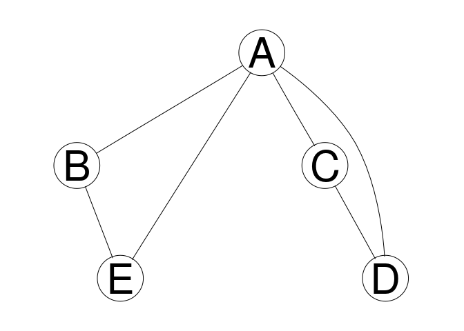

# S3 and S4 classes

## Learning goals

- General understanding of data objects, in particular objects from S3 and S4 classes.    
- How to recognize and access S3 and S4 classes
<!-- - Introducing functions `attributes`, `methods` and `isS4` and `pryr` package.  -->

## Objects

- Object is a piece of data with a type (class)
- Basic types and precedence
  - NULL < raw < <span style="color:blue">`logical < integer < double < character`</span> < list < expression
  - `is.<basic type>`, `as.<basic type>` functions  for type test and conversion respectively.
  - `typeof` function
- Object may be associated to methods/functions (Object Orientation : S3/S4)
  - S3 : ad hoc 
    - most objects in `base` and `stats` and R core
  - S4 : formal/strict
    - e.g. `Bioconductor`


## S3

Most objects in `base` and `stats` are of S3 class and are almost always based on `list`, but not necessarily. 


```r
res <- lm(extra ~ group, data=sleep)
res
```

```

Call:
lm(formula = extra ~ group, data = sleep)

Coefficients:
(Intercept)       group2  
       0.75         1.58  
```

```r
class(res)
```

```
[1] "lm"
```

You will recognize a S3 class via an explicit attribute `class`:


```r
attributes(res)
```

```
$names
 [1] "coefficients"  "residuals"     "effects"       "rank"         
 [5] "fitted.values" "assign"        "qr"            "df.residual"  
 [9] "contrasts"     "xlevels"       "call"          "terms"        
[13] "model"        

$class
[1] "lm"
```

There are many generic functions in R such as `print`, `plot`, `summary` etc. that behave differently based on the class of an object:


```r
methods(plot)
```

```
 [1] plot.acf*           plot.data.frame*    plot.decomposed.ts*
 [4] plot.default        plot.dendrogram*    plot.density*      
 [7] plot.ecdf           plot.factor*        plot.formula*      
[10] plot.function       plot.hclust*        plot.histogram*    
[13] plot.HoltWinters*   plot.isoreg*        plot.lm*           
[16] plot.medpolish*     plot.mlm*           plot.ppr*          
[19] plot.prcomp*        plot.princomp*      plot.profile.nls*  
[22] plot.raster*        plot.spec*          plot.stepfun       
[25] plot.stl*           plot.table*         plot.ts            
[28] plot.tskernel*      plot.TukeyHSD*     
see '?methods' for accessing help and source code
```

<!-- Problem of S3 objects is that it can be difficult to find out what kind of functions are available for your object.  -->

## S4

S4 objects are more structured and more strict than S3 objects. They are not so popular with packages on CRAN, but very popular for packages on Bioconductor. Let’s look at an example from Bioconductor


```r
source("https://bioconductor.org/biocLite.R")
biocLite(c("graph", "Rgraphviz"))
```

The packages graph and Rgraphviz are for working with graphs and visualizing them.


```r
library(graph) ; library(Rgraphviz)
```


```r
g1 <- randomEGraph(LETTERS[1:5], edges=6)
g1
```

```
A graphNEL graph with undirected edges
Number of Nodes = 5 
Number of Edges = 6 
```

```r
class(g1)
```

```
[1] "graphNEL"
attr(,"package")
[1] "graph"
```

```r
plot(g1)
```

<!-- -->

Note the attr(,"package") at the bottom. This shows that it is an S4, not an S3 object. To check explicitly


```r
isS4(g1)
```

```
[1] TRUE
```

There is no isS3. Things you may expect to work for these objects from S3 don’t:


```r
names(g1)
```

```
NULL
```

```r
getSlots('graphNEL') # class name
```

```
       nodes        edgeL     edgeData     nodeData   renderInfo    graphData 
    "vector"       "list"   "attrData"   "attrData" "renderInfo"       "list" 
```


With S4 object you can directly access the contents with `@` but you are not meant to:


```r
g1@nodes
```

```
[1] "A" "B" "C" "D" "E"
```

There is always a help file for an S4 object which lists all the methods you can use:


```r
class?graphNEL
?graphNEL
```


- - -

> _Quick task(s)_:
> 
> Solve [the task(s)](s3s4.tasks.nocode.html#s3s4), and check your solution(s) [here](s3s4.tasks.code.html#s3s4).

- - -
