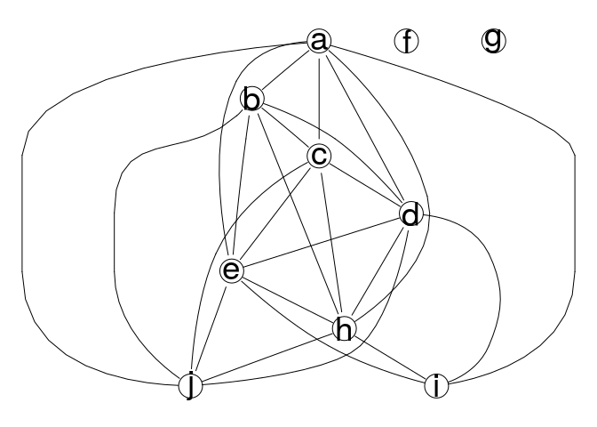

# S3 and S4 classes (tasks) {#s3s4}

<!-- ## S3 and S4 classes {#s3s4} -->

Start a fresh workspace with no objects in your environment. You can do this either by running `rm(list=ls())` in your console or clicking the brush icon on the `Environment` pane (RStudio top right). Also restart the R session to remove any loaded packages (menu: Session -> Restart R).

Run the following line in your R console:


```r
source(url("https://barmsijs.lumc.nl/R_course/data/objects.R"))
```


This will create a set of objects in your environment. Inspect the objects and answer the following questions: 

1. What is the class and the class category (S3/S4/base) of each object?


```r
library(pryr)
```

```
Registered S3 method overwritten by 'pryr':
  method      from
  print.bytes Rcpp
```

```r
class(o1);otype(o1) 
```

```
[1] "graphNEL"
attr(,"package")
[1] "graph"
```

```
[1] "S4"
```

```r
class(o2);otype(o2) 
```

```
[1] "lm"
```

```
[1] "S3"
```

```r
class(o3);otype(o3) 
```

```
[1] "density"
```

```
[1] "S3"
```

```r
class(o4);otype(o4) 
```

```
[1] "table"
```

```
[1] "S3"
```

```r
class(o5);otype(o5) 
```

```
[1] "integer"
```

```
[1] "base"
```

2. List the slots of the objects if possible. 


```r
# o1 is an S4 class category so it has slots that can be retrieved by getSlots() 
getSlots(class(o1))
```

```
       nodes        edgeL     edgeData     nodeData   renderInfo    graphData 
    "vector"       "list"   "attrData"   "attrData" "renderInfo"       "list" 
```

```r
# o2 is an S3 so names() will retrieve the slots
names(o2)
```

```
 [1] "coefficients"  "residuals"     "effects"       "rank"         
 [5] "fitted.values" "assign"        "qr"            "df.residual"  
 [9] "contrasts"     "xlevels"       "call"          "terms"        
[13] "model"        
```

```r
# o3 is an S3 
names(o3)
```

```
[1] "x"         "y"         "bw"        "n"         "call"      "data.name"
[7] "has.na"   
```

```r
# o4 is S3 
names(o4)
```

```
 [1] "b" "c" "h" "i" "k" "m" "n" "o" "r" "s" "u" "w" "y" "z"
```

```r
# o5 is a named vector, a base class, but has names as attribute so function 
# names() is still valid.  
names(o5)
```

```
 [1] "a" "b" "c" "d" "e" "f" "g" "h" "i" "j"
```

3. Often class categories S3 and S4 have an slot called `call`. Find which objects have this attribute and report the value


```r
# The objects o2 and o3 have the slot 'call. 

# o2 : data used is sleep, see ?lm and ?sleep for more details.
o2$call
```

```
lm(formula = extra ~ group, data = sleep)
```

```r
# o3 : is a density object on mtcars$hp , see ?density and ?mtcars
o3$call
```

```
density.default(x = mtcars$hp)
```

4. Plot the objects. 


```r
plot(o1)
```

<!-- -->

```r
plot(o2)
```

<!-- --><!-- --><!-- --><!-- -->

```r
plot(o3)
```

<!-- -->

```r
plot(o4)
```

<!-- -->

```r
plot(o5)
```

<!-- -->


