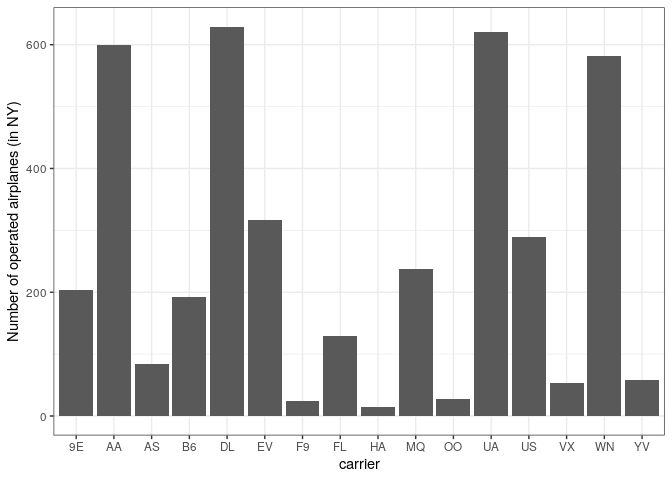
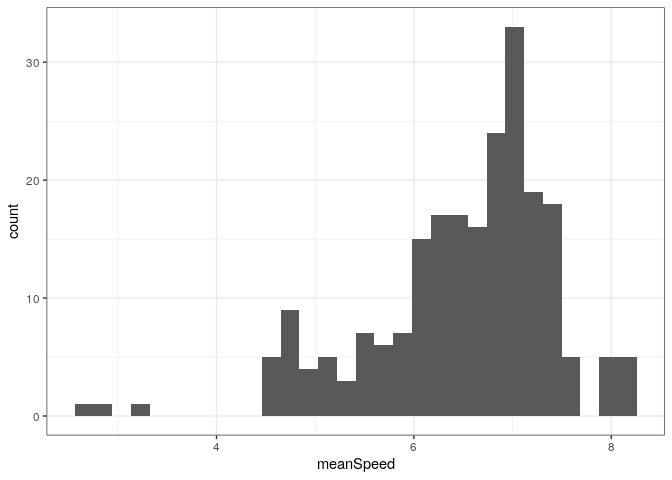
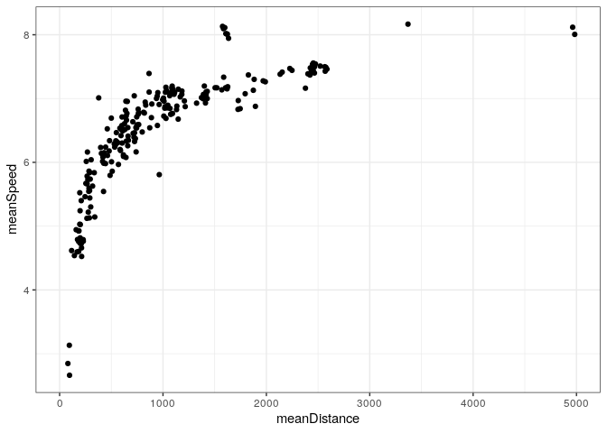

# Analyse `flights` data set {#final}

Use the following setting. You'll need to install `nycflights13` data package from `cran`. 


```r
library( dplyr )
library( tidyr )
library( ggplot2 )
# install.packages( "nycflights13" )
library( nycflights13 ) 
f <- flights
```

### Airplanes

The column `tailnum` (of `flights` table from `nycflights` library) can be used to identify an airplane. 
- How many different airplanes took of from New York in 2013?

```r
# Some tailnum's are missing, therefore we first filter out entries 
# with missing tailnum:
f <- f %>% filter( ! is.na(tailnum)  )
# (1) When distinct is used with no variables as argument then it 
# will take all variables in the dataframe, in this case the only 
# variable selected in the dataframe is tailnum: 
f %>% select( tailnum ) %>% distinct() %>% nrow()
```

```
[1] 4043
```

```r
# (2) Or use disctinct directly:
f %>% distinct( tailnum ) %>% nrow()
```

```
[1] 4043
```

- Was there any airplane operated by more than one carrier?

```r
# (1) Find first the distinct combinations of airplanes and carriers 
# and then count the number of airplanes (tailnum) and finally select 
# counts >1. 
f %>% select( tailnum, carrier ) %>% distinct() %>% count( tailnum ) %>% 
  filter( n > 1 )
```

```
# A tibble: 17 x 2
   tailnum     n
   <chr>   <int>
 1 N146PQ      2
 2 N153PQ      2
 3 N176PQ      2
 4 N181PQ      2
 5 N197PQ      2
 6 N200PQ      2
 7 N228PQ      2
 8 N232PQ      2
 9 N933AT      2
10 N935AT      2
11 N977AT      2
12 N978AT      2
13 N979AT      2
14 N981AT      2
15 N989AT      2
16 N990AT      2
17 N994AT      2
```

```r
# (2) Or count the nr. of unique airplane and carrier combinations and 
# then count the number of unqiue airplanes. The first count will 
# introduce a new column 'n' in the dataframe therefore we need to 
# rename it to avoid conflict with the second count. 
f %>% count( tailnum, carrier ) %>% rename( airplaneCarrierPairs = n ) %>% 
  count( tailnum ) %>% filter( n > 1 )
```

```
# A tibble: 17 x 2
   tailnum     n
   <chr>   <int>
 1 N146PQ      2
 2 N153PQ      2
 3 N176PQ      2
 4 N181PQ      2
 5 N197PQ      2
 6 N200PQ      2
 7 N228PQ      2
 8 N232PQ      2
 9 N933AT      2
10 N935AT      2
11 N977AT      2
12 N978AT      2
13 N979AT      2
14 N981AT      2
15 N989AT      2
16 N990AT      2
17 N994AT      2
```

- How many different airplanes were operated by each carrier? Which carrier operates the largest number of airplanes?

```r
# Similar as the previous but now we are interested in the frequency of carrier 
# occurencesin the unique combinations of airplane-carriers.  
f %>% count( carrier, tailnum ) %>% rename( airplaneCarrierPairs = n ) %>% 
  count( carrier ) %>% arrange( desc( n ) )
```

```
# A tibble: 16 x 2
   carrier     n
   <chr>   <int>
 1 DL        629
 2 UA        620
 3 AA        600
 4 WN        582
 5 EV        316
 6 US        289
 7 MQ        237
 8 9E        203
 9 B6        193
10 FL        129
11 AS         84
12 YV         58
13 VX         53
14 OO         28
15 F9         25
16 HA         14
```

- Summarize the previous result in a barplot. Use `geom_bar( stat = "identity" )`. Reproduce: (*)

```r
ggplot( 
  f %>% count( carrier, tailnum ) %>% rename( airplaneCarrierPairs = n ) %>% 
    count( carrier ) %>% arrange( desc( n ) ),
  aes( x = carrier, y = n ))    + 
  geom_bar( stat = "identity" ) +
  theme_bw() + ylab( "Number of operated airplanes (in NY)")
```

<!-- -->

### Flight speeds?

The goal is to find mean flight speeds for each route.

- Add a `speed` column (calculated from `distance` and `air_time`)

```r
# Use the original flight data (including missing tailnum's)
f <- flights
f %>% mutate( speed = distance / air_time ) %>% select( origin, dest, speed, everything() ) 
```

```
# A tibble: 336,776 x 20
   origin dest  speed  year month   day dep_time sched_dep_time dep_delay
   <chr>  <chr> <dbl> <int> <int> <int>    <int>          <int>     <dbl>
 1 EWR    IAH    6.17  2013     1     1      517            515         2
 2 LGA    IAH    6.24  2013     1     1      533            529         4
 3 JFK    MIA    6.81  2013     1     1      542            540         2
 4 JFK    BQN    8.61  2013     1     1      544            545        -1
 5 LGA    ATL    6.57  2013     1     1      554            600        -6
 6 EWR    ORD    4.79  2013     1     1      554            558        -4
 7 EWR    FLL    6.74  2013     1     1      555            600        -5
 8 LGA    IAD    4.32  2013     1     1      557            600        -3
 9 JFK    MCO    6.74  2013     1     1      557            600        -3
10 LGA    ORD    5.31  2013     1     1      558            600        -2
# … with 336,766 more rows, and 11 more variables: arr_time <int>,
#   sched_arr_time <int>, arr_delay <dbl>, carrier <chr>, flight <int>,
#   tailnum <chr>, air_time <dbl>, distance <dbl>, hour <dbl>, minute <dbl>,
#   time_hour <dttm>
```

- For each route calculate the mean speed (put it to column `meanSpeed`)


```r
# Some of the (origin,dest) pairs will result in speeds with NA as value. 
# This is due to missing air_time. You need to account for this with na.rm 
# argument to mean when calculating the means over the multiple speeds per 
# route with possible NA's 
f %>% mutate( speed = distance / air_time ) %>% group_by( origin, dest ) %>% 
  summarize( meanSpeed = mean( speed, na.rm = TRUE ) )
```

```
# A tibble: 224 x 3
# Groups:   origin [3]
   origin dest  meanSpeed
   <chr>  <chr>     <dbl>
 1 EWR    ALB        4.54
 2 EWR    ANC        8.17
 3 EWR    ATL        6.71
 4 EWR    AUS        7.17
 5 EWR    AVL        6.54
 6 EWR    BDL        4.62
 7 EWR    BNA        6.59
 8 EWR    BOS        5.02
 9 EWR    BQN        8.10
10 EWR    BTV        5.78
# … with 214 more rows
```

- Produce a histogram of the mean speeds. Question: what is the unit of speed? Reproduce: (*)

```r
ggplot( 
  f %>% mutate( speed = distance / air_time ) %>% group_by( origin, dest ) %>% 
    summarize( meanSpeed = mean( speed, na.rm = TRUE ) ),
  aes( x = meanSpeed ) ) +
  geom_histogram() +
  theme_bw()
```

<!-- -->

- Maybe there is a relation of mean speed and distance? Produce a scatter plot of `meanSpeed` vs. `meanDistance`. Reproduce: (*)

```r
ggplot( 
  f %>% mutate( speed = distance / air_time ) %>% group_by( origin, dest ) %>% 
    summarize( meanSpeed = mean( speed, na.rm = TRUE ), meanDistance = mean( distance ) ),
  aes( x = meanDistance, y = meanSpeed )) +
  geom_point() +
  theme_bw()
```

<!-- -->

<!-- - Try `ggplotly` version of the above plot. Add to `aes( ..., origin = origin, dest = dest )`. Hoover above points to see where the longest flights go (*) -->


### Names of airports of origin

- Study table `airports`, in particular, the columns `faa` and `name`. 


```r
# Inspect the dataframe airports:
glimpse(airports)
```

```
Rows: 1,458
Columns: 8
$ faa   <chr> "04G", "06A", "06C", "06N", "09J", "0A9", "0G6", "0G7", "0P2", …
$ name  <chr> "Lansdowne Airport", "Moton Field Municipal Airport", "Schaumbu…
$ lat   <dbl> 41.13047, 32.46057, 41.98934, 41.43191, 31.07447, 36.37122, 41.…
$ lon   <dbl> -80.61958, -85.68003, -88.10124, -74.39156, -81.42778, -82.1734…
$ alt   <dbl> 1044, 264, 801, 523, 11, 1593, 730, 492, 1000, 108, 409, 875, 1…
$ tz    <dbl> -5, -6, -6, -5, -5, -5, -5, -5, -5, -8, -5, -6, -5, -5, -5, -5,…
$ dst   <chr> "A", "A", "A", "A", "A", "A", "A", "A", "U", "A", "A", "U", "A"…
$ tzone <chr> "America/New_York", "America/Chicago", "America/Chicago", "Amer…
```

```r
# We are interested in the airport codes (faa) and their names:  
( ap <- airports %>% select( faa, name ) ) 
```

```
# A tibble: 1,458 x 2
   faa   name                          
   <chr> <chr>                         
 1 04G   Lansdowne Airport             
 2 06A   Moton Field Municipal Airport 
 3 06C   Schaumburg Regional           
 4 06N   Randall Airport               
 5 09J   Jekyll Island Airport         
 6 0A9   Elizabethton Municipal Airport
 7 0G6   Williams County Airport       
 8 0G7   Finger Lakes Regional Airport 
 9 0P2   Shoestring Aviation Airfield  
10 0S9   Jefferson County Intl         
# … with 1,448 more rows
```

- Identify all `faa` codes of airports of `origin`, note that the `origin` and `dest` variables in flights tables are FAA codes.  


```r
origin <- flights %>% select( origin ) %>% distinct()
origin
```

```
# A tibble: 3 x 1
  origin
  <chr> 
1 EWR   
2 LGA   
3 JFK   
```

- Merge the above tables: to each airport of origin add its name, based on a match between `origin` and `faa` variables

```r
origin %>% rename( faa = origin ) %>% left_join( ap , by = "faa")
```

```
# A tibble: 3 x 2
  faa   name               
  <chr> <chr>              
1 EWR   Newark Liberty Intl
2 LGA   La Guardia         
3 JFK   John F Kennedy Intl
```
