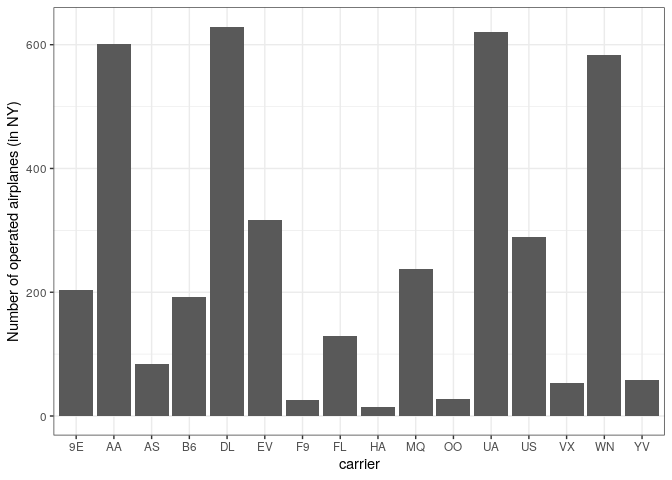
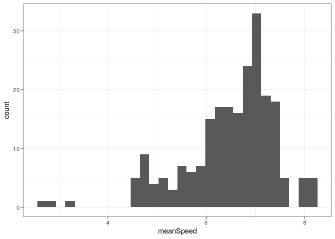
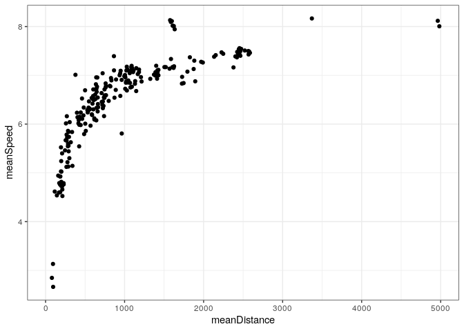

# Analyse `flights` data set {#final}

Use the following setting. You'll need to install `nycflights13` data package from `cran`. 


```r
library( dplyr )
library( tidyr )
library( ggplot2 )
# install.packages( "nycflights13" )
library( nycflights13 ) 
f <- flights
```

### Airplanes

The column `tailnum` (of `flights` table from `nycflights` library) can be used to identify an airplane. 
- How many different airplanes took of from New York in 2013?


- Was there any airplane operated by more than one carrier?


- How many different airplanes were operated by each carrier? Which carrier operates the largest number of airplanes?


- Summarize the previous result in a barplot. Use `geom_bar( stat = "identity" )`. Reproduce: (*)
<!-- -->

### Flight speeds?

The goal is to find mean flight speeds for each route.

- Add a `speed` column (calculated from `distance` and `air_time`)


- For each route calculate the mean speed (put it to column `meanSpeed`)


- Produce a histogram of the mean speeds. Question: what is the unit of speed? Reproduce: (*)
<!-- -->

- Maybe there is a relation of mean speed and distance? Produce a scatter plot of `meanSpeed` vs. `meanDistance`. Reproduce: (*)
<!-- -->

<!-- - Try `ggplotly` version of the above plot. Add to `aes( ..., origin = origin, dest = dest )`. Hoover above points to see where the longest flights go (*) -->


### Names of airports of origin

- Study table `airports`, in particular, the columns `faa` and `name`. 


- Identify all `faa` codes of airports of `origin`, note that the `origin` and `dest` variables in flights tables are FAA codes.  


- Merge the above tables: to each airport of origin add its name, based on a match between `origin` and `faa` variables

